# Architecture Migration Plan

> **From**: Monolithic `VideoController` + layer-by-type structure  
> **To**: Feature-first clean architecture (see [`1_clean-architecture.md`](./1_clean-architecture.md))  
> **Strategy**: Backup & Rebuild (Greenfield Reconstruction)

---

## Overview

The current codebase is functional but structurally coupled. To ensure a clean transition and avoid build-system "ghosts" (stale MOC/cache collisions), we will:
1. **Backup**: Move the current `app` folder to `app_legacy` or `app_backup`.
2. **Rebuild**: Create a brand new `app` structure with the final Clean Architecture layout.
3. **Port**: Incremental port logic feature-by-feature from `app_backup` into the new `app`.

This strategy guarantees that the new build environment is always clean and follows the new rules from day one.


---

## Current Structure Audit

### What exists today

```
app/src/
├── core/
│   ├── VideoController.h / .cpp   ← God class (controller + 2 workers + thread mgmt)
│   └── SystemMonitor.h / .cpp
├── models/
│   ├── DetectionStruct.h
│   ├── DetectionListModel.h / .cpp
├── pipeline/
│   ├── YoloTypes.h
│   ├── YoloPipeline.h / .cpp
│   ├── PreProcessor.h / .cpp
│   ├── PostProcessor.h / .cpp
│   ├── SimdUtils.h
│   └── backends/
│       ├── IInferenceBackend.h
│       ├── OnnxRuntimeBackend.h / .cpp
│       └── OpenVinoBackend.h / .cpp
├── ui/
│   ├── DetectionOverlayItem.h / .cpp
└── main.cpp
```

### Structural problems

| Problem | Impact |
|:--------|:-------|
| `VideoController.h` contains 3 class definitions (`VideoController`, `CaptureWorker`, `InferenceWorker`) | Impossible to unit-test workers in isolation; any change touches the same file |
| `AppConfig` namespace defined inside `VideoController.h` | Creates implicit coupling: any translation unit that needs a config constant must include the controller |
| `CaptureWorker` holds a raw `atomic<bool>*` pointer to `InferenceWorker`'s state | Non-owning raw pointer shared across threads — fragile; leaks abstraction |
| `DL_RESULT` (C struct with `cv::Rect`) crosses into `DetectionListModel` | Infrastructure type (`cv::Rect`) bleeds into model layer |
| `TaskType` / `RuntimeType` enums defined inside `VideoController` | QML must reach through the controller class to access enum values |
| Single `Main.qml` with all UI | Every UI change requires reading 400+ lines; no component isolation |
| `content/` is flat with one file | No organizational structure for future QML components |

---

## Migration Strategy

### Guiding Principles

- **Rename, don't rewrite**: move files first, adjust includes, then extract interfaces.
- **One feature at a time**: each phase is independently compilable and runnable.
- **Keep the old `VideoController` alive** until the final phase — it acts as a compatibility shim.
- **CMakeLists.txt is updated per phase** to reflect new source paths.
- **No behavior change**: identical threading model, identical signal names (during transition).

---

## Phase 0 — Greenfield Initialization
**Goal**: Preserve the current working state and establish the new clean structure.

### Actions
1. **Backup**: Rename `app` directory to `app_backup`.
2. **Initialize New App**:
   - Create a fresh `app` folder.
   - Create the new feature-first directory skeleton:
     ```
     app/src/features/[detection,camera,monitoring]/[domain,application,infrastructure,ui]
     app/src/shared/[domain,application]
     app/content/features/[...]
     ```
3. **Copy Build Essentials**:
   - Create a fresh `CMakeLists.txt` in the new `app` (copied from `app_backup` but stripped).
   - Copy `main.cpp` and basic QML infrastructure.

### Verification
- Empty project structure created.
- `app_backup` contains the functional monolithic version for reference.


### Files created

| New File | Extracted From |
|:---------|:---------------|
| `src/shared/domain/AppConfig.h` | `VideoController.h` (`AppConfig` namespace) |
| `src/features/detection/domain/TaskType.h` | `VideoController.h` (`TaskType`, `RuntimeType` enums) |

### Verification
- Project compiles with `cmake --build .` — zero behavior change.

---

## Phase 1 — Extract Monitoring Feature (2–3 hours)

**Goal**: Fully isolate `SystemMonitor` into `features/monitoring/`. Introduce `ISystemMonitor` interface. The existing `VideoController` calls are updated to use the interface.

### Actions

1. **Create `monitoring/domain/SystemStats.h`**:
   ```cpp
   struct SystemStats {
       double cpuPercent = 0.0;
       QString systemMemory;
       QString processMemory;
   };
   ```

2. **Create `monitoring/domain/ISystemMonitor.h`** (pure virtual):
   ```cpp
   class ISystemMonitor {
   public:
       virtual ~ISystemMonitor() = default;
       virtual void initialize() = 0;
       virtual void cleanup() = 0;
       virtual SystemStats poll() = 0;
   };
   ```

3. **Move `SystemMonitor.h/.cpp` → `monitoring/infrastructure/`**:
   - Rename class to `WindowsSystemMonitor` (or keep `SystemMonitor` as alias).
   - Inherit from `ISystemMonitor`.
   - Replace `resourceUsageUpdated(QString)` raw signal with `poll()` returning `SystemStats`.

4. **Create `monitoring/application/SystemMonitorWorker.h/.cpp`**:
   - Extracts the timer-driven polling loop.
   - Takes `ISystemMonitor*` (injected in constructor — testable).
   - Emits `statsUpdated(SystemStats)`.

5. **Update `VideoController`**:
   - Change `SystemMonitor* m_systemMonitor` to `SystemMonitorWorker* m_systemMonitorWorker`.
   - Connect `statsUpdated(SystemStats)` → `updateSystemStats()`.

6. **Delete `src/core/SystemMonitor.h/.cpp`** (after confirming compilation).

### Files moved / created

| Action | Old Path | New Path |
|:-------|:---------|:---------|
| Move + rename | `src/core/SystemMonitor.h` | `src/features/monitoring/infrastructure/WindowsSystemMonitor.h` |
| Move + rename | `src/core/SystemMonitor.cpp` | `src/features/monitoring/infrastructure/WindowsSystemMonitor.cpp` |
| Create (new) | — | `src/features/monitoring/domain/SystemStats.h` |
| Create (new) | — | `src/features/monitoring/domain/ISystemMonitor.h` |
| Create (new) | — | `src/features/monitoring/application/SystemMonitorWorker.h` |
| Create (new) | — | `src/features/monitoring/application/SystemMonitorWorker.cpp` |

### Verification
- Application runs; `systemStats` property in QML still updates CPU/RAM correctly.

---

## Phase 2 — Extract Detection Domain & Infrastructure (3–4 hours)

**Goal**: Move the entire YOLO pipeline into `features/detection/`. Define `IDetectionModel`. Remove `cv::Rect` and `DL_RESULT` from the model layer.

### Actions

1. **Create `detection/domain/DetectionResult.h`** — mirror of `DL_RESULT` using only standard C++ types:
   ```cpp
   struct DetectionResult {
       int classId;
       float confidence;
       cv::Rect box;           // cv::Rect is acceptable in domain — it's a math type
       std::vector<cv::Point2f> keyPoints;
       cv::Mat boxMask;
   };
   ```
   > **Note**: `cv::Rect` and `cv::Mat` are kept because they are *value types* from a math library, not framework/runtime coupling. The rule is no ONNX/Qt types in domain.

2. **Create `detection/domain/InferenceConfig.h`** — clean version of `DL_INIT_PARAM`:
   ```cpp
   struct InferenceConfig {
       std::string modelPath;
       TaskType    taskType    = TaskType::Detect;
       RuntimeType runtimeType = RuntimeType::OpenVINO;
       std::vector<int> imgSize = {640, 640};
       float  confidenceThreshold = 0.4f;
       float  iouThreshold        = 0.5f;
       int    keyPointsNum        = 2;
       bool   cudaEnable          = false;
       int    intraOpThreads      = std::max(1u, std::thread::hardware_concurrency() / 2);
       int    interOpThreads      = 1;
       int    sessionPoolSize     = 1;
   };
   ```

3. **Create `detection/domain/InferenceTiming.h`** — extracted from `YoloPipeline.h`.

4. **Create `detection/domain/IDetectionModel.h`** (pure interface):
   ```cpp
   class IDetectionModel {
   public:
       virtual ~IDetectionModel() = default;
       virtual const char* createSession(const InferenceConfig& config) = 0;
       virtual char* runDetection(const cv::Mat& frame,
                                  std::vector<DetectionResult>& results,
                                  InferenceTiming& timing) = 0;
       virtual const std::vector<std::string>& classNames() const = 0;
       virtual void warmUp() = 0;
   };
   ```

5. **Move pipeline files** to `detection/infrastructure/`:
   ```
   pipeline/YoloPipeline.h/.cpp        → detection/infrastructure/YoloPipeline.h/.cpp
   pipeline/PreProcessor.h/.cpp        → detection/infrastructure/PreProcessor.h/.cpp
   pipeline/PostProcessor.h/.cpp       → detection/infrastructure/PostProcessor.h/.cpp
   pipeline/SimdUtils.h                → detection/infrastructure/SimdUtils.h
   pipeline/YoloTypes.h                → detection/infrastructure/YoloTypes.h (deprecated alias)
   pipeline/backends/IInferenceBackend.h → detection/infrastructure/IInferenceBackend.h
   pipeline/backends/OnnxRuntimeBackend.* → detection/infrastructure/OnnxRuntimeBackend.*
   pipeline/backends/OpenVinoBackend.* → detection/infrastructure/OpenVinoBackend.*
   ```

6. **Make `YoloPipeline` implement `IDetectionModel`**.

7. **Update `CMakeLists.txt`** source list to reference new paths.

### Files moved / created

| Action | Old Path | New Path |
|:-------|:---------|:---------|
| Move | `src/pipeline/YoloPipeline.*` | `src/features/detection/infrastructure/YoloPipeline.*` |
| Move | `src/pipeline/PreProcessor.*` | `src/features/detection/infrastructure/PreProcessor.*` |
| Move | `src/pipeline/PostProcessor.*` | `src/features/detection/infrastructure/PostProcessor.*` |
| Move | `src/pipeline/SimdUtils.h` | `src/features/detection/infrastructure/SimdUtils.h` |
| Move | `src/pipeline/backends/*` | `src/features/detection/infrastructure/backends/*` |
| Create (new) | — | `src/features/detection/domain/DetectionResult.h` |
| Create (new) | — | `src/features/detection/domain/InferenceConfig.h` |
| Create (new) | — | `src/features/detection/domain/InferenceTiming.h` |
| Create (new) | — | `src/features/detection/domain/IDetectionModel.h` |
| Delete | `src/pipeline/YoloTypes.h` | (after replacing all usages with new domain types) |

### Verification
- Application compiles and runs — detection still works with same FPS.

---

## Phase 3 — Extract Detection Application & UI (3–4 hours)

**Goal**: Extract `InferenceWorker` and `DetectionListModel` out of `VideoController` / `models/` into `features/detection/`. Create `DetectionController` as a focused `QML_ELEMENT`.

### Actions

1. **Move `InferenceWorker`** from `VideoController.h` into its own files:
   - `detection/application/InferenceWorker.h`
   - `detection/application/InferenceWorker.cpp`
   - Constructor takes `IDetectionModel*` (dependency injected).
   - Signals: `detectionsReady(...)`, `latestDetectionsReady(...)`, `modelLoaded(...)`, `errorOccurred(...)` — **identical to current signatures**.

2. **Create `DetectionController`** — new focused `QML_ELEMENT` replacing detection-related properties of `VideoController`:
   ```cpp
   class DetectionController : public QObject {
       Q_OBJECT
       QML_ELEMENT
       Q_PROPERTY(QObject* detections    READ detections    NOTIFY detectionsChanged)
       Q_PROPERTY(TaskType currentTask   READ currentTask   WRITE setCurrentTask   NOTIFY currentTaskChanged)
       Q_PROPERTY(RuntimeType currentRuntime ...)
       Q_PROPERTY(double preProcessTime  READ preProcessTime NOTIFY timingChanged)
       Q_PROPERTY(double inferenceTime   ...)
       Q_PROPERTY(double postProcessTime ...)
       Q_PROPERTY(double inferenceFps    ...)
   };
   ```

3. **Move `DetectionListModel`** from `src/models/` → `src/features/detection/ui/DetectionListModel.h/.cpp`.
   - Update `updateDetections` to accept `std::vector<DetectionResult>` instead of `DL_RESULT`.

4. **Move `DetectionOverlayItem`** from `src/ui/` → `src/features/detection/ui/DetectionOverlayItem.h/.cpp`.

5. **Move `DetectionStruct.h`** → `src/features/detection/domain/Detection.h` — minimal rename.

6. Keep `VideoController` as a **temporary compatibility shim** that delegates to `DetectionController` — this avoids breaking `Main.qml` before Phase 5.

### Files moved / created

| Action | Old Path | New Path |
|:-------|:---------|:---------|
| Extract + move | `VideoController.h` (`InferenceWorker`) | `src/features/detection/application/InferenceWorker.*` |
| Create (new) | — | `src/features/detection/application/DetectionController.*` |
| Move | `src/models/DetectionListModel.*` | `src/features/detection/ui/DetectionListModel.*` |
| Move | `src/ui/DetectionOverlayItem.*` | `src/features/detection/ui/DetectionOverlayItem.*` |
| Move | `src/models/DetectionStruct.h` | `src/features/detection/domain/Detection.h` |
| Delete | `src/models/` directory | (after Phase 3 compiles) |
| Delete | `src/ui/` directory | (after Phase 3 compiles) |

### Verification
- Application runs; bounding boxes render correctly; QML timing HUD shows correct values.

---

## Phase 4 — Extract Camera Feature (2–3 hours)

**Goal**: Extract `CaptureWorker` into `features/camera/`. Define `ICameraSource`. Create `CameraController`.

### Actions

1. **Create `camera/domain/ICameraSource.h`** (pure virtual):
   ```cpp
   class ICameraSource {
   public:
       virtual ~ICameraSource() = default;
       virtual bool open(const CameraConfig& config) = 0;
       virtual void close() = 0;
       virtual bool readFrame(cv::Mat& outFrame) = 0;
       virtual QSize currentResolution() const = 0;
       virtual QVariantList availableResolutions() const = 0;
   };
   ```

2. **Create `camera/domain/CameraConfig.h`**:
   ```cpp
   struct CameraConfig {
       int deviceIndex     = 0;
       QSize resolution    = {640, 480};
       int   targetFps     = 30;
       bool  mjpgCodec     = true;
   };
   ```

3. **Create `camera/infrastructure/OpenCVCameraSource.h/.cpp`** — wraps `cv::VideoCapture`, ring buffer, `QVideoFrame` pool. Implements `ICameraSource`.

4. **Extract `CaptureWorker`** from `VideoController.h`:
   - New file: `camera/application/CaptureWorker.h/.cpp`
   - Constructor takes `ICameraSource*` (injected).
   - Signals: `frameReady(...)`, `fpsUpdated(...)`, `resolutionChanged(...)` — **identical to current**.

5. **Create `CameraController`** as focused `QML_ELEMENT`:
   ```cpp
   class CameraController : public QObject {
       Q_OBJECT
       QML_ELEMENT
       Q_PROPERTY(QVideoSink* videoSink  WRITE setVideoSink NOTIFY videoSinkChanged)
       Q_PROPERTY(double fps             READ fps           NOTIFY fpsChanged)
       Q_PROPERTY(QSize  currentResolution READ currentResolution WRITE setCurrentResolution ...)
       Q_PROPERTY(QVariantList supportedResolutions ...)
   };
   ```

### Files moved / created

| Action | Old Path | New Path |
|:-------|:---------|:---------|
| Extract + move | `VideoController.h` (`CaptureWorker`) | `src/features/camera/application/CaptureWorker.*` |
| Create (new) | — | `src/features/camera/domain/ICameraSource.h` |
| Create (new) | — | `src/features/camera/domain/CameraConfig.h` |
| Create (new) | — | `src/features/camera/infrastructure/OpenCVCameraSource.*` |
| Create (new) | — | `src/features/camera/application/CameraController.*` |

### Verification
- Camera feed renders at correct FPS; resolution switching works.

---

## Phase 5 — Introduce AppController & Delete VideoController (2–3 hours)

**Goal**: Replace `VideoController` with `AppController`. Update `Main.qml` to use feature-specific controllers. Delete `VideoController`.

### Actions

1. **Create `shared/application/AppController.h/.cpp`**:
   - Owns `CameraController`, `DetectionController`, `SystemMonitorWorker`.
   - Wires cross-feature signals (`CaptureWorker::frameReady` → `InferenceWorker::processFrame`).
   - Exposes sub-controllers as `Q_PROPERTY`:
     ```cpp
     Q_PROPERTY(CameraController*    camera     READ camera     CONSTANT)
     Q_PROPERTY(DetectionController* detection  READ detection  CONSTANT)
     Q_PROPERTY(MonitoringController* monitoring READ monitoring CONSTANT)
     ```

2. **Update `Main.qml`**:
   ```qml
   import CameraModule 1.0

   Window {
       AppController { id: app }

       CameraView {
           videoSink: app.camera.videoSink
           cameraFps: app.camera.fps
           currentResolution: app.camera.currentResolution
       }

       DetectionOverlay {
           detections: app.detection.detections
       }

       DetectionHud {
           inferenceFps:    app.detection.inferenceFps
           preProcessTime:  app.detection.preProcessTime
           inferenceTime:   app.detection.inferenceTime
           postProcessTime: app.detection.postProcessTime
       }

       SystemHud {
           stats: app.monitoring.statsText
       }
   }
   ```

3. **Split `Main.qml`** into feature-specific QML components:
   - `content/features/camera/CameraView.qml`
   - `content/features/detection/DetectionOverlay.qml`
   - `content/features/detection/DetectionHud.qml`
   - `content/features/monitoring/SystemHud.qml`

4. **Delete `src/core/VideoController.h/.cpp`** (now empty shim).

5. **Delete `src/core/` directory** (now empty).

6. **Update `CMakeLists.txt`**: remove all old `src/core/`, `src/models/`, `src/ui/`, `src/pipeline/` entries; add feature module paths.

### Verification
- Full end-to-end test: camera opens, inference runs, bounding boxes render, HUD updates, resolution switching works.

---

## Phase 6 — Polish & QML Component Extraction (1–2 hours)

**Goal**: Extract reusable QML atoms and establish the theme system.

### Actions

1. Extract `CustomDropdown.qml` from `Main.qml` → `content/shared/components/CustomDropdown.qml`.
2. Create `content/shared/theme/Theme.qml` with color tokens (background, accent, text, overlay alpha).
3. Replace all hardcoded colors and font sizes in QML components with `Theme.*` references.
4. Update `CMakeLists.txt` `qt_add_qml_module` to list all new QML files.

### Verification
- UI appearance is identical to pre-migration; theming tokens work.

---

## Migration Sequencing Summary

```mermaid
gantt
    title YOLOApp Architecture Migration
    dateFormat  X
    axisFormat  Phase %s

    section Foundation
    Phase 0 – Directory skeleton & AppConfig   :p0, 0, 1
    Phase 1 – Extract Monitoring feature       :p1, after p0, 1
    Phase 2 – Extract Detection infra/domain   :p2, after p1, 1
    Phase 3 – Extract Detection app/ui         :p3, after p2, 1
    Phase 4 – Extract Camera feature           :p4, after p3, 1
    Phase 5 – AppController + delete VideoCtrl :p5, after p4, 1
    Phase 6 – QML polish & theming             :p6, after p5, 1
```



---

## Risk Register

| Risk | Likelihood | Mitigation |
|:-----|:-----------|:-----------|
| Broken `#include` paths after file moves | High | Update includes one phase at a time; `cmake --build .` after every move |
| QML module registration errors (moved QML files) | Medium | Update `qt_add_qml_module QML_FILES` list in same PR as file move |
| Signal/slot type mismatch after domain type rename (`DL_RESULT` → `DetectionResult`) | Medium | Keep `using DL_RESULT = DetectionResult;` alias in `YoloTypes.h` during transition; remove in Phase 5 |
| CMake incremental build caching old paths | Low | Run `cmake --fresh` after major include path changes |
| Performance regression from added indirection (interface virtual calls) | Very Low | Virtual dispatch is negligible vs. ONNX inference time; profile if concerned |

---

## Definition of Done

Each phase is complete when:
- [ ] `cmake --build .` succeeds with zero errors and zero new warnings.
- [ ] Application launches and all features (camera, detection, monitoring) function correctly.
- [ ] No files remain in the old path for the extracted feature.
- [ ] `CMakeLists.txt` source list reflects only the new paths.
- [ ] `docs/class-reference.md` is updated to reflect new file locations.

Full migration is complete when:
- [ ] `src/core/`, `src/models/`, `src/ui/`, `src/pipeline/` directories are deleted.
- [ ] `VideoController` class no longer exists.
- [ ] `AppController` is the single root `QML_ELEMENT`.
- [ ] All QML files are organized under `content/features/` and `content/shared/`.
- [ ] `docs/project-structure.md` is updated to reflect the new tree.
