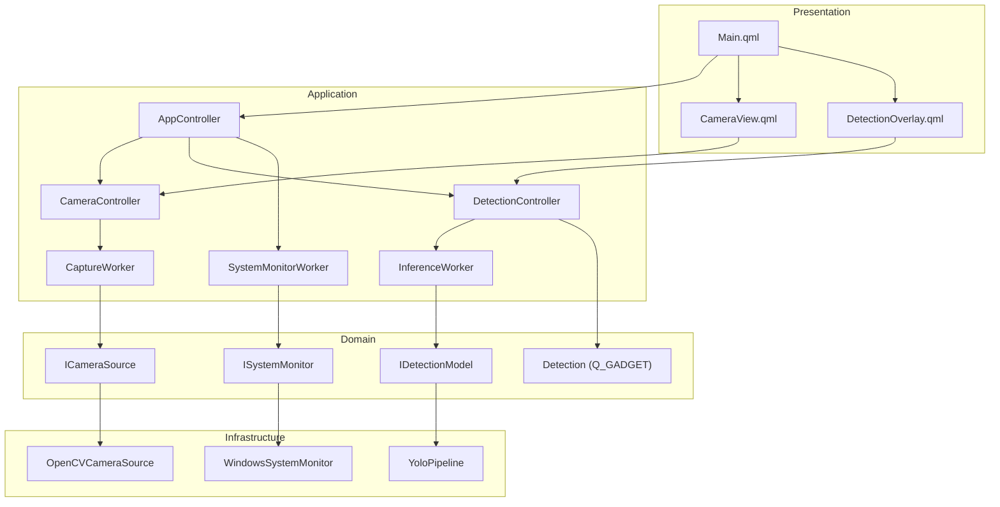

# Clean Architecture — YOLOApp

> **Scope**: This document defines the canonical clean architecture for the **QtOpenCVCamera / YOLOApp** C++/Qt/QML desktop application. It is the single source of truth for structural decisions, layer boundaries, dependency rules, and feature organization.

---

## 1. Philosophy & Goals

| Principle | Rationale |
|:----------|:----------|
| **Dependency inversion** | Inner layers (domain) never depend on outer layers (infrastructure, UI). Interfaces always point inward. |
| **Separation of concerns** | AI pipeline, camera hardware, UI rendering, and system metrics are completely isolated from each other. |
| **Testability** | Business logic lives in pure C++ classes with no Qt/OpenCV coupling, enabling unit tests without a running application. |
| **Feature cohesion** | Code is organized by **feature** (detection, camera, monitoring), not by technical type (controllers, models, views). Each feature folder is a self-contained vertical slice. |
| **Performance preservation** | The architecture adds no runtime overhead. Interfaces and strategy patterns are resolved at compile/link time wherever possible. |

---

## 2. Layer Model

The application is organized into four concentric layers. Dependencies flow strictly **inward** (outer → inner). No inner layer may import from an outer layer.

```
┌────────────────────────────────────────────────────────────────┐
│                     PRESENTATION LAYER                         │
│          QML Files · QQuickItem · Q_PROPERTY bindings          │
│             (features/*/ui/*.qml, features/*/ui/*.h)           │
├────────────────────────────────────────────────────────────────┤
│                    APPLICATION LAYER                           │
│     Qt controllers (QObject) · Worker threads · Mediators      │
│      (features/*/application/*.h, features/*/application/*.cpp)│
├────────────────────────────────────────────────────────────────┤
│                      DOMAIN LAYER                              │
│   Pure C++ interfaces, data structs, business rules / models   │
│        (features/*/domain/*.h, shared/domain/*.h)              │
├────────────────────────────────────────────────────────────────┤
│                  INFRASTRUCTURE LAYER                          │
│  OpenCV · ONNX Runtime · OpenVINO · PDH/PSAPI · QVideoSink    │
│   (features/*/infrastructure/*.h, features/*/infrastructure/*.cpp) │
└────────────────────────────────────────────────────────────────┘
```

### Layer Contracts

| Layer | May import from | Must NOT import from |
|:------|:----------------|:---------------------|
| **Presentation** | Application, Domain | Infrastructure directly |
| **Application** | Domain, Infrastructure (via interface) | Presentation |
| **Domain** | Nothing external | Application, Infrastructure, Presentation |
| **Infrastructure** | Domain (interfaces/types only) | Application, Presentation |

---

## 3. Feature-First Project Structure

Each top-level folder under `src/features/` is a self-contained **feature module** that owns its own domain model, application logic, infrastructure adapter, and UI bridge.

```
app/
├── CMakeLists.txt
├── src/
│   ├── main.cpp                        # Entry point — wires QML engine only
│   │
│   ├── features/                       # Feature modules (vertical slices)
│   │   │
│   │   ├── detection/                  # ── DETECTION FEATURE ──────────────
│   │   │   ├── domain/
│   │   │   │   ├── Detection.h         # Q_GADGET value type (normalized coords)
│   │   │   │   ├── DetectionResult.h   # Pure-C++ raw inference result (replaces DL_RESULT)
│   │   │   │   ├── InferenceConfig.h   # Init params (replaces DL_INIT_PARAM)
│   │   │   │   ├── InferenceTiming.h   # Per-phase timing struct
│   │   │   │   ├── TaskType.h          # Enum: Detect / Pose / Segment
│   │   │   │   └── IDetectionModel.h   # Interface: runDetection(frame) → results
│   │   │   │
│   │   │   ├── application/
│   │   │   │   ├── InferenceWorker.h   # QObject worker, lives on inference thread
│   │   │   │   ├── InferenceWorker.cpp
│   │   │   │   ├── DetectionController.h  # QML_ELEMENT, exposes detections/timing/runtime
│   │   │   │   └── DetectionController.cpp
│   │   │   │
│   │   │   ├── infrastructure/
│   │   │   │   ├── IInferenceBackend.h    # Strategy interface (pure C++)
│   │   │   │   ├── OnnxRuntimeBackend.h
│   │   │   │   ├── OnnxRuntimeBackend.cpp
│   │   │   │   ├── OpenVinoBackend.h
│   │   │   │   ├── OpenVinoBackend.cpp
│   │   │   │   ├── YoloPipeline.h         # Facade: preprocess → infer → postprocess
│   │   │   │   ├── YoloPipeline.cpp
│   │   │   │   ├── PreProcessor.h
│   │   │   │   ├── PreProcessor.cpp
│   │   │   │   ├── PostProcessor.h        # IPostProcessor + concrete strategies
│   │   │   │   ├── PostProcessor.cpp
│   │   │   │   └── SimdUtils.h            # SSE4.1 intrinsics (header-only)
│   │   │   │
│   │   │   └── ui/
│   │   │       ├── DetectionListModel.h   # QAbstractListModel bridge
│   │   │       ├── DetectionListModel.cpp
│   │   │       ├── DetectionOverlayItem.h # QQuickItem Scene Graph renderer
│   │   │       └── DetectionOverlayItem.cpp
│   │   │
│   │   ├── camera/                     # ── CAMERA FEATURE ─────────────────
│   │   │   ├── domain/
│   │   │   │   ├── CameraConfig.h      # Resolution, codec, FPS preferences
│   │   │   │   ├── CameraFrame.h       # Value type wrapping shared_ptr<cv::Mat>
│   │   │   │   └── ICameraSource.h     # Interface: open/close/nextFrame()
│   │   │   │
│   │   │   ├── application/
│   │   │   │   ├── CaptureWorker.h     # QObject worker, lives on capture thread
│   │   │   │   ├── CaptureWorker.cpp
│   │   │   │   ├── CameraController.h  # QML_ELEMENT: fps, resolution, videoSink
│   │   │   │   └── CameraController.cpp
│   │   │   │
│   │   │   ├── infrastructure/
│   │   │   │   ├── OpenCVCameraSource.h   # ICameraSource → cv::VideoCapture
│   │   │   │   └── OpenCVCameraSource.cpp
│   │   │   │
│   │   │   └── ui/
│   │   │       └── ResolutionModel.h      # QAbstractListModel for resolution picker
│   │   │
│   │   └── monitoring/                 # ── MONITORING FEATURE ──────────────
│   │       ├── domain/
│   │       │   ├── SystemStats.h       # Value type: cpuPercent, sysMem, procMem
│   │       │   └── ISystemMonitor.h    # Interface: startMonitoring / stopMonitoring
│   │       │
│   │       ├── application/
│   │       │   ├── SystemMonitorWorker.h    # QObject worker, lives on monitor thread
│   │       │   └── SystemMonitorWorker.cpp
│   │       │
│   │       └── infrastructure/
│   │           ├── WindowsSystemMonitor.h   # PDH + PSAPI implementation
│   │           ├── WindowsSystemMonitor.cpp
│   │           ├── LinuxSystemMonitor.h     # /proc implementation
│   │           └── LinuxSystemMonitor.cpp
│   │
│   └── shared/                         # Cross-cutting, no feature affiliation
│       ├── domain/
│       │   └── AppConfig.h             # Compile-time constants (frame/model dims)
│       └── application/
│           └── AppController.h         # Root QML_ELEMENT orchestrating features
│           └── AppController.cpp
│
└── content/                            # QML UI files
    ├── Main.qml                        # Root window, feature composition
    ├── features/
    │   ├── detection/
    │   │   ├── DetectionHud.qml        # Pre/inference/post timing display
    │   │   └── DetectionOverlay.qml    # Bounding box + label compositing
    │   ├── camera/
    │   │   ├── CameraView.qml          # VideoOutput + overlay composition
    │   │   └── ResolutionPicker.qml    # Custom dropdown for resolution
    │   └── monitoring/
    │       └── SystemHud.qml           # CPU/RAM display
    └── shared/
        ├── components/
        │   ├── CustomDropdown.qml      # Reusable dropdown component
        │   └── MetricBadge.qml         # Reusable stat pill
        └── theme/
            └── Theme.qml              # Color tokens, typography, spacing
```

---

## 4. Layer Detail: Domain

The Domain layer contains **no framework dependencies**. Every class is a plain C++ struct or pure-virtual interface.

### 4.1 Detection Domain

```cpp
// features/detection/domain/DetectionResult.h
// Raw inference result in pixel-space (replaces DL_RESULT)
struct DetectionResult {
    int        classId;
    float      confidence;
    cv::Rect   box;
    std::vector<cv::Point2f> keyPoints;  // pose
    cv::Mat    boxMask;                  // segmentation
};

// features/detection/domain/Detection.h
// Normalized [0,1] coordinate value-type for QML (Q_GADGET)
struct Detection {
    Q_GADGET
    Q_PROPERTY(int classId ...)
    Q_PROPERTY(float confidence ...)
    Q_PROPERTY(QString label ...)
    Q_PROPERTY(float x ...)
    Q_PROPERTY(float y ...)
    Q_PROPERTY(float w ...)
    Q_PROPERTY(float h ...)
    Q_PROPERTY(QList<QPointF> keyPoints ...)
};

// features/detection/domain/IDetectionModel.h
// Pure interface — infrastructure implements, application consumes
class IDetectionModel {
public:
    virtual ~IDetectionModel() = default;
    virtual const char* createSession(const InferenceConfig& config) = 0;
    virtual char* runDetection(const cv::Mat& frame,
                               std::vector<DetectionResult>& results,
                               InferenceTiming& timing) = 0;
    virtual const std::vector<std::string>& classNames() const = 0;
    virtual void warmUp() = 0;
};
```

### 4.2 Camera Domain

```cpp
// features/camera/domain/ICameraSource.h
class ICameraSource {
public:
    virtual ~ICameraSource() = default;
    virtual bool open(const CameraConfig& config) = 0;
    virtual void close() = 0;
    virtual bool readFrame(cv::Mat& outFrame) = 0;
    virtual QSize currentResolution() const = 0;
};
```

### 4.3 Monitoring Domain

```cpp
// features/monitoring/domain/ISystemMonitor.h
class ISystemMonitor {
public:
    virtual ~ISystemMonitor() = default;
    virtual void initialize() = 0;
    virtual void cleanup() = 0;
    virtual SystemStats poll() = 0;
};
```

---

## 5. Layer Detail: Infrastructure

Infrastructure classes implement domain interfaces using concrete third-party libraries. They **inject dependencies** (via constructor or factory) into Application layer workers.

### 5.1 Inference Infrastructure

```
IDetectionModel  ←  YoloPipeline
                         │
              ┌──────────┴──────────┐
              │                     │
    IInferenceBackend       IPostProcessor
              │                     │
    ┌─────────┴──────┐    ┌─────────┴──────────────────┐
    │                │    │          │                   │
 OnnxRuntime   OpenVINO  Detect   Pose           Segmentation
 Backend       Backend   PostProcessor PostProcessor PostProcessor
```

### 5.2 Camera Infrastructure

`OpenCVCameraSource` adapts `cv::VideoCapture` to `ICameraSource`. It owns the 3-frame ring buffer and double-buffered `QVideoFrame` allocation, keeping all OpenCV coupling inside the infrastructure layer.

### 5.3 Monitoring Infrastructure

Platform-specific implementations are selected at compile time via `#ifdef` or CMake target selection — the `ISystemMonitor` interface is always the same regardless of host OS.

---

## 6. Layer Detail: Application

Application layer classes are the only ones allowed to own `QObject`, `QThread`, and Qt cross-thread plumbing. Workers coordinate infrastructure + domain; Controllers expose state to QML.

### 6.1 Threading Model

```
┌─────────────────────────────────────────────────────────┐
│  Main Thread (Qt Event Loop / GUI)                       │
│  AppController · CameraController · DetectionController  │
│  DetectionListModel · DetectionOverlayItem               │
│  Constraint: never block > 16 ms                         │
└────────┬───────────────────┬──────────────────┬──────────┘
         │ QueuedConnection  │ QueuedConnection  │ QueuedConnection
    ┌────▼────────┐   ┌──────▼──────┐   ┌───────▼──────┐
    │CaptureWorker│   │InferenceWork│   │SystemMonitor │
    │ (Normal P.) │   │er (High P.) │   │Worker (Low P)│
    │             │   │             │   │              │
    │ OpenCV      │   │ YoloPipeline│   │ PDH/PSAPI    │
    │ VideoCapture│   │ OnnxRuntime │   │ /proc        │
    └─────────────┘   └─────────────┘   └──────────────┘
```

### 6.2 AppController

`AppController` is the single root `QML_ELEMENT`. It:
- Holds and owns `CameraController` and `DetectionController` as properties.
- Wires the `CaptureWorker::frameReady` signal to `InferenceWorker::processFrame`.
- Wires `InferenceWorker::detectionsReady` to `DetectionController::updateDetections`.
- Manages shared `QThread` lifetimes.

This removes the "god class" burden from the current `VideoController`.

### 6.3 CameraController

Exposes to QML:
- `videoSink` (write-once, triggers worker startup)
- `fps` (double, updated from CaptureWorker)
- `currentResolution` (QSize, R/W)
- `supportedResolutions` (QVariantList)

### 6.4 DetectionController

Exposes to QML:
- `detections` (QObject* → DetectionListModel)
- `currentTask` (TaskType enum)
- `currentRuntime` (RuntimeType enum)
- `preProcessTime`, `inferenceTime`, `postProcessTime` (double, ms)
- `inferenceFps` (double)

---

## 7. Layer Detail: Presentation

The QML layer reads Controller properties and never contains logic. All computations happen in C++.

### 7.1 QML Composition Strategy

```qml
// Main.qml
Window {
    AppController { id: app }

    CameraView {
        cameraController: app.camera
        detectionController: app.detection
    }

    Column {  // HUD overlay
        DetectionHud { controller: app.detection }
        SystemHud    { controller: app.monitoring }
    }
}
```

### 7.2 QML–C++ Boundary Rules

| What | Where |
|:-----|:------|
| Color constants / theming | `shared/theme/Theme.qml` |
| Reusable atomic widgets | `shared/components/` |
| Feature-specific composites | `features/<name>/` QML folder |
| Business logic | **Never in QML** — always C++ domain/application |

---

## 8. Dependency Graph (Cross-Feature)



---

## 9. Inter-Feature Communication

Features communicate exclusively through the **Application layer**. No feature's domain or infrastructure may import from another feature's domain or infrastructure.

```
camera::CaptureWorker  ──frameReady()──►  detection::InferenceWorker
                                               (wired by AppController)

detection::InferenceWorker  ──detectionsReady()──►  detection::DetectionController
                                                     ──latestDetectionsReady()──►  camera::CaptureWorker
                                                             (for on-frame overlay blending)
```

All cross-feature signals are wired inside `AppController::setupPipeline()` using `Qt::QueuedConnection`.

---

## 10. Design Patterns Inventory

| Pattern | Location | Purpose |
|:--------|:---------|:--------|
| **Strategy** | `IInferenceBackend` → `OnnxRuntimeBackend` / `OpenVinoBackend` | Swap inference runtime without touching pipeline |
| **Strategy** | `IPostProcessor` → `DetectionPostProcessor` / `PosePostProcessor` / `SegmentationPostProcessor` | Task-specific post-processing |
| **Facade** | `YoloPipeline` | Single entry point for pre→infer→post pipeline |
| **Template Method** | `IPostProcessor::PostProcess` | Skeleton algorithm with task-specific overrides |
| **Factory** | `YoloPipeline::CreateSession` | Selects backend + post-processor based on `InferenceConfig` |
| **Observer / Reactive** | Qt signals/slots across threads | Decoupled event propagation without shared state |
| **Repository / Model** | `DetectionListModel` | Normalizes and serves detection data to QML |
| **Worker Thread** | `CaptureWorker`, `InferenceWorker`, `SystemMonitorWorker` | Offload blocking ops from GUI thread |
| **Adapter** | `OpenCVCameraSource` | Adapts `cv::VideoCapture` to `ICameraSource` |
| **Value Object** | `Detection`, `SystemStats`, `CameraFrame` | Immutable data carriers with no behavior |

---

## 11. Key Architectural Rules (Enforced)

1. **No `#include` of Qt headers inside `domain/`** — domain is framework-agnostic.
2. **No `cv::Mat` or ONNX types inside `application/`** — only domain types cross this boundary.
3. **No business logic in QML** — controllers expose computed properties only.
4. **Workers never access `QGuiApplication`** — all GUI interactions go through signals to the main thread.
5. **`AppConfig.h` is the only global constant header** — no magic numbers scattered in code.
6. **One `QML_ELEMENT` per Controller** — each feature exposes exactly one root QML element.
7. **`shared/` has no feature dependencies** — it is a true leaf with zero upstream imports.

---

## 12. File → Responsibility Map

| File | Layer | Responsibility |
|:-----|:------|:---------------|
| `features/detection/domain/IDetectionModel.h` | Domain | Contract for any YOLO-compatible model |
| `features/detection/domain/Detection.h` | Domain | Normalized, QML-safe detection value object |
| `features/detection/infrastructure/YoloPipeline.h` | Infrastructure | Facade orchestrating ONNX/OpenVINO inference |
| `features/detection/infrastructure/OnnxRuntimeBackend.h` | Infrastructure | ONNX Runtime session pool + inference |
| `features/detection/infrastructure/OpenVinoBackend.h` | Infrastructure | OpenVINO compiled model + infer request |
| `features/detection/application/InferenceWorker.h` | Application | Thread worker: receives frames → runs pipeline |
| `features/detection/application/DetectionController.h` | Application | QML_ELEMENT: exposes task/runtime/timing/detections |
| `features/detection/ui/DetectionListModel.h` | Presentation | QAbstractListModel bridging detections to QML |
| `features/detection/ui/DetectionOverlayItem.h` | Presentation | QQuickItem scene-graph bounding box renderer |
| `features/camera/domain/ICameraSource.h` | Domain | Contract for any camera hardware adapter |
| `features/camera/infrastructure/OpenCVCameraSource.h` | Infrastructure | OpenCV VideoCapture + ring buffer |
| `features/camera/application/CaptureWorker.h` | Application | Thread worker: captures frames → feeds inference |
| `features/camera/application/CameraController.h` | Application | QML_ELEMENT: exposes fps/resolution/videoSink |
| `features/monitoring/domain/ISystemMonitor.h` | Domain | Contract for platform resource polling |
| `features/monitoring/infrastructure/WindowsSystemMonitor.h` | Infrastructure | PDH CPU + PSAPI memory |
| `features/monitoring/application/SystemMonitorWorker.h` | Application | Timer-driven worker emitting SystemStats |
| `shared/application/AppController.h` | Application | Root orchestrator: wires all feature controllers |
| `shared/domain/AppConfig.h` | Domain | Compile-time constants (frame size, model dims) |
| `content/Main.qml` | Presentation | Root QML window |

---

## 13. Glossary

| Term | Definition |
|:-----|:-----------|
| **Feature module** | A vertical slice of functionality owning domain, application, infrastructure, and UI sub-layers |
| **Domain** | Pure C++ layer: interfaces, value objects, business rules; no framework dependencies |
| **Application** | Qt layer: QObject workers, controllers, thread management; orchestrates domain + infrastructure |
| **Infrastructure** | Third-party adapters: OpenCV, ONNX Runtime, OpenVINO, PDH/PSAPI |
| **Presentation** | QML files + QQuickItem/QAbstractListModel bridges; reads controller properties only |
| **Controller** | A `QML_ELEMENT` QObject exposing feature state as Qt properties to the QML layer |
| **Worker** | A `QObject` designed to live on a background `QThread`; performs blocking I/O or computation |
| **Strategy** | A polymorphic algorithm family selectable at runtime via a shared interface |
| **Facade** | A simplified front-end to a complex subsystem (e.g., `YoloPipeline`) |
