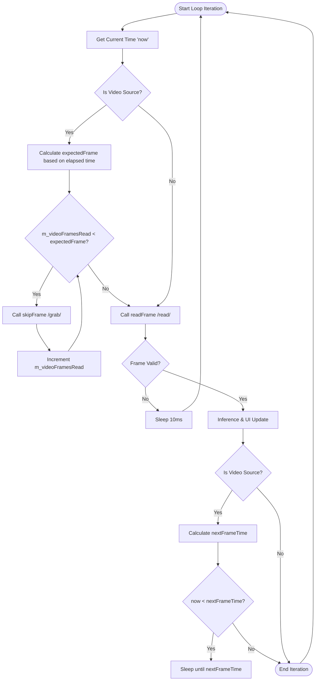

# Feature: Frame Synchronization & Real-Time Playback

**Created**: 2026-05-03 10:22 (UTC+7)
**Last Modified**: 2026-05-03 10:30 (UTC+7)

> **Scope**: This document defines the strategy for ensuring video file playback stays synchronized with the wall clock ("Real-Time"), even when computationally expensive inference takes longer than the video's native frame duration.

---

## 1. Problem Statement

In the initial implementation, the `CaptureWorker` processed video frames sequentially. If inference took 50ms per frame on a 30 FPS video (where each frame should last ~33.3ms), the application would still process every single frame. 

**Symptoms**:
- The video appears to play in "slow motion."
- The time displayed/perceived in the app drifts significantly from the actual video duration.
- CPU/GPU bottlenecks directly cause playback lag.

To achieve a "synced" experience, the application must prioritize **temporal accuracy** over **frame completeness** for video files, similar to how live camera streams naturally drop frames when the processing pipeline is full.

---

## 2. Architecture Strategy: Wall-Clock Synchronization

The core principle is to treat the video file as a "virtual live stream." Instead of asking "what is the next frame?", we ask "which frame should be visible *right now* based on how much time has passed since we started?".

### Key Metrics
- **`m_videoStartTime`**: The high-resolution timestamp when the first frame of the video session was read.
- **`m_videoFramesRead`**: A persistent counter of how many frames have been advanced in the stream (including skipped ones).
- **`nativeFps`**: The video's metadata-reported frame rate.
- **`expectedFrame`**: Calculated as `(currentTime - startTime) * nativeFps`.

---

## 3. Visualization of Sync Logic

The following diagram illustrates how the `CaptureWorker` handles each iteration to maintain synchronization:



---

## 4. Technical Implementation

### 4.1 Frame Skipping via `grab()`

When `expectedFrame > m_videoFramesRead`, the worker enters a catch-up phase.

**Why `grab()` instead of `read()`?**
- `cv::VideoCapture::read()` is a combination of `grab()` and `retrieve()`.
- `grab()` decodes only the bitstream headers to find the next frame start; it does **not** decompress the image data into a `cv::Mat`.
- `retrieve()` performs the actual image decompression (YUV to BGR, etc.), which is the most CPU-intensive part of decoding.
- By using `grab()` for skipping, we can advance the stream at roughly 5x-10x the speed of full decoding.

### 4.2 Pacing (Throttle) for Fast Processing

If inference is extremely fast (e.g., 5ms on a 30 FPS video), the app would play the video at 200 FPS. To prevent this, we calculate the absolute timestamp when the *next* frame is due:

```cpp
int64_t nextFrameTime = (m_videoFramesRead) * 1000.0 / nativeFps;
if (elapsed < nextFrameTime) {
    QThread::msleep(nextFrameTime - elapsed);
}
```

This creates a self-correcting loop that handles both lag (via skipping) and speed (via sleeping).

---

## 5. Layer Changes

### Infrastructure (`OpenCVVideoFileSource`)
- Implements `skipFrame()` using `m_capture.grab()`.
- Exposes `frameCount()` to allow the worker to detect end-of-file and reset sync timers for looping.

### Application (`CaptureWorker`)
- Holds the state for `m_videoStartTime` and `m_videoFramesRead`.
- Resets sync state in `openSource()` and whenever a loop is detected (when `m_videoFramesRead` reaches `frameCount`).

---

## 6. Edge Cases & Mitigations

| Case | Mitigation |
|:-----|:-----------|
| **Massive Catch-up** | If the app is suspended or frozen for seconds, `expectedFrame` might jump by 100+. The `while` loop will execute `grab()` 100 times. This is fast but visible as a "jump" in the video. |
| **End of File / Looping** | When `readFrame` loops the video internally, the `CaptureWorker` resets its internal `m_videoStartTime` to the current time, ensuring the sync math starts fresh for the new loop. |
| **System Clock Jitter** | Using `high_resolution_clock` minimizes jitter compared to `system_clock`. |
