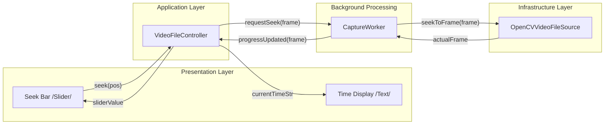
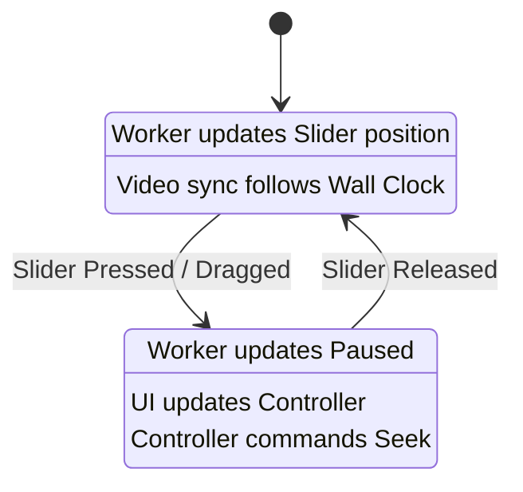
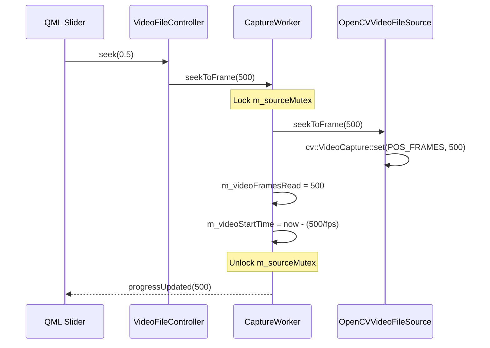

# Feature: Video Playback Controls (Playtime Bar)

**Created**: 2026-05-03 10:48 (UTC+7)
**Last Modified**: 2026-05-03 10:51 (UTC+7)

> **Scope**: This document outlines the architecture and implementation plan for adding a interactive playtime bar (seek bar) and time status (Current/Total) for the **Video File** input mode.

---

## 1. Component Architecture

The following diagram illustrates the decoupled relationship between the UI layer, the logical controllers, and the background processing worker.



---

## 2. Problem Statement

While video files play in real-time, the user lacks visibility into the current playback position and has no way to jump to a specific part of the video. To improve UX, we need a standard "Video Player" control bar that:
1. Displays the current playback time (MM:SS).
2. Displays the total duration (MM:SS).
3. Provides a seek bar (slider) that moves with the video.
4. Allows the user to click/drag the seek bar to jump to a specific timestamp.

---

## 3. Architecture Strategy

We will extend the existing `VideoFileController` and `CaptureWorker` to handle bidirectional time updates.

### State Management: Playback vs Seeking
To prevent the UI slider from "fighting" the user's mouse while dragging, we implement a state-aware update logic.



---

## 4. Technical Implementation

### 4.1 Domain Extensions (`ICaptureSource`)
Add methods to query and modify frame position:
```cpp
virtual int64_t currentFrameIndex() const { return -1; }
virtual bool seekToFrame(int64_t frameIndex) { return false; }
```

### 4.2 Application Layer: Sync Recovery

When a seek is performed, the wall-clock synchronization timer must be shifted. If we jump from frame 100 to frame 500, we must "convince" the sync logic that 500 frames worth of time have already elapsed since the start.

**Sync Adjustment Formula**:
`m_videoStartTime = now() - (m_videoFramesRead / nativeFps)`

---

## 5. Visualization of Seeking Sync

The sequence of operations during a user-initiated seek:



---

## 6. Implementation Plan

| Step | Task | Files |
|:-----|:-----|:------|
| 1 | Add `currentFrameIndex()` and `seekToFrame()` to `ICaptureSource` | `ICaptureSource.h` |
| 2 | Implement `seekToFrame` in `OpenCVVideoFileSource` | `OpenCVVideoFileSource.cpp` |
| 3 | Add `seekToFrame` slot to `CaptureWorker` + Sync Reset Logic | `CaptureWorker.h/.cpp` |
| 4 | Add time/frame properties and formatting to `VideoFileController` | `VideoFileController.h/.cpp` |
| 5 | Update `AppController` to wire `VideoFileController` progress signals | `AppController.cpp` |
| 6 | Implement the Slider UI in `Main.qml` with custom styling | `Main.qml` |

---

## 7. Edge Cases & Mitigations

| Case | Mitigation |
|:-----|:-----------|
| **Seek while Inference is running** | The `m_sourceMutex` ensures we don't seek while `readFrame` is in progress. |
| **Seek past EOF** | `seekToFrame` should clamp input to `[0, frameCount - 1]`. |
| **Inaccurate Seek (OpenCV limitation)** | Some codecs only seek to I-frames. `readFrame` might return a slightly different frame than requested. We update `m_videoFramesRead` based on the *actual* frame index after seeking. |
| **Slider Jitter** | Use a "isUserSeeking" flag to prevent the worker's progress updates from fighting with the user's manual dragging. |
