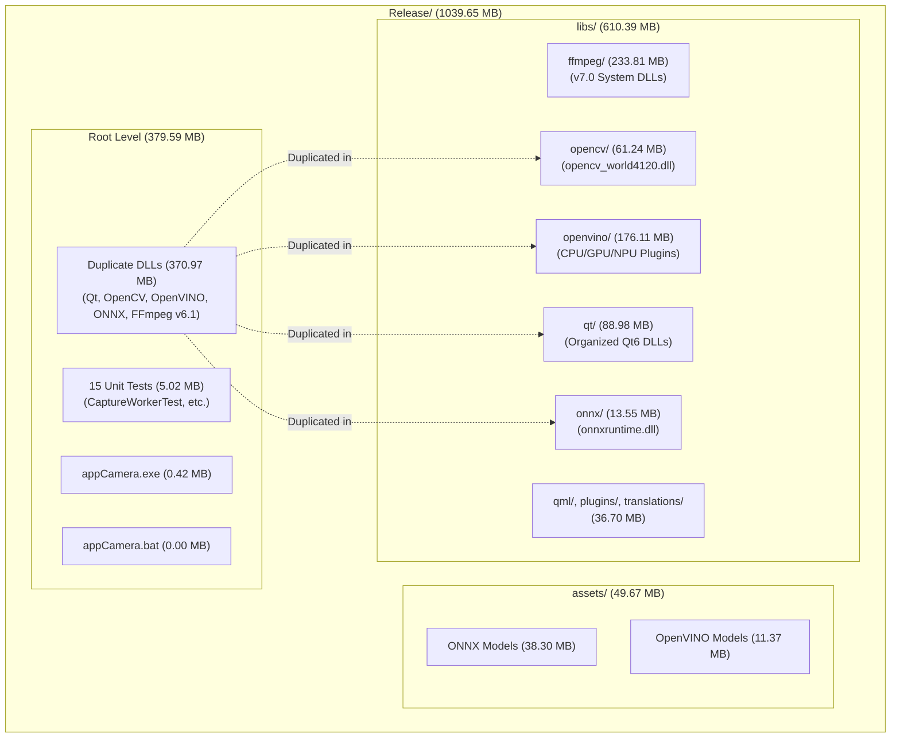

# 8. Release Build Size Analysis

## Status: COMPLETED
**Last Modified**: 2026-05-24 14:55 (UTC+7)

## Executive Summary

The `app/build/Release` folder currently occupies **1039.65 MB (approx. 1.02 GiB)**. A thorough investigation reveals that this bloated size is driven by two main factors:
1. **Redundant DLL Duplication**: Visual Studio post-build copy commands for unit tests copy shared libraries directly to the root of `build/Release/`, while the deployment script (`deploy.sh`) organizes them into the `libs/` subdirectory.
2. **Dual-Versioned FFmpeg Conflict**: The release bundles both FFmpeg v6.1 (deployed by Qt Multimedia/windeployqt) and FFmpeg v7.0 (copied by `deploy.sh` from the system's `C:/ffmpeg` folder), resulting in **270.6 MB** of media library footprint.

---

## Release Size Distribution

The space within the release folder is distributed as follows:

| Category | Component | Path | Size (MB) | Share (%) |
| :--- | :--- | :--- | :--- | :--- |
| **Organized Libs** | FFmpeg v7.0 (System) | `libs/ffmpeg/` | 233.81 MB | 22.5% |
| | OpenVINO Runtime | `libs/openvino/` | 176.11 MB | 16.9% |
| | Qt6 Framework | `libs/qt/` | 88.98 MB | 8.6% |
| | OpenCV World | `libs/opencv/` | 61.24 MB | 5.9% |
| | ONNX Runtime | `libs/onnx/` | 13.55 MB | 1.3% |
| | Other Qt plugins & QML modules | `libs/qml/`, `libs/plugins/`, etc. | 36.70 MB | 3.5% |
| **Root DLLs** | Duplicate DLLs (Qt, OpenCV, ONNX, OpenVINO) | `Release/*.dll` | 370.97 MB | 35.7% |
| **Assets** | Model files (ONNX, OpenVINO IR formats) | `Release/assets/` | 49.67 MB | 4.8% |
| **Testing** | 15 Unit Test executables | `Release/*Test.exe` | 5.02 MB | 0.5% |
| **Other** | Executables, launcher script, map files | `Release/*` | 3.60 MB | 0.3% |
| **Total** | **All Release Files** | `Release/` | **1039.65 MB** | **100.0%** |

### Footprint Visualization

The following diagram illustrates how the build footprint is organized and where the redundancy lies:

---

## Detailed Analysis of Key Size Drivers

### 1. The Redundant Root DLLs (370.97 MB)
In `app/tests/CMakeLists.txt`, the helper function `yolo_add_test(TEST_NAME)` contains a post-build custom command for Windows. This command copies:
- `opencv_world4120.dll` (61.24 MB)
- All main Qt6 DLLs (~40 MB)
- `onnxruntime.dll` & its providers (13.55 MB)
- All OpenVINO and TBB DLLs (~176 MB)

These are copied directly to the directory of the test executables, which is `build/Release/`. 
Since `deploy.sh` also copies these DLLs and organizes them into `libs/`, the same DLLs exist **twice** on disk: once at the root level of `Release/` (to allow tests to run without `libs/` subfolders in their path) and once inside `libs/` (for organized app distribution).

### 2. Dual-Versioned FFmpeg Clash (270.6 MB)
The codebase links to two different versions of FFmpeg simultaneously:
* **Qt Multimedia FFmpeg (v6.1)**: Qt 6.8.3 ships with FFmpeg 6.1 built-in. When `windeployqt` runs, it places Qt's FFmpeg v6.1 DLLs (`avcodec-61.dll`, `avformat-61.dll`, `avutil-59.dll`, `swscale-8.dll`, `swresample-5.dll`) directly under `Release/libs/`. Test targets also copy them to the root. This accounts for **18.4 MB** in `Release/` and **18.4 MB** in `Release/libs/` (total **36.8 MB**).
* **System FFmpeg (v7.0)**: In `deploy.sh`, system DLLs are copied from `C:/ffmpeg/bin/` into `Release/libs/ffmpeg/`. On this system, it copies v7.0 DLLs (`avcodec-62.dll`, `avfilter-11.dll`, etc.), occupying **233.81 MB** of disk space (with `avfilter-11.dll` alone taking 105.4 MB and `avcodec-62.dll` taking 97.3 MB).

Linking and deploying both sets of FFmpeg binaries creates a massive, unnecessary footprint.

### 3. OpenVINO Plugin Suite (176.11 MB)
OpenVINO's distribution is modular but heavy. The plugins copied include:
- `openvino_intel_npu_compiler.dll` (69.55 MB): Compiler for Intel NPUs.
- `openvino_intel_cpu_plugin.dll` (40.94 MB): Plugin for CPU inference.
- `openvino_intel_gpu_plugin.dll` (30.58 MB): Plugin for GPU inference.
- Frontend engines for unused frameworks: PyTorch (2.47 MB), TensorFlow (3.84 MB), PaddlePaddle (1.42 MB), and TFLite (1.12 MB).

Since the application only runs YOLO models (typically ONNX or OpenVINO IR formats), many of these frontends and hardware compilers are unused in standard deployments.

---

## Actionable Optimization Recommendations

To shrink the release package size down to **under 350 MB** (a ~65% reduction), we can implement the following strategy:

### Phase 1: Separate Testing Output (Cleans Root Level)
* **Action**: Modify `app/tests/CMakeLists.txt` to place test executables into a separate subfolder, e.g. `build/Release/tests/`.
* **Impact**: Moves all 15 test executables and their required root DLLs out of the main deployment folder. This immediately removes **375.99 MB** from the distribution root.

### Phase 2: Consolidate FFmpeg Dependencies
* **Action**: Rely on a single FFmpeg version. 
  - If we compile our native FFmpeg code against the same FFmpeg version that Qt 6.8.3 uses (FFmpeg v6.1 / `avcodec-61.dll`), we can completely remove the `libs/ffmpeg/` folder from the deployment script.
  - Alternatively, if FFmpeg v7 is required, we must compile Qt with FFmpeg v7 support and share the DLLs.
* **Impact**: Eliminating the secondary system FFmpeg folder (`libs/ffmpeg/`) saves **233.81 MB**.

### Phase 3: Prune Unused OpenVINO Components
* **Action**: Modify `deploy.sh` to copy only the required OpenVINO plugins.
  - Exclude PyTorch, TensorFlow, Paddle, and TFLite frontends if they are not used for runtime model format parsing.
  - Exclude NPU compiler DLLs (`openvino_intel_npu_compiler.dll`) unless targeting NPU hardware execution.
* **Impact**: Saves **~85 MB** of unused binaries.

### Phase 4: Final Package Cleanup Script
* **Action**: Add a packaging cleanup step at the end of `deploy.sh` to remove any duplicate files remaining at the root of `Release/` (such as `opengl32sw.dll` or `dxcompiler.dll` if software fallback is not required).
