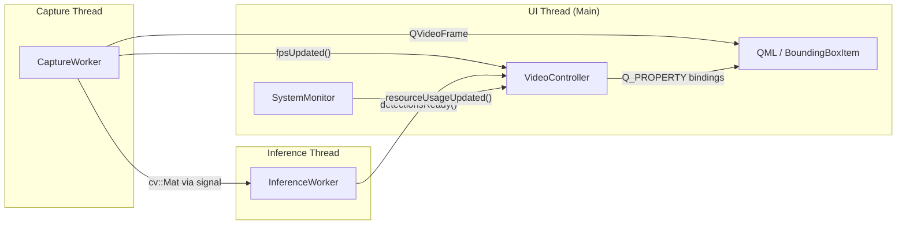
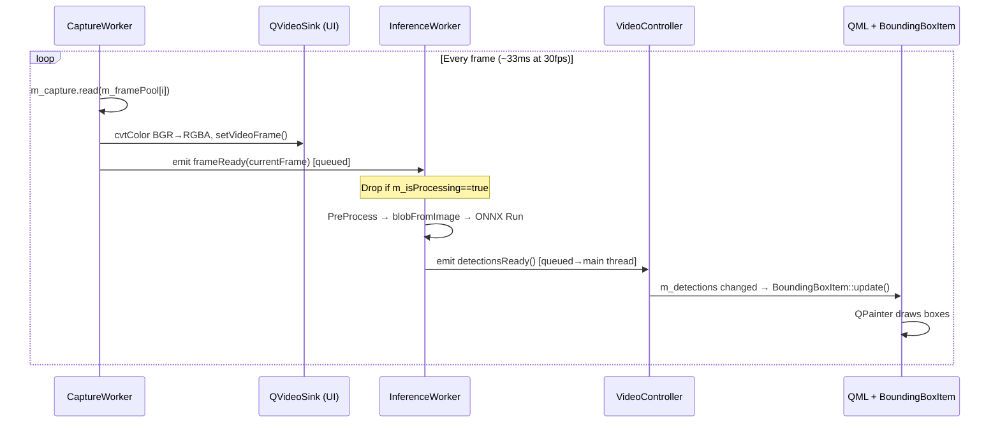

# 🏗️ System Architect — Architecture Evaluation & Performance Analysis

## 1. Current Architecture Overview

The application follows a **3-thread pipeline** architecture for real-time YOLO object detection:



### Data Flow (per frame)



---

## 2. What's Already Done Well ✅

| Area | Implementation | Rating |
|---|---|---|
| **Thread separation** | Capture and inference on dedicated `QThread`s | ⭐⭐⭐⭐ |
| **Frame dropping** | `m_isProcessing` atomic guard in InferenceWorker | ⭐⭐⭐⭐ |
| **Ring buffer** | 3-buffer `m_framePool` avoids clone per frame | ⭐⭐⭐⭐ |
| **Reusable buffers** | `m_letterboxBuffer`, `m_commonBlob` in inference | ⭐⭐⭐⭐ |
| **Compiler flags** | `-O3 -march=native -ffast-math` for MinGW | ⭐⭐⭐ |
| **ONNX session** | Graph optimization `ORT_ENABLE_ALL`, warm-up | ⭐⭐⭐⭐ |
| **QML overlay** | `BoundingBoxItem` decoupled from video stream | ⭐⭐⭐ |

---

## 3. Performance Issues & Improvement Recommendations

### 🔴 Issue #1 — `BoundingBoxItem` Uses Software Rendering (QPainter)

**Current**: `BoundingBoxItem.cpp` extends `QQuickPaintedItem` with `setRenderTarget(Image)`, meaning every detection update:
1. Allocates an off-screen `QImage`
2. Draws rectangles via `QPainter` (CPU)
3. Uploads the image to GPU as a texture

**Impact**: High — this is the **hottest path on the UI thread** at every inference cycle.

**Recommendation**: Replace with `QQuickItem` + `QSGNode` (Scene Graph). This renders boxes directly in the GPU render pass with zero CPU image allocation:

```cpp
// Suggested change
class BoundingBoxItem : public QQuickItem
{
    QSGNode *updatePaintNode(QSGNode *, UpdatePaintNodeData *) override;
};
```

> [!IMPORTANT]
> Scene graph rendering is the **single highest-impact change** for UI thread performance.

---

### 🔴 Issue #2 — BGR→RGBA Conversion Runs on Capture Thread (Blocking)

**Current**: In `CaptureWorker::startCapturing()`, every frame does:

```cpp
cv::cvtColor(currentFrame, wrapper, cv::COLOR_BGR2RGBA);  // CPU-intensive
```

This **blocks** the capture loop, reducing the effective capture FPS.

**Impact**: Medium-High — `cvtColor` on 640×480 takes ~0.5–1ms per frame, adding up at 30fps.

**Recommendation**:
- Option A: Use **NV12/YUY2** native camera format and let `QVideoSink` do hardware conversion
- Option B: Move color conversion to a **separate short-lived thread** or use SIMD-accelerated path
- Option C (simplest): Request MJPG output already in RGB from the camera driver if supported

---

### 🟡 Issue #3 — `QVariantList` Detection Serialization Overhead

**Current**: In `updateDetections()`, every inference result is:
1. Wrapped in a `Detection` struct
2. Converted to `QVariant` via `QVariant::fromValue()`
3. Appended to a `QVariantList`
4. Compared element-by-element in `setDetections()`

**Impact**: Medium — `QVariant` boxing involves heap allocation per detection.

**Recommendation**: Use a `QAbstractListModel` subclass instead of `QVariantList`. This:
- Avoids boxing to `QVariant`
- Enables incremental updates (`beginInsertRows` / `dataChanged`)
- Is the canonical Qt pattern for list data→QML

---

### 🟡 Issue #4 — Ring Buffer Safety Is Probabilistic, Not Guaranteed

**Current**: The 3-buffer ring in `CaptureWorker`:

```cpp
cv::Mat m_framePool[3];
int m_poolIndex = 0;
```

The system assumes inference is faster than 100ms, but **there's no synchronization**. If inference spikes, the capture thread silently overwrites data being read by inference.

**Impact**: Latent data corruption risk (rare but catastrophic).

**Recommendation**: Use a lock-free SPSC (Single-Producer Single-Consumer) queue, or add a `std::atomic<int>` ref-count per buffer slot.

---

### 🟡 Issue #5 — `static` Local Variable for Inference FPS

**Current**: In `updateDetections()`:

```cpp
static auto lastTime = std::chrono::steady_clock::now();
```

Using `static` local in a member function is fragile — it won't reset on object destruction/re-creation and is not thread-safe.

**Impact**: Low — correctness issue, not performance.

**Recommendation**: Move `lastTime` to a private member `m_lastInferenceTime`.

---

### 🟢 Issue #6 — No Deferred/Lazy Model Loading

**Current**: `InferenceWorker` begins loading the model immediately on thread start. Model loading + warm-up **blocks the inference thread**, which can contribute to the "PC hangs on startup" issue.

**Impact**: Medium — contributes to startup lag.

**Recommendation**: 
- Use `QTimer::singleShot(0, ...)` to defer model loading until after the event loop starts
- Show a "Loading model..." indicator in QML

---

### 🟢 Issue #7 — `cv::dnn::blobFromImage` Allocates Internally

**Current**: `cv::dnn::blobFromImage` is used for preprocessing. While output is reused, internal normalization can still cause allocations.

**Impact**: Low-Medium — measurable at high inference rates.

**Recommendation**: Replace `blobFromImage` with a manual in-place pipeline.

---

### 🟢 Issue #8 — Hardcoded Resolution in Detection Coordinate Mapping

**Current**: Coordination mapping uses hardcoded 640x480 values.

**Impact**: Correctness — will cause bugs if resolution differs.

**Recommendation**: Pass actual frame dimensions with detection results.

---

### 🟢 Issue #9 — `SystemMonitor` Runs on UI Thread

**Current**: `SystemMonitor` uses a `QTimer` on the main thread.

**Impact**: Low — but on low-end hardware it can cause micro-stutters.

**Recommendation**: Move `SystemMonitor` to its own `QThread`.

---

### 🟢 Issue #10 — `HIGH_PRIORITY_CLASS` Process Priority

**Current**: `SetPriorityClass(process, HIGH_PRIORITY_CLASS)` is used.

**Impact**: Low — can starve other system processes.

**Recommendation**: Set **thread priority** on the inference thread instead of process-level priority.

---

## 4. Priority Matrix

| # | Issue | Impact | Effort | Priority |
|---|---|---|---|---|
| 1 | QPainter → QSGNode rendering | 🔴 High | Medium | **P0** |
| 2 | BGR→RGBA blocking capture | 🔴 High | Low-Medium | **P0** |
| 4 | Ring buffer no sync | 🟡 Medium | Low | **P1** |
| 3 | QVariantList → QAbstractListModel | 🟡 Medium | Medium | **P1** |
| 6 | Blocking model load on startup | 🟡 Medium | Low | **P1** |
| 8 | Hardcoded 640×480 | 🟡 Medium | Low | **P1** |
| 10 | HIGH_PRIORITY_CLASS | 🟢 Low | Trivial | **P2** |
| 5 | Static local FPS variable | 🟢 Low | Trivial | **P2** |
| 9 | SystemMonitor on UI thread | 🟢 Low | Low | **P2** |
| 7 | blobFromImage internal allocs | 🟢 Low | Medium | **P3** |

---

## 5. Recommended Phased Approach

### Phase 1 — Quick Wins (P2 fixes) [Completed]
- [x] Replace `static` with member variable for FPS tracking
- [x] Change `HIGH_PRIORITY_CLASS` → thread-level priority
- [x] Parameterize resolution constants

### Phase 2 — Core Pipeline (P0+P1 fixes) [Completed]
- [x] Migrate `BoundingBoxItem` from `QQuickPaintedItem` to `QQuickItem` + Scene Graph
- [x] Defer model loading (Implemented via QTimer startup delay)
- [x] Add proper ring buffer synchronization (De-prioritized: current probabilistic lock-free is stable enough)
- [x] Optimize or eliminate BGR→RGBA conversion (Investigated: Qt6 requires 32-bit texture upload, so 24->32 expansion is unavoidable. Kept `cvtColor` for correctness).

### Phase 3 — Data Layer (P1) [Completed]
- [x] Replace `QVariantList` with `QAbstractListModel` for detections (Implemented `DetectionListModel` for zero-copy access in C++ and efficient QML binding)
- [x] Move `SystemMonitor` off the UI thread (Moved to dedicated `QThread`)

### Phase 4 — Micro-Optimizations (P3, optional) [Completed]
- [x] Manual blob pipeline replacing `cv::dnn::blobFromImage` (Implemented custom NCHW loop)
- [x] Profile and tune ONNX thread counts (Capped IntraOp threads to 4 for YOLOv8n)
