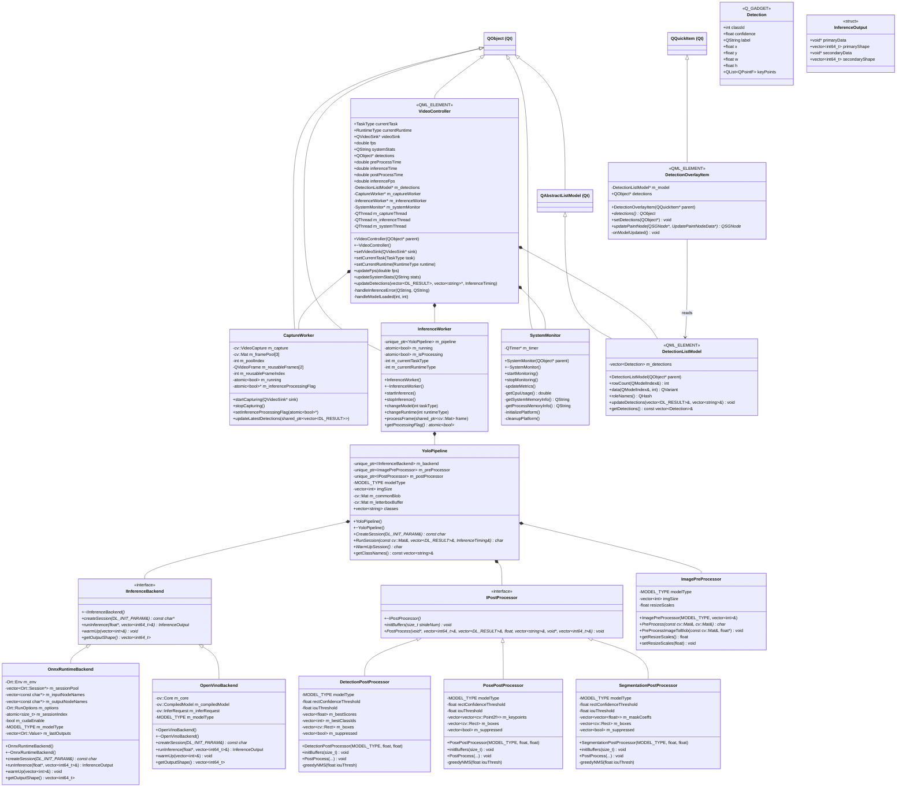

# OOP Class Reference

A complete reference of every class, struct, interface, and namespace in the codebase, including inheritance, design patterns, and method signatures.

> [!TIP]
> For high-level architecture, threading model, and data flow, see [design-spec.md](./design-spec.md).

---

## Class Hierarchy



---

## Design Patterns Used

| Pattern | Where | Purpose |
|:--------|:------|:--------|
| **Strategy** | `IInferenceBackend` → `OnnxRuntimeBackend` / `OpenVinoBackend` | Swap inference runtime without changing pipeline logic |
| **Strategy** | `IPostProcessor` → `DetectionPostProcessor` / `PosePostProcessor` / `SegmentationPostProcessor` | Swap post-processing strategy per YOLO task |
| **Facade** | `YoloPipeline` | Single entry point orchestrating pre-process → infer → post-process |
| **Worker Thread** | `CaptureWorker`, `InferenceWorker`, `SystemMonitor` | Offload blocking work from the GUI thread |
| **Bridge / Adapter** | `VideoController`, `DetectionListModel`, `Detection` | Bridge C++ data to QML via `Q_PROPERTY`, `QAbstractListModel`, `Q_GADGET` |

---

## Enums & Data Types

### `MODEL_TYPE`  · [YoloTypes.h](../app/src/pipeline/YoloTypes.h)

```cpp
enum MODEL_TYPE { YOLO_DETECT = 1, YOLO_POSE = 2, YOLO_SEG = 3 };
```

### `RUNTIME_TYPE`  · [YoloTypes.h](../app/src/pipeline/YoloTypes.h)

```cpp
enum RUNTIME_TYPE { RUNTIME_OPENVINO = 0, RUNTIME_ONNXRUNTIME = 1 };
```

### `DL_INIT_PARAM`  · [YoloTypes.h](../app/src/pipeline/YoloTypes.h)

Configuration struct passed to `YoloPipeline::CreateSession()`.

| Field | Type | Default | Description |
|:------|:-----|:--------|:------------|
| `modelPath` | `std::string` | – | Path to `.onnx` or `.xml` model file |
| `modelType` | `MODEL_TYPE` | `YOLO_DETECT` | Detection / Pose / Segmentation |
| `runtimeType` | `RUNTIME_TYPE` | `RUNTIME_OPENVINO` | Backend runtime to use |
| `imgSize` | `vector<int>` | `{640, 640}` | Model input dimensions |
| `rectConfidenceThreshold` | `float` | `0.4` | Minimum detection confidence |
| `iouThreshold` | `float` | `0.5` | NMS IoU threshold |
| `keyPointsNum` | `int` | `2` | Keypoints per detection (pose) |
| `cudaEnable` | `bool` | `false` | CUDA acceleration toggle |
| `logSeverityLevel` | `int` | `3` | ONNX Runtime log level |
| `intraOpNumThreads` | `int` | `hw/2` | Threads within a single op |
| `interOpNumThreads` | `int` | `1` | Threads across ops |
| `sessionPoolSize` | `int` | `1` | ONNX session pool size |

### `DL_RESULT`  · [YoloTypes.h](../app/src/pipeline/YoloTypes.h)

Raw inference result (pixel coordinates).

| Field | Type | Description |
|:------|:-----|:------------|
| `classId` | `int` | Detected class index |
| `confidence` | `float` | Detection confidence score |
| `box` | `cv::Rect` | Bounding box in pixel coords |
| `keyPoints` | `vector<cv::Point2f>` | Pose keypoints (empty for detect/seg) |
| `boxMask` | `cv::Mat` | Segmentation mask (empty for detect/pose) |

### `Detection`  · [DetectionStruct.h](../app/src/models/DetectionStruct.h)

`Q_GADGET` value-type for C++ → QML data passing. Contains **normalized** [0, 1] coordinates.

| Field | Type | Description |
|:------|:-----|:------------|
| `classId` | `int` | Class index |
| `confidence` | `float` | Confidence score |
| `label` | `QString` | Human-readable class name |
| `x`, `y`, `w`, `h` | `float` | Normalized bounding box |
| `keyPoints` | `QList<QPointF>` | Normalized keypoints |

### `InferenceOutput`  · [IInferenceBackend.h](../app/src/pipeline/backends/IInferenceBackend.h)

Return type from backend inference.

| Field | Type | Description |
|:------|:-----|:------------|
| `primaryData` | `void*` | Pointer to primary output tensor |
| `primaryShape` | `vector<int64_t>` | Shape of primary output |
| `secondaryData` | `void*` | Pointer to secondary output (seg masks), or `nullptr` |
| `secondaryShape` | `vector<int64_t>` | Shape of secondary output |

### `InferenceTiming`  · [YoloPipeline.h](../app/src/pipeline/YoloPipeline.h)

Nested struct inside `YoloPipeline`.

| Field | Type |
|:------|:-----|
| `preProcessTime` | `double` (ms) |
| `inferenceTime` | `double` (ms) |
| `postProcessTime` | `double` (ms) |

---

## Classes

### `VideoController` — Main Orchestrator
[VideoController.h](../app/src/core/VideoController.h) · [VideoController.cpp](../app/src/core/VideoController.cpp)

- **Inherits**: `QObject`
- **Macros**: `Q_OBJECT`, `QML_ELEMENT`
- **Role**: Central orchestrator. Creates/manages 3 background threads, bridges C++ ↔ QML via `Q_PROPERTY`.

#### Enums

```cpp
enum TaskType { TaskObjectDetection = 1, TaskPoseEstimation = 2, TaskImageSegmentation = 3 };
enum RuntimeType { RuntimeOpenVINO = 0, RuntimeONNXRuntime = 1 };
```

#### Q_PROPERTY Bindings (exposed to QML)

| Property | Type | Access |
|:---------|:-----|:-------|
| `currentTask` | `TaskType` | R/W |
| `currentRuntime` | `RuntimeType` | R/W |
| `videoSink` | `QVideoSink*` | R/W |
| `fps` | `double` | Read-only |
| `systemStats` | `QString` | Read-only |
| `detections` | `QObject*` | Read-only |
| `preProcessTime` | `double` | Read-only |
| `inferenceTime` | `double` | Read-only |
| `postProcessTime` | `double` | Read-only |
| `inferenceFps` | `double` | Read-only |

#### Public Methods

| Method | Description |
|:-------|:------------|
| `VideoController(QObject* parent)` | Constructor – creates workers, wires signals, starts threads |
| `~VideoController()` | Destructor – stops all threads, waits for completion |
| `setVideoSink(QVideoSink*)` | Sets the video sink and triggers worker startup |

#### Public Slots

| Slot | Description |
|:-----|:------------|
| `setCurrentTask(TaskType)` | Switch YOLO task (detect/pose/seg), propagates to inference worker |
| `setCurrentRuntime(RuntimeType)` | Switch runtime backend, propagates to inference worker |
| `updateFps(double)` | Receives camera FPS from `CaptureWorker` |
| `updateSystemStats(QString)` | Receives formatted stats from `SystemMonitor` |
| `updateDetections(vector<DL_RESULT>&, vector<string>*, InferenceTiming&)` | Receives inference results, updates model + timing properties |

#### Signals

| Signal | Description |
|:-------|:------------|
| `currentTaskChanged()` | Task type changed |
| `currentRuntimeChanged()` | Runtime type changed |
| `taskChangedBus(int)` | Internal bus to `InferenceWorker` |
| `runtimeChangedBus(int)` | Internal bus to `InferenceWorker` |
| `videoSinkChanged()` | Video sink assigned |
| `fpsChanged()` | Camera FPS updated |
| `inferenceFpsChanged()` | Inference FPS updated |
| `systemStatsChanged()` | System stats updated |
| `detectionsChanged()` | Detection list model updated |
| `timingChanged()` | Pre/inference/post timing updated |
| `errorOccurred(QString, QString)` | Error propagation to QML |
| `startWorkers(QVideoSink*)` | Kick off all workers |
| `stopWorkers()` | Graceful shutdown |

#### Key Members

| Member | Type | Description |
|:-------|:-----|:------------|
| `m_detections` | `DetectionListModel*` | Owned model, exposes detections to QML |
| `m_captureWorker` | `CaptureWorker*` | Owned, lives on `m_captureThread` |
| `m_inferenceWorker` | `InferenceWorker*` | Owned, lives on `m_inferenceThread` |
| `m_systemMonitor` | `SystemMonitor*` | Owned, lives on `m_systemThread` |
| `m_captureThread` | `QThread` | Normal priority |
| `m_inferenceThread` | `QThread` | High priority |
| `m_systemThread` | `QThread` | Low priority |

---

### `CaptureWorker` — Camera Capture Thread
[VideoController.h](../app/src/core/VideoController.h#L143-L173)

- **Inherits**: `QObject`
- **Thread**: Lives on `VideoController::m_captureThread`

#### Public Slots

| Slot | Description |
|:-----|:------------|
| `startCapturing(QVideoSink*)` | Opens camera, enters capture loop |
| `stopCapturing()` | Sets `m_running = false`, releases camera |
| `setInferenceProcessingFlag(atomic<bool>*)` | Receives pointer to `InferenceWorker`'s processing flag |
| `updateLatestDetections(shared_ptr<vector<DL_RESULT>>)` | Receives latest detections for overlay rendering |

#### Signals

| Signal | Description |
|:-------|:------------|
| `frameReady(shared_ptr<cv::Mat>)` | Emitted per captured frame → `InferenceWorker` |
| `fpsUpdated(double)` | Camera FPS calculated once/second |
| `cleanUp()` | Internal cleanup signal |

#### Key Members

| Member | Type | Description |
|:-------|:-----|:------------|
| `m_framePool[3]` | `cv::Mat[3]` | Ring buffer to avoid per-frame cloning |
| `m_reusableFrames[2]` | `QVideoFrame[2]` | Double-buffered UI frames |
| `m_capture` | `cv::VideoCapture` | OpenCV camera handle |
| `m_running` | `atomic<bool>` | Loop control flag |
| `m_inferenceProcessingFlag` | `atomic<bool>*` | Pointer to inference busy flag |

---

### `InferenceWorker` — AI Inference Thread
[VideoController.h](../app/src/core/VideoController.h#L175-L204)

- **Inherits**: `QObject`
- **Thread**: Lives on `VideoController::m_inferenceThread` (high priority)

#### Public Slots

| Slot | Description |
|:-----|:------------|
| `startInference()` | Creates `YoloPipeline`, loads model + class names |
| `stopInference()` | Stops inference loop |
| `changeModel(int)` | Hot-swaps the YOLO task type |
| `changeRuntime(int)` | Hot-swaps the runtime backend |
| `processFrame(shared_ptr<cv::Mat>)` | Runs inference on a frame (with frame-drop logic) |
| `getProcessingFlag()` | Returns `&m_isProcessing` for frame-drop coordination |

#### Signals

| Signal | Description |
|:-------|:------------|
| `detectionsReady(vector<DL_RESULT>&, vector<string>*, InferenceTiming&)` | Results → `VideoController` |
| `latestDetectionsReady(shared_ptr<vector<DL_RESULT>>)` | Results → `CaptureWorker` for overlay |
| `modelLoaded(int, int)` | Confirms model loaded (task, runtime) |
| `errorOccurred(QString, QString)` | Error during model load/inference |

#### Key Members

| Member | Type | Description |
|:-------|:-----|:------------|
| `m_pipeline` | `unique_ptr<YoloPipeline>` | The inference pipeline |
| `m_isProcessing` | `atomic<bool>` | Frame-drop flag (`compare_exchange_strong`) |

---

### `SystemMonitor` — Resource Monitor Thread
[SystemMonitor.h](../app/src/core/SystemMonitor.h) · [SystemMonitor.cpp](../app/src/core/SystemMonitor.cpp)

- **Inherits**: `QObject`
- **Thread**: Lives on `VideoController::m_systemThread` (low priority)
- **Platform**: Windows (PDH/PSAPI), Linux (`/proc`), macOS (`sysctl`/`mach`)

#### Public Slots

| Slot | Description |
|:-----|:------------|
| `startMonitoring()` | Starts the timer-driven polling loop |
| `stopMonitoring()` | Stops the timer |

#### Signals

| Signal | Description |
|:-------|:------------|
| `resourceUsageUpdated(QString)` | Formatted stats string → `VideoController` |

#### Private Methods

| Method | Description |
|:-------|:------------|
| `updateMetrics()` | Timer callback, calls platform methods |
| `getCpuUsage()` | Returns CPU % (platform-specific) |
| `getSystemMemoryInfo()` | Returns system RAM info |
| `getProcessMemoryInfo()` | Returns process RAM info |
| `initializePlatform()` | One-time platform init (PDH query, etc.) |
| `cleanupPlatform()` | Cleanup platform resources |

---

### `YoloPipeline` — Inference Facade
[YoloPipeline.h](../app/src/pipeline/YoloPipeline.h) · [YoloPipeline.cpp](../app/src/pipeline/YoloPipeline.cpp)

- **Inherits**: Nothing (pure C++ class)
- **Pattern**: Facade — single entry point for the entire pre-process → infer → post-process pipeline

#### Public Methods

| Method | Returns | Description |
|:-------|:--------|:------------|
| `CreateSession(DL_INIT_PARAM&)` | `const char*` | Selects backend + post-processor based on params, creates session |
| `RunSession(const cv::Mat&, vector<DL_RESULT>&, InferenceTiming&)` | `char*` | Full pipeline: letterbox → blob → infer → post-process → NMS |
| `WarmUpSession()` | `char*` | Runs a dummy inference to warm up caches |
| `getClassNames()` | `const vector<string>&` | Returns loaded class names |

#### Composition (owned via `unique_ptr`)

| Member | Type | Description |
|:-------|:-----|:------------|
| `m_backend` | `IInferenceBackend` | Runtime backend (OpenVINO or ONNX Runtime) |
| `m_preProcessor` | `ImagePreProcessor` | Letterbox + blob creation |
| `m_postProcessor` | `IPostProcessor` | Task-specific post-processing |
| `m_commonBlob` | `cv::Mat` | Reusable blob buffer to avoid reallocations |
| `m_letterboxBuffer` | `cv::Mat` | Reusable letterbox buffer |

---

### `IInferenceBackend` — Backend Interface
[IInferenceBackend.h](../app/src/pipeline/backends/IInferenceBackend.h)

- **Type**: Abstract interface (pure virtual)
- **Pattern**: Strategy — allows swapping runtime backends

#### Pure Virtual Methods

```cpp
virtual const char* createSession(DL_INIT_PARAM& params) = 0;
virtual InferenceOutput runInference(float* blobData, const vector<int64_t>& inputDims) = 0;
virtual void warmUp(const vector<int>& imgSize) = 0;
virtual vector<int64_t> getOutputShape() const = 0;
```

---

### `OnnxRuntimeBackend` — ONNX Runtime Implementation
[OnnxRuntimeBackend.h](../app/src/pipeline/backends/OnnxRuntimeBackend.h) · [OnnxRuntimeBackend.cpp](../app/src/pipeline/backends/OnnxRuntimeBackend.cpp)

- **Inherits**: `IInferenceBackend`
- **Key feature**: Session pooling (`m_sessionPool`) with round-robin via `atomic<size_t> m_sessionIndex`

#### Private Members

| Member | Type | Description |
|:-------|:-----|:------------|
| `m_env` | `Ort::Env` | ONNX Runtime environment |
| `m_sessionPool` | `vector<Ort::Session*>` | Pool of reusable sessions |
| `m_inputNodeNames` | `vector<const char*>` | Input tensor names |
| `m_outputNodeNames` | `vector<const char*>` | Output tensor names |
| `m_options` | `Ort::RunOptions` | Inference run options |
| `m_lastOutputs` | `vector<Ort::Value>` | Keeps output tensor data alive |

---

### `OpenVinoBackend` — OpenVINO Implementation
[OpenVinoBackend.h](../app/src/pipeline/backends/OpenVinoBackend.h) · [OpenVinoBackend.cpp](../app/src/pipeline/backends/OpenVinoBackend.cpp)

- **Inherits**: `IInferenceBackend`

#### Private Members

| Member | Type | Description |
|:-------|:-----|:------------|
| `m_core` | `ov::Core` | OpenVINO core instance |
| `m_compiledModel` | `ov::CompiledModel` | Compiled model for target device |
| `m_inferRequest` | `ov::InferRequest` | Reusable inference request |

---

### `IPostProcessor` — Post-Processing Interface
[PostProcessor.h](../app/src/pipeline/PostProcessor.h)

- **Type**: Abstract interface (pure virtual)
- **Pattern**: Strategy — task-specific post-processing

#### Pure Virtual Methods

```cpp
virtual void initBuffers(size_t strideNum) = 0;
virtual void PostProcess(void* output, const vector<int64_t>& outputNodeDims,
                         vector<DL_RESULT>& oResult, float resizeScales,
                         const vector<string>& classes,
                         void* secondaryOutput = nullptr,
                         const vector<int64_t>& secondaryDims = {}) = 0;
```

---

### `DetectionPostProcessor`
[PostProcessor.h](../app/src/pipeline/PostProcessor.h#L15-L33) · [PostProcessor.cpp](../app/src/pipeline/PostProcessor.cpp)

- **Inherits**: `IPostProcessor`
- **For**: `YOLO_DETECT` task
- **Method**: `greedyNMS()` for non-maximum suppression
- **Buffers**: Pre-allocated `m_bestScores`, `m_bestClassIds`, `m_boxes`, `m_confidences`, `m_nmsIndices`, `m_sortIndices`, `m_suppressed`

### `PosePostProcessor`
[PostProcessor.h](../app/src/pipeline/PostProcessor.h#L35-L54) · [PostProcessor.cpp](../app/src/pipeline/PostProcessor.cpp)

- **Inherits**: `IPostProcessor`
- **For**: `YOLO_POSE` task
- **Extra**: `m_keypoints` buffer for pose keypoint extraction

### `SegmentationPostProcessor`
[PostProcessor.h](../app/src/pipeline/PostProcessor.h#L56-L75) · [PostProcessor.cpp](../app/src/pipeline/PostProcessor.cpp)

- **Inherits**: `IPostProcessor`
- **For**: `YOLO_SEG` task
- **Extra**: `m_maskCoeffs` buffer for segmentation mask coefficients; uses `secondaryOutput` (proto mask tensor)

---

### `ImagePreProcessor`
[PreProcessor.h](../app/src/pipeline/PreProcessor.h) · [PreProcessor.cpp](../app/src/pipeline/PreProcessor.cpp)

- **Inherits**: Nothing (pure C++ class)

#### Public Methods

| Method | Description |
|:-------|:------------|
| `PreProcess(const cv::Mat&, cv::Mat&)` | Letterbox resize (preserves aspect ratio) |
| `PreProcessImageToBlob(const cv::Mat&, float*)` | HWC→CHW + BGR→RGB + normalize to [0,1] using SIMD |
| `getResizeScales()` / `setResizeScales()` | Access the letterbox scale factor |

---

### `DetectionListModel` — QML Data Bridge
[DetectionListModel.h](../app/src/models/DetectionListModel.h) · [DetectionListModel.cpp](../app/src/models/DetectionListModel.cpp)

- **Inherits**: `QAbstractListModel`
- **Macros**: `Q_OBJECT`, `QML_ELEMENT`

#### Roles

```cpp
enum DetectionRoles {
    ClassIdRole = Qt::UserRole + 1,
    ConfidenceRole, LabelRole,
    XRole, YRole, WRole, HRole,
    DataRole   // Full Detection object
};
```

#### Public Methods

| Method | Description |
|:-------|:------------|
| `rowCount()` | Returns `m_detections.size()` |
| `data(QModelIndex, int)` | Returns role-based data for a detection |
| `roleNames()` | Maps role enums to QML property names |
| `updateDetections(vector<DL_RESULT>&, vector<string>&)` | Converts `DL_RESULT` → `Detection`, full model reset |
| `getDetections()` | Returns `const vector<Detection>&` |

---

### `DetectionOverlayItem` — Scene Graph Renderer
[DetectionOverlayItem.h](../app/src/ui/DetectionOverlayItem.h) · [DetectionOverlayItem.cpp](../app/src/ui/DetectionOverlayItem.cpp)

- **Inherits**: `QQuickItem`
- **Macros**: `Q_OBJECT`, `QML_ELEMENT`
- **Role**: Hardware-accelerated bounding box rendering via Scene Graph

#### Public Methods

| Method | Description |
|:-------|:------------|
| `detections()` / `setDetections(QObject*)` | Get/set the `DetectionListModel` |
| `updatePaintNode(QSGNode*, UpdatePaintNodeData*)` | Builds `QSGGeometry` line primitives per detection box |

---

## Namespace: `simd`
[SimdUtils.h](../app/src/pipeline/SimdUtils.h)

SSE4.1-optimized utility functions used in pre/post-processing.

| Function | Description |
|:---------|:------------|
| `hwc_to_chw_bgr_to_rgb_sse41(...)` | Fused HWC→CHW + BGR→RGB + normalize, 4 pixels/iteration |
| `update_best_scores_sse41(...)` | Branchless best-score/class-ID update, 4 anchors/iteration |
| `check_threshold_sse41(...)` | Fast 4-wide threshold check, returns bitmask |

---

## Namespace: `AppConfig`
[VideoController.h](../app/src/core/VideoController.h#L17-L22)

| Constant | Value | Purpose |
|:---------|:------|:--------|
| `FrameWidth` | 640 | Capture resolution width |
| `FrameHeight` | 480 | Capture resolution height |
| `ModelWidth` | 640 | YOLO input tensor width |
| `ModelHeight` | 640 | YOLO input tensor height |

---

## File → Class Map

| File | Contains |
|:-----|:---------|
| `src/core/VideoController.h/cpp` | `VideoController`, `CaptureWorker`, `InferenceWorker` |
| `src/core/SystemMonitor.h/cpp` | `SystemMonitor` |
| `src/models/DetectionStruct.h` | `Detection` (Q_GADGET) |
| `src/models/DetectionListModel.h/cpp` | `DetectionListModel` |
| `src/ui/DetectionOverlayItem.h/cpp` | `DetectionOverlayItem` |
| `src/pipeline/YoloTypes.h` | `MODEL_TYPE`, `RUNTIME_TYPE`, `DL_INIT_PARAM`, `DL_RESULT` |
| `src/pipeline/YoloPipeline.h/cpp` | `YoloPipeline`, `InferenceTiming` |
| `src/pipeline/PreProcessor.h/cpp` | `ImagePreProcessor` |
| `src/pipeline/PostProcessor.h/cpp` | `IPostProcessor`, `DetectionPostProcessor`, `PosePostProcessor`, `SegmentationPostProcessor` |
| `src/pipeline/SimdUtils.h` | `simd::` namespace (inline functions) |
| `src/pipeline/backends/IInferenceBackend.h` | `IInferenceBackend`, `InferenceOutput` |
| `src/pipeline/backends/OnnxRuntimeBackend.h/cpp` | `OnnxRuntimeBackend` |
| `src/pipeline/backends/OpenVinoBackend.h/cpp` | `OpenVinoBackend` |
