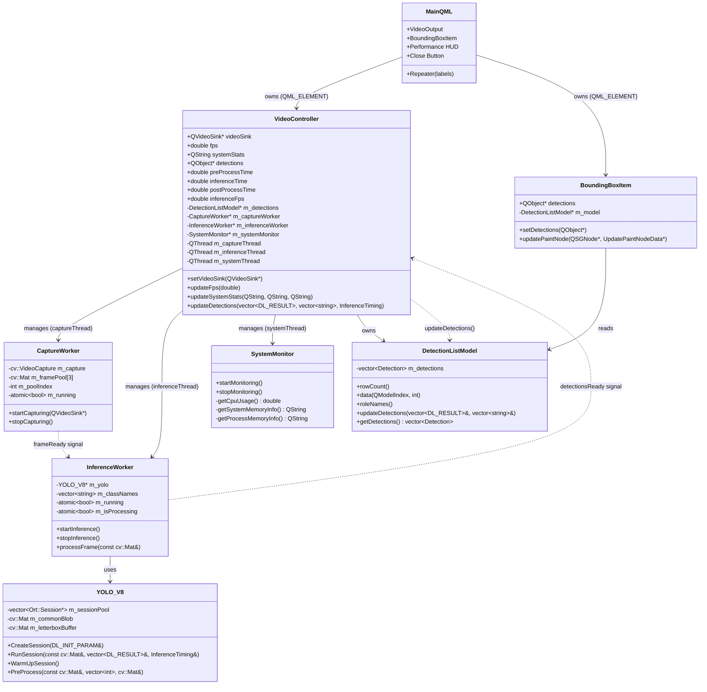
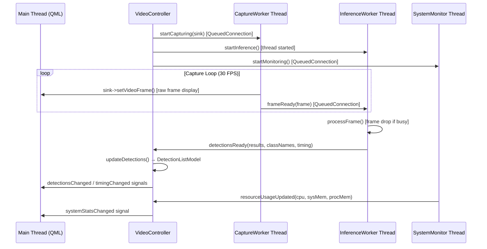

# Design Specifications

This document details the architectural decisions, threading models, and class interactions for the **QtOpenCVCamera** application.

## System Architecture

The application uses a hybrid **C++/QML** architecture where the business logic and performance-critical operations (computer vision, AI inference) live in C++, while the presentation layer is handled by QML. The system is decomposed into three asynchronous pipelines connected via Qt's signal/slot mechanism.

## Threading Model

To ensure a responsive UI (60 FPS target), all blocking operations are offloaded to dedicated background threads. The application uses **three worker threads** in addition to the main GUI thread.

### Thread 1: Main Thread (GUI)
- Handles QML rendering (Scene Graph updates).
- Processes user input (clicks, key presses).
- Receives signals from worker threads to update UI state.
- Owns `VideoController`, `DetectionListModel`, and `BoundingBoxItem`.
- **Constraint**: Must never block for >16ms.

### Thread 2: Capture Thread (`CaptureWorker`, Normal Priority)
- **Role**: Runs a continuous capture loop.
- **Loop**:
    1. Grabs a frame into the next ring buffer slot (`m_framePool[3]`).
    2. Converts BGR → RGBA and pushes the frame to `QVideoSink` for display (zero-copy into `QVideoFrame`).
    3. Emits `frameReady(cv::Mat&)` to the Inference Thread via `QueuedConnection`.
    4. Advances the ring buffer index.
    5. Calculates camera FPS once per second.
- **Camera Configuration**: DSHOW backend, MJPG codec, 640×480 at 30 FPS.

### Thread 3: Inference Thread (`InferenceWorker`, High Priority)
- **Role**: Loads the YOLO model at startup, then responds to incoming frames.
- **Initialization** (`startInference()`):
    1. Creates `YOLO_V8` instance.
    2. Loads `classes.txt` for class names.
    3. Creates ONNX session with optimized thread count (`min(4, hw_concurrency/2)`).
- **Frame Processing** (`processFrame()`):
    1. **Frame Drop**: Uses `atomic<bool> m_isProcessing` with `compare_exchange_strong` to skip frames if inference is still ongoing (prevents queue buildup).
    2. Runs `YOLO_V8::RunSession()` which performs preprocessing, inference, and postprocessing.
    3. Emits `detectionsReady(results, classNames, timing)` to the main thread.
- **Synchronization**: Uses `QueuedConnection` for thread-safe signal delivery.

### Thread 4: System Monitor Thread (`SystemMonitor`, Low Priority)
- **Role**: Periodically polls platform-native APIs for CPU and memory usage.
- **Interval**: Timer-driven sampling.
- **Platform Support**: Windows (PDH/PSAPI), Linux (`/proc`), macOS (`sysctl`/`mach`).

### Thread Communication Diagram

## Component Breakdown

### 1. VideoController (`src/VideoController.h/cpp`)
- **Type**: `QObject` + `QML_ELEMENT`, instantiated from QML.
- **Responsibility**: Orchestrates the entire application lifecycle. Creates and manages three background threads. Bridges C++ detection data to QML via `Q_PROPERTY` bindings.
- **Properties Exposed to QML**:
    - `videoSink` (QVideoSink*) – for video frame delivery
    - `fps` (double) – camera capture FPS
    - `inferenceFps` (double) – smoothed inference FPS
    - `systemStats` (QString) – formatted CPU/RAM string
    - `detections` (QObject*) – pointer to `DetectionListModel`
    - `preProcessTime`, `inferenceTime`, `postProcessTime` (double) – in milliseconds
- **Startup Sequence**: Threads are started via `QTimer::singleShot(500ms)` to prevent UI freeze at launch.
- **Shutdown Sequence**: Emits `stopWorkers()`, quits all threads, then waits for completion.

### 2. CaptureWorker (`src/VideoController.h/cpp`)
- **Type**: `QObject`, lives on `m_captureThread`.
- **Responsibility**: Camera capture loop with optimized frame delivery.
- **Key Optimization**: 3-frame ring buffer (`m_framePool[3]`) avoids `cv::Mat::clone()` per frame. With 3 buffers at 30 FPS, each buffer has ~100ms before it gets overwritten, which is sufficient for typical inference durations.

### 3. InferenceWorker (`src/VideoController.h/cpp`)
- **Type**: `QObject`, lives on `m_inferenceThread`.
- **Responsibility**: AI inference pipeline.
- **Key Optimization**: Atomic frame-drop mechanism. If a new frame arrives while inference is still running, the frame is silently dropped instead of accumulating in the event queue.

### 4. YOLO_V8 (`src/inference.h/cpp`)
- **Type**: Pure C++ Class (no QObject).
- **Responsibility**: Full ONNX Runtime wrapper for YOLOv8 inference.
- **Features**:
    - Session Pooling (`m_sessionPool`) for potential multi-session strategies.
    - Letterbox Preprocessing with reusable `m_letterboxBuffer`.
    - Reusable blob memory (`m_commonBlob`) to avoid per-frame allocations.
    - `InferenceTiming` struct returning per-phase millisecond timings.
    - Non-Maximum Suppression (NMS) postprocessing.

### 5. BoundingBoxItem (`src/BoundingBoxItem.h/cpp`)
- **Type**: `QQuickItem` + `QML_ELEMENT`.
- **Responsibility**: Renders bounding box rectangles at the Scene Graph level for hardware-accelerated performance.
- **Rendering**: Uses `QSGGeometry` with `DrawLines` mode and `QSGVertexColorMaterial` for per-class color-coded boxes.
- **Label Rendering**: Handled by a QML `Repeater` nested inside the `BoundingBoxItem` in `Main.qml`, providing easy text rendering without Scene Graph complexity.

### 6. DetectionListModel (`src/DetectionListModel.h/cpp`)
- **Type**: `QAbstractListModel` + `QML_ELEMENT`.
- **Responsibility**: Stores detection data as a `std::vector<Detection>` and exposes it to QML via roles (classId, confidence, label, x, y, w, h).
- **Update Strategy**: Full model reset per inference frame (`beginResetModel` / `endResetModel`).
- **Coordinate System**: Normalized [0, 1] coordinates relative to `AppConfig::FrameWidth` / `AppConfig::FrameHeight`.

### 7. Detection (`src/DetectionStruct.h`)
- **Type**: `Q_GADGET` struct.
- **Fields**: `classId`, `confidence`, `label` (QString), `x`, `y`, `w`, `h` (normalized floats).
- **Purpose**: Efficient value-type for passing detection data between C++ and QML without QObject overhead.

### 8. SystemMonitor (`src/SystemMonitor.h/cpp`)
- **Type**: `QObject`, lives on `m_systemThread`.
- **Responsibility**: Cross-platform system resource monitoring.
- **Platforms**: Windows (PDH queries for CPU, PSAPI for memory), Linux (`/proc/stat`, `sysinfo`), macOS (`sysctl`, `mach` task info).

## Data Flow

1. **Input**: Webcam feed (640×480 via DSHOW, MJPG codec).
2. **Capture** (Capture Thread):
   - Frame grabbed into ring buffer slot.
   - BGR → RGBA conversion into `QVideoFrame` for display.
   - Raw BGR `cv::Mat` emitted to Inference Thread.
3. **Inference** (Inference Thread):
   - Frame drop check (skip if still processing previous frame).
   - Letterbox resize to 640×640 (preserving aspect ratio via padding).
   - Float32 normalization → blob creation (reusable buffer).
   - ONNX Runtime inference.
   - Output tensor parsing (1, 84, 8400) → NMS → `DL_RESULT` vector.
   - Timing captured for pre-process, inference, and post-process phases.
4. **Display** (Main Thread):
   - `DetectionListModel` updated with normalized coordinates + labels.
   - `BoundingBoxItem` re-renders bounding box geometry via Scene Graph.
   - QML `Repeater` re-creates label overlays.
   - Performance HUD updated (camera FPS, inference FPS, timing, CPU/RAM).
5. **Output**: Live annotated video feed with real-time performance metrics.
