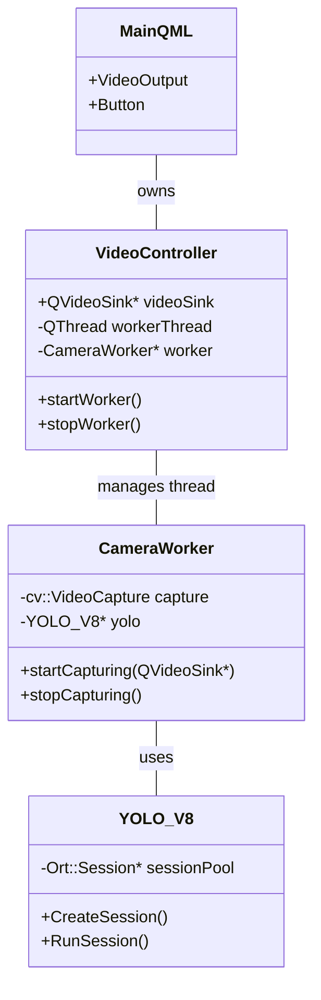

# Design Specifications

This document details the architectural decisions, threading models, and class interactions for the **QtOpenCVCamera** application.

## System Architecture

The application uses a hybrid **C++/QML** architecture where the detailed business logic and performance-critical operations (Computer Vision, AI) live in C++, while the presentation layer is handled by QML.

## Threading Model

To ensure a responsive UI (60 FPS), all blocking operations are offloaded to a dedicated worker thread.

### Main Thread (GUI)
- Handles QML rendering.
- Processes user input (clicks, key presses).
- Receives signals from the worker thread to update UI elements (stats, status).
- **Constraint**: Must never block for >16ms.

### Worker Thread (Capture & Inference)
- **Role**: `CameraWorker` moves to this thread via `moveToThread`.
- **Loop**:
    1. Grabs a frame using `cv::VideoCapture`.
    2. Runs inference using `YOLO_V8::RunSession`.
    3. Draws bounding boxes on the frame.
    4. Converts the frame to `QVideoFrame`.
    5. Pushes the frame to `QVideoSink` for display.
- **Synchronization**: Uses Signals/Slots to communicate with the Main Thread safely.

## Component Breakdown

### 1. VideoController (`src/VideoController.h`)
- **Type**: `QObject`, exposed to QML via `QML_ELEMENT`.
- **Responsibility**: Lifecycle management of the background thread.
- **Key Method**: `setVideoSink(QVideoSink*)` - receives the video surface from QML and passes it to the worker.

### 2. CameraWorker (`src/VideoController.h`)
- **Type**: `QObject`.
- **Responsibility**: The "run loop" of the application.
- **Logic**:
    - Initializes OpenCV camera.
    - Initializes ONNX Runtime session.
    - Executes the capture-detect-display loop.

### 3. YOLO_V8 (`src/inference.h`)
- **Type**: Pure C++ Class.
- **Responsibility**: Wrapper around ONNX Runtime C++ API.
- **Features**:
    - Session Pooling (supports multiple threading strategies).
    - Image Preprocessing (Letterbox resizing).
    - Postprocessing (Non-Maximum Suppression).

## Data Flow

1. **Input**: Webcam feed (640x480 typical).
2. **Process**:
   - Resize to 640x640 (preserving aspect ratio via padding).
   - Float32 normalization.
   - Inference (ONNX Runtime).
   - Parse Output Tensor (1, 84, 8400).
3. **Output**:
   - Annotated OpenCV Matrix.
   - Converted to `QVideoFrame` (Format: `Format_BGR888` or `Format_RGB32`).
   - Rendered on `VideoOutput` in QML.
