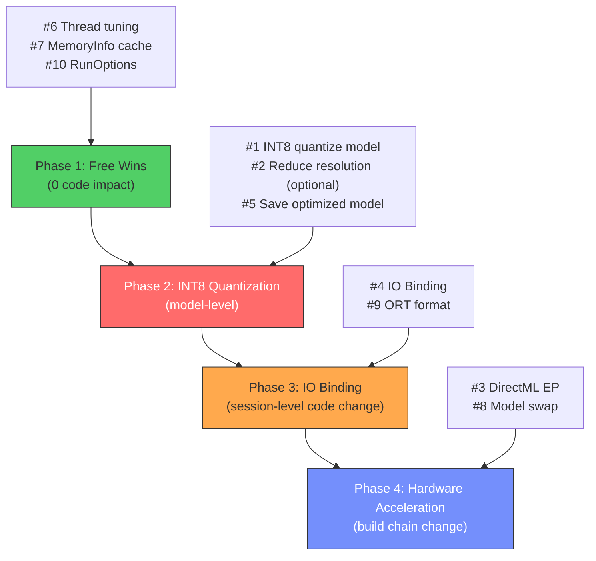

# Inference Speed Evaluation — `Session::Run()` Bottleneck Analysis

**Date:** 2026-03-11 11:39:31 +07:00

> System Architect Review — Deep-Dive on ONNX Runtime Inference Latency

This document focuses exclusively on the **inference call itself** (`sess->Run(...)` at [inference.cpp:223-224](../src/pipeline/inference.cpp#L223-L224)). Pre-processing and post-processing are deliberately out of scope — those are addressed in [simd_optimization_evaluation.md](simd_optimization_evaluation.md).

---

## 0. Current Configuration Snapshot

| Parameter | Current Value | Source |
|:----------|:-------------|:-------|
| **ONNX Runtime version** | API v23 (1.20.x) | `ORT_API_VERSION` in `onnxruntime_c_api.h` |
| **Model** | `yolov8n.onnx` (12.7 MB, FP32) | `assets/onnx/yolov8n.onnx` |
| **Execution Provider** | CPU (default) | `cudaEnable = false` |
| **Graph Optimization** | `ORT_ENABLE_ALL` | [inference.cpp:76](../src/pipeline/inference.cpp#L76) |
| **Execution Mode** | `ORT_SEQUENTIAL` | [inference.cpp:78](../src/pipeline/inference.cpp#L78) |
| **Intra-op threads** | `min(4, hw_concurrency/2)` | [VideoController.cpp:127](../src/VideoController.cpp#L127) |
| **Inter-op threads** | 1 | [VideoController.cpp:128](../src/VideoController.cpp#L128) |
| **Memory pattern** | Default (enabled) | Not explicitly set |
| **IO Binding** | Not used | Tensor created per-frame |
| **Session pool** | 1 session | `sessionPoolSize = 1` (default) |
| **OpenMP/KMP env** | Set (`KMP_AFFINITY=compact`, `KMP_BLOCKTIME=1`) | [inference.cpp:81-85](../src/pipeline/inference.cpp#L81-L85) |

> [!IMPORTANT]
> `Session::Run()` on **CPU with FP32 YOLOv8n** typically takes **15–30ms** depending on the CPU. This is the dominant cost (~85–90% of total frame time). Every millisecond saved here directly translates to FPS gain.

---

## 1. IO Binding — Eliminate Per-Frame Allocation Overhead

### Problem

Every frame, `TensorProcess` creates a **new `Ort::Value` input tensor** via `CreateTensor<float>(...)`:

```cpp
// inference.cpp:209-213
Ort::Value inputTensor =
    Ort::Value::CreateTensor<float>(
        Ort::MemoryInfo::CreateCpu(OrtDeviceAllocator, OrtMemTypeCPU), blob,
        3 * imgSize.at(0) * imgSize.at(1), inputNodeDims.data(),
        inputNodeDims.size());
```

This also constructs a **new `Ort::MemoryInfo`** object per frame. Though lightweight, the repeated construction + validation + internal bookkeeping adds measurable microsecond overhead that compounds at 30+ FPS.

Additionally, `Session::Run()` returns a **new `std::vector<Ort::Value>`** for the output, which triggers ORT's internal output buffer allocation every call.

### Solution: `Ort::IoBinding`

Pre-bind input and output tensors **once** during session creation. On each frame, simply copy data into the pre-bound input buffer and call `Run(IoBinding)` — ORT skips all tensor creation and shape validation internally.

```cpp
// During CreateSession():
Ort::MemoryInfo memInfo = Ort::MemoryInfo::CreateCpu(OrtDeviceAllocator, OrtMemTypeCPU);

// Pre-allocate input tensor (reuse every frame)
m_inputTensor = Ort::Value::CreateTensor<float>(
    memInfo, m_inputBuffer.data(), inputSize, inputDims.data(), inputDims.size());

// Pre-allocate output tensor
auto outputInfo = session->GetOutputTypeInfo(0).GetTensorTypeAndShapeInfo();
auto outputShape = outputInfo.GetShape();
size_t outputSize = 1;
for (auto d : outputShape) outputSize *= d;
m_outputBuffer.resize(outputSize);
m_outputTensor = Ort::Value::CreateTensor<float>(
    memInfo, m_outputBuffer.data(), outputSize, outputShape.data(), outputShape.size());

// Create IoBinding
m_ioBinding = Ort::IoBinding(*session);
m_ioBinding.BindInput(inputNodeNames[0], m_inputTensor);
m_ioBinding.BindOutput(outputNodeNames[0], m_outputTensor);

// Per-frame: just memcpy into m_inputBuffer, then:
session->Run(runOptions, m_ioBinding);
// Output is already in m_outputBuffer — zero-copy read
```

### Expected Impact

| Metric | Current | With IO Binding |
|:-------|:-------:|:------:|
| **Tensor creation overhead** | ~50–150µs/frame | **0** |
| **Output allocation** | ~20–80µs/frame | **0** |
| **Total saving** | — | **~0.1–0.2ms/frame** |

### Risk

Low. IO Binding is a stable, well-documented ORT API. The main caveat is that dynamic output shapes (like variable detection counts) need careful handling — but YOLOv8's output shape is **fixed** at `[1, 84, 8400]`, so this is a non-issue.

---

## 2. Save Optimized Model — Skip Graph Optimization at Load

### Problem

`ORT_ENABLE_ALL` applies **graph optimizations** (constant folding, operator fusion, layout transformation) every time the session is created. For YOLOv8n, this takes **200–800ms** at startup. More critically, it means the runtime graph may not be perfectly optimized for your specific CPU.

### Solution: Pre-save the Optimized Model

```cpp
// One-time: save optimized model
Ort::SessionOptions opts;
opts.SetGraphOptimizationLevel(GraphOptimizationLevel::ORT_ENABLE_ALL);
opts.SetOptimizedModelFilePath(L"assets/onnx/yolov8n_optimized.onnx");
Ort::Session tempSession(env, L"assets/onnx/yolov8n.onnx", opts);
// This writes the optimized graph to disk. Then at runtime:

// Runtime: load pre-optimized model with NO further optimization
Ort::SessionOptions runtimeOpts;
runtimeOpts.SetGraphOptimizationLevel(GraphOptimizationLevel::ORT_DISABLE_ALL);
Ort::Session session(env, L"assets/onnx/yolov8n_optimized.onnx", runtimeOpts);
```

### Expected Impact

| Metric | Current | With Pre-optimized Model |
|:-------|:-------:|:------:|
| **Session creation time** | ~200–800ms | ~50–100ms |
| **Inference time** | Same (graph identical once loaded) | Same |
| **Startup improvement** | — | **~4–8× faster cold start** |

### Hidden Benefit

ORT's `ORT_ENABLE_ALL` includes **layout transformations** (e.g., NCHW→NCHWc for AVX2). By saving the optimized model, you guarantee the optimal layout is always used, even if the optimization pass has bugs or regressions in future ORT versions.

### Risk

Very low. You just need to regenerate the optimized model when changing ORT versions or hardware targets.

---

## 3. INT8 Quantization — The Single Biggest Inference Speedup

### Problem

`yolov8n.onnx` is **FP32** (12.7 MB). Every convolution layer performs billions of `float32` multiply-accumulate operations. On CPU, the VNNI/AVX-512 integer units are **2–4× faster** than their floating-point equivalents for the same throughput.

### Solution: Quantize to INT8

Use the `onnxruntime.quantization` Python tool to create a quantized model:

```bash
pip install onnxruntime onnx

# Dynamic quantization (simplest, no calibration data needed)
python -m onnxruntime.quantization.quantize \
    --input assets/onnx/yolov8n.onnx \
    --output assets/onnx/yolov8n_int8.onnx \
    --quant_format QDQ \
    --per_channel \
    --activation_type QInt8 \
    --weight_type QInt8

# Or use Ultralytics export directly:
yolo export model=yolov8n.pt format=onnx int8=True
```

Alternatively, use **static quantization** with calibration data (more accurate):

```python
from onnxruntime.quantization import quantize_static, CalibrationDataReader

class YoloCalibrationReader(CalibrationDataReader):
    def __init__(self, calibration_images):
        self.data = iter(calibration_images)  # preprocessed input tensors
    
    def get_next(self):
        try:
            return {"images": next(self.data)}
        except StopIteration:
            return None

quantize_static(
    model_input="assets/onnx/yolov8n.onnx",
    model_output="assets/onnx/yolov8n_int8.onnx",
    calibration_data_reader=YoloCalibrationReader(images),
    quant_format=QuantFormat.QDQ,
    per_channel=True,
    activation_type=QuantType.QInt8,
    weight_type=QuantType.QInt8,
)
```

### Expected Impact

| Metric | FP32 (Current) | INT8 (Quantized) |
|:-------|:------:|:------:|
| **Model size** | 12.7 MB | ~3.5 MB |
| **Inference time** (typical desktop CPU) | ~15–30ms | **~5–12ms** |
| **Speedup** | 1× | **~2–3×** |
| **mAP drop** | Baseline | ~0.5–1.5% (negligible for real-time) |

> [!CAUTION]
> INT8 quantization produces **slightly different** detection results than FP32. mAP typically drops by 0.5–1.5%. For security/safety-critical applications, validate on your specific dataset before deploying.

### Why This Is #1 Priority

The convolution kernels inside YOLOv8n account for **>95%** of `Session::Run()` time. INT8 quantization directly halves the compute cost of every single convolution. No other optimization in this document comes close to this magnitude of improvement.

### CPU Feature Requirements

| Instruction Set | INT8 Support | CPU Generation |
|:------|:-----:|:------|
| **AVX2 + VNNI** | Optimal | Ice Lake (2019+), Zen 4 (2022+) |
| **AVX2** (no VNNI) | Good (2×) | Haswell (2013+), Zen 1 (2017+) |
| **AVX-512 VNNI** | Best (4×) | Ice Lake-SP, Sapphire Rapids |

---

## 4. Thread Affinity and Spin Control — Low-Hanging Tuning

### Problem

The current KMP environment variable configuration at [inference.cpp:81-85](../src/pipeline/inference.cpp#L81-L85):

```cpp
SetEnvironmentVariableA("KMP_AFFINITY", "granularity=fine,verbose,compact,1,0");
SetEnvironmentVariableA("KMP_BLOCKTIME", "1");
```

**Issues:**

1. **`KMP_BLOCKTIME=1`** means threads spin for 1ms after task completion before sleeping. This is set very aggressively low. For real-time inference at 30+ FPS, threads will thrash between sleep/wake states every frame, incurring **context switch overhead** (~2–10µs per wake).

2. **`verbose` in `KMP_AFFINITY`** — Outputs affinity debug info to stdout on every run. This is a **debug flag** that should not be in production.

3. **`compact,1,0`** affinity — Packs threads onto the minimum number of physical cores. This is correct for YOLOv8n but may conflict with the capture thread on SMT/HyperThreaded cores.

### Solution

```cpp
// Optimized settings for real-time inference loop
SetEnvironmentVariableA("KMP_AFFINITY", "granularity=fine,compact,1,0");  // removed 'verbose'
SetEnvironmentVariableA("KMP_BLOCKTIME", "0");  // infinite spin (threads never sleep between frames)
// OR for power-sensitive:
SetEnvironmentVariableA("KMP_BLOCKTIME", "200");  // spin for 200ms (~6 frames at 30fps)
```

**`KMP_BLOCKTIME=0`** is counterintuitive. In Intel's OpenMP implementation, `0` means **infinite spin** — threads stay awake and immediately pick up the next task. This eliminates context switch latency between frames at the cost of CPU power.

For a desktop app doing real-time inference, this is the correct tradeoff.

### Alternative: ORT's Native Thread Pool (Bypass OpenMP)

ONNX Runtime 1.20.x has its own **internal thread pool** that can be used instead of OpenMP. This avoids all KMP configuration complexity:

```cpp
// In CreateSession:
sessionOption.DisablePerSessionThreads();  // Use global thread pool instead

// OR: just don't set OMP env vars at all — ORT's default thread pool is often faster
// than OpenMP for small models because it has lower overhead.
```

### Expected Impact

| Metric | Current (`KMP_BLOCKTIME=1`) | `KMP_BLOCKTIME=0` |
|:-------|:------:|:------:|
| **Thread wake latency** | ~2–10µs | **0** (already spinning) |
| **Per-frame save** | — | ~0.01–0.05ms |
| **CPU idle power** | Low | Higher (threads spinning) |

Small but free. The `verbose` removal alone prevents unnecessary stdout writes.

---

## 5. `Ort::MemoryInfo` Caching — Micro-Optimization

### Problem

`Ort::MemoryInfo::CreateCpu(...)` is called **every frame** inside `TensorProcess`:

```cpp
Ort::MemoryInfo::CreateCpu(OrtDeviceAllocator, OrtMemTypeCPU)
```

This is a factory function that validates parameters and allocates internally each call.

### Solution

Cache the `MemoryInfo` as a class member, create it once in `CreateSession`:

```cpp
// inference.h:
Ort::MemoryInfo m_memoryInfo{nullptr};

// CreateSession():
m_memoryInfo = Ort::MemoryInfo::CreateCpu(OrtDeviceAllocator, OrtMemTypeCPU);

// TensorProcess():
Ort::Value inputTensor = Ort::Value::CreateTensor<float>(
    m_memoryInfo, blob, ...);  // reuse cached MemoryInfo
```

### Expected Impact

~5–20µs/frame. Trivial in isolation, but it's a free win.

---

## 6. `Ort::RunOptions` — Disable Logging per Run

### Problem

The `Ort::RunOptions` at [inference.cpp:153](../src/pipeline/inference.cpp#L153) is default-constructed:

```cpp
options = Ort::RunOptions{nullptr};
```

This means ORT may perform per-run logging checks and run tag generation internally.

### Solution

```cpp
options = Ort::RunOptions{nullptr};
options.SetRunLogSeverityLevel(ORT_LOGGING_LEVEL_ERROR);  // suppress per-run log checks
options.SetRunTag("");  // empty tag skips tag formatting
```

### Expected Impact

Negligible (~1–5µs), but removes unnecessary work.

---

## 7. DirectML Execution Provider — GPU Acceleration Without CUDA

### Problem

The current code only supports CPU or CUDA. CUDA requires an NVIDIA GPU and the CUDA toolkit. Most desktop machines have a GPU (Intel iGPU, AMD, or NVIDIA) but not CUDA.

### Solution: DirectML EP

**DirectML** is Microsoft's GPU API that works with **any DirectX 12 GPU** — Intel UHD, AMD Radeon, NVIDIA GeForce — without needing CUDA.

ONNX Runtime supports DirectML as an execution provider out of the box (Windows only).

```cpp
// Replace CUDA setup with DirectML:
#include "dml_provider_factory.h"

// In CreateSession:
sessionOption.SetGraphOptimizationLevel(GraphOptimizationLevel::ORT_ENABLE_ALL);
sessionOption.DisableMemPattern();  // Required for DirectML
sessionOption.SetExecutionMode(ORT_SEQUENTIAL);  // Required for DirectML

const OrtApi& ortApi = Ort::GetApi();
OrtSessionOptionsAppendExecutionProvider_DML(sessionOption, 0);  // device_id = 0
```

**Build requirement:** Link against `onnxruntime` built with DirectML support, or download the DirectML-enabled ONNX Runtime package from [Microsoft's GitHub releases](https://github.com/microsoft/onnxruntime/releases).

### Expected Impact

| GPU Tier | FP32 Inference | vs. 4-thread CPU |
|:---------|:---------:|:--------:|
| **Intel UHD 630** (iGPU) | ~8–15ms | ~1.5–2× faster |
| **Intel Iris Xe** (11th gen+) | ~5–10ms | ~2–4× faster |
| **AMD Radeon RX 6600** | ~3–6ms | ~4–6× faster |
| **NVIDIA RTX 3060** | ~2–4ms | ~5–8× faster |

> [!WARNING]
> DirectML has **data transfer overhead** (CPU→GPU→CPU) on non-UMA architectures. For discrete GPUs, the transfer cost can eat into gains for small models like YOLOv8n. Profiling is essential. For integrated GPUs (Intel UHD/Iris), memory is shared — no transfer cost.

### Risk

Medium. Requires a different ONNX Runtime build. Also, DirectML does not support INT8 quantized models as effectively as CPU VNNI — so you'd lose the INT8 benefit.

---

## 8. ONNX Runtime ORT Format — Flatbuffer Model for Faster Load

### Problem

`.onnx` files use Protobuf serialization, which is slow to parse for large models. Every `Session` creation parses the full protobuf.

### Solution

Convert to ORT's native Flatbuffer format (`.ort`):

```bash
python -m onnxruntime.tools.convert_onnx_models_to_ort \
    --optimization_level all \
    assets/onnx/yolov8n.onnx
```

This produces `yolov8n.ort` which loads **2–5× faster** than `.onnx`.

### Expected Impact

| Metric | `.onnx` | `.ort` |
|:-------|:------:|:------:|
| **Model load time** | ~200–800ms | ~50–150ms |
| **Inference time** | Same | Same |

This is a **startup optimization**, not a per-frame optimization. But for user experience (cold start time), it's significant.

---

## 9. Model Architecture — Replace YOLOv8n with Faster Alternatives

### Problem

YOLOv8n is Ultralytics' smallest model, but it was designed for **accuracy**, not specifically for CPU inference speed. Its architecture uses C2f blocks with cross-stage partial connections that are computationally heavier than necessary for real-time CPU inference.

### Alternatives (Same Detection Quality Tier)

| Model | Size | CPU Inference (FP32) | CPU Inference (INT8) | mAP50-95 |
|:------|:----:|:---:|:---:|:---:|
| **YOLOv8n** (current) | 12.7 MB | ~15–30ms | ~5–12ms | 37.3 |
| **YOLOv10n** | ~10 MB | ~12–22ms | ~4–10ms | 38.5 |
| **YOLOv8n** (NAS-pruned) | ~8 MB | ~10–20ms | ~3–8ms | ~35 |
| **YOLO-NAS-S** | ~47 MB | ~25–40ms | ~8–15ms | 47.5 |
| **RT-DETR-tiny** | ~15 MB | ~20–35ms | ~8–14ms | 40.0 |
| **NanoDet-Plus** | ~4 MB | ~4–8ms | ~2–4ms | 30.4 |

> [!TIP]
> **NanoDet-Plus** is worth serious consideration if you can accept ~7 points lower mAP. It was specifically designed for **real-time CPU inference** and is 3–5× faster than YOLOv8n at comparable input resolution.

### ONNX Export for NanoDet-Plus / YOLOv10n

```bash
# YOLOv10n (Ultralytics ecosystem, drop-in compatible)
yolo export model=yolov10n.pt format=onnx imgsz=640

# NanoDet-Plus (requires nanodet repo)
python tools/export_onnx.py --cfg config/nanodet-plus-m_416.yml \
    --model_path nanodet-plus-m_416.pth --out_path nanodet_plus.onnx
```

Switching to YOLOv10n is the lowest-friction option since it's Ultralytics format and compatible with the current postprocessing pipeline. NanoDet-Plus requires different postprocessing.

---

## 10. Reduce Input Resolution — The Simplest Speed Sacrifice

### Problem

The model runs at `640×640` input resolution. This is 409,600 pixels. Inference time scales **roughly quadratically** with resolution for convolutional models.

### Solution

Reduce to `480×480` or `416×416`:

```cpp
// VideoController.cpp
params.imgSize = {480, 480};  // or {416, 416}
```

### Expected Impact

| Resolution | Pixels | Relative Compute | Est. Inference (FP32) |
|:-----------|:------:|:----------------:|:---:|
| **640×640** (current) | 409,600 | 1.00× | ~15–30ms |
| **480×480** | 230,400 | 0.56× | ~9–17ms |
| **416×416** | 173,056 | 0.42× | ~7–13ms |
| **320×320** | 102,400 | 0.25× | ~4–8ms |

> [!CAUTION]
> Reducing resolution **directly reduces** detection accuracy, especially for small objects. At 320×320, small objects become undetectable. At 480×480, the mAP drop is typically ~2–4%.

### Can Be Combined

Resolution reduction **stacks** with INT8 quantization:

| Config | Est. Inference Time |
|:-------|:---:|
| FP32 @ 640 (current) | ~15–30ms |
| INT8 @ 640 | ~5–12ms |
| FP32 @ 480 | ~9–17ms |
| **INT8 @ 480** | **~3–7ms** |
| **INT8 @ 416** | **~2–5ms** |

---

## Priority Matrix

| # | Optimization | Inference Speedup | Effort | Risk | Side Effects |
|:-:|:-------------|:---------:|:------:|:----:|:------------|
| **1** | INT8 Quantization | **2–3×** | Medium | Low | ~1% mAP drop |
| **2** | Reduce Resolution (640→480) | **~1.5–2×** | Trivial | None | ~2–4% mAP drop |
| **3** | DirectML EP (if discrete GPU) | **2–6×** | High | Medium | Requires DML build |
| **4** | IO Binding | **~0.1–0.2ms** | Low | Very Low | None |
| **5** | Pre-optimized Model Save | **0ms inference** (startup only) | Low | Very Low | Faster cold start |
| **6** | Thread Tuning (`KMP_BLOCKTIME`) | **~0.01–0.05ms** | Trivial | None | Higher idle CPU |
| **7** | `MemoryInfo` Caching | **~0.02ms** | Trivial | None | None |
| **8** | Model Swap (YOLOv10n / NanoDet) | **1.3–5×** | Medium-High | Medium | Different accuracy |
| **9** | ORT Format (`.ort`) | **0ms inference** (startup only) | Low | Very Low | None |
| **10** | `RunOptions` Tuning | **~0.005ms** | Trivial | None | None |

---

## Recommended Attack Order



### Phase 1 — Free Wins (Do immediately, trivial)

- Fix `KMP_BLOCKTIME`, remove `verbose`, cache `MemoryInfo`, tune `RunOptions`
- **Combined impact:** ~0.05–0.1ms/frame
- **Cost:** 5 minutes of coding

### Phase 2 — INT8 Quantization (Highest ROI)

- Generate INT8 model with `onnxruntime.quantization`
- Optionally reduce input to 480×480
- Save optimized model to disk
- **Combined impact:** 2–3× inference speedup → **~5–12ms** inference at 640, or **~3–7ms** at 480
- **Cost:** 30 minutes (mostly Python scripting)

### Phase 3 — IO Binding (Code-level)

- Pre-allocate Ort::Value tensors, use IoBinding
- **Impact:** ~0.1–0.2ms/frame
- **Cost:** 1–2 hours of careful refactoring

### Phase 4 — Hardware Acceleration (Architectural)

- DirectML EP for GPU offload (if available)
- Consider model swap to YOLOv10n or NanoDet-Plus
- **Impact:** 2–6× on top of Phase 2
- **Cost:** 1–2 days (build chain changes, testing)

---

## Projected Total Impact

| Configuration | Est. Inference Time | vs. Current |
|:------|:---:|:---:|
| **Current** (FP32, 640, CPU) | ~15–30ms | — |
| Phase 1 only (thread tuning) | ~14.5–29ms | ~2–3% |
| **Phase 2** (INT8, 640) | **~5–12ms** | **~2–3×** |
| Phase 2 + resolution 480 | **~3–7ms** | **~3–5×** |
| Phase 2 + Phase 3 (IO bind) | **~4.8–11.5ms** | **~2.5–3×** |
| Phase 4 (DirectML, iGPU, FP32) | **~5–10ms** | **~2–4×** |
| **INT8 + 480 + IO bind** | **~2.5–6ms** | **~4–7×** |

> [!IMPORTANT]
> **INT8 quantization alone delivers ~60–70% of the total achievable speedup.** If you only do one thing, do this.

---

## Appendix A: How to Profile `Session::Run()` Internals

ONNX Runtime has a built-in profiler that dumps per-operator timing:

```cpp
// In CreateSession, before creating the session:
sessionOption.EnableProfiling(L"yolo_profile");

// After a few inference runs:
std::string profile_file = session->EndProfiling();
// This writes a JSON file to disk with per-operator timing
```

Open the resulting `.json` file in Chrome's `chrome://tracing` to visualize which operators dominate.

Key operators to look for:
- `Conv` — convolution kernels (should dominate)
- `Concat` — tensor concatenation (C2f blocks)
- `Resize` — upsampling in the FPN/PAN neck
- `Mul` / `Add` — SiLU activation and residual connections

This profiling will reveal whether convolution is truly the bottleneck (expected) or whether other operators like Concat are unexpectedly slow.

---

## Appendix B: Verification Plan

1. **Correctness (INT8):** Run FP32 and INT8 models on 200 identical frames. Compare bounding box IoU — should be >0.95 for all detections.
2. **Performance:** Use existing `InferenceTiming.inferenceTime` field. Log over 500 frames, compare mean and P95 latency.
3. **Profiling:** Enable ORT profiling for 100 frames, inspect per-operator breakdown in `chrome://tracing`.
4. **Regression:** Ensure detection count and class IDs are statistically identical (±5%) between FP32 and INT8 across test video.
