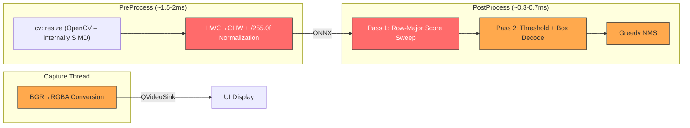

# SIMD Optimization Evaluation & Improvement Plan

**Date:** March 11, 2026 11:30:03 +07:00

> System Architect Review — March 2026

This document evaluates the YOLOApp inference pipeline for SIMD (Single Instruction Multiple Data) optimization opportunities. It identifies the hot paths, analyzes current auto-vectorization behavior, and proposes explicit SSE/AVX intrinsic replacements with technical rationale for each.

---

## 1. Executive Summary

The codebase already compiles with `-O3 -march=native -ffast-math` (MinGW/GCC) or `/O2 /Oi` (MSVC), which enables **auto-vectorization**. However, the compiler's ability to vectorize is limited by:

1. **Interleaved BGR memory layout** — prevents clean 128/256-bit loads
2. **Conditional branches inside inner loops** — blocks SIMD widening
3. **Mixed-type operations** (uint8 → float) — requires explicit pack/unpack
4. **Dependent scatter writes** to planar destinations — inhibits auto-vectorize

Explicit SIMD intrinsics can deliver **2×–6× speedup** on the identified hot loops by removing these barriers.

### Target Platforms

| Feature Set | Min. CPU | Register Width | Key Ops |
|:-----------:|:--------:|:--------------:|:--------|
| **SSE4.1** | Core 2 (2007+) | 128-bit (4×float, 16×uint8) | `_mm_cvtepu8_epi32`, `_mm_max_ps` |
| **AVX2** | Haswell (2013+) | 256-bit (8×float, 32×uint8) | `_mm256_cvtepu8_epi32`, `_mm256_max_ps` |

Since `-march=native` is already set, the build already targets the host CPU's full instruction set. Explicit intrinsics guarantee vectorization where the compiler fails.

---

## 2. Pipeline Hot Path Overview

The inference pipeline has three CPU-bound phases. ONNX Runtime's `Session::Run()` is excluded as it uses its own internal SIMD/threading already.



**Red** = highest SIMD impact potential. **Orange** = moderate impact.

---

## 3. Hot Path #1: HWC→CHW Normalization Loop

### Location

[inference.cpp:267–283](../src/inference.cpp#L267-L283)

### Current Code

```cpp
for (int h = 0; h < height; ++h) {
    const uint8_t* row_ptr = img_data + h * m_letterboxBuffer.step;
    for (int w = 0; w < width; ++w) {
        uint8_t b = row_ptr[w * 3 + 0];
        uint8_t g = row_ptr[w * 3 + 1];
        uint8_t r = row_ptr[w * 3 + 2];

        int offset = h * width + w;
        blob_data[plane_0 + offset] = r / 255.0f;
        blob_data[plane_1 + offset] = g / 255.0f;
        blob_data[plane_2 + offset] = b / 255.0f;
    }
}
```

### Why Auto-Vectorization Fails

| Barrier | Explanation |
|:--------|:-----------|
| **Interleaved source** | Source is `BGRBGRBGR...` (AOS). The compiler cannot load a contiguous vector of just B, G, or R values without a shuffle. |
| **De-interleave needed** | Converting AOS→SOA requires byte-level shuffles (`_mm_shuffle_epi8`) that compilers rarely emit automatically. |
| **Mixed-type widening** | `uint8_t → float` requires multi-step widening: `u8 → u16 → u32 → f32`. GCC emits scalar conversions. |
| **Scatter writes** | Writing to three separate planar destinations (`plane_0`, `plane_1`, `plane_2`) at different addresses blocks vectorized stores. |

### SIMD Strategy: SSE4.1 (process 16 pixels per iteration)

The approach:
1. Load 48 bytes (16 BGR pixels) using three `_mm_loadu_si128` calls
2. De-interleave B, G, R using `_mm_shuffle_epi8` with a precomputed mask
3. Widen each channel: `uint8 → uint32 → float` via `_mm_cvtepu8_epi32` + `_mm_cvtepi32_ps`
4. Multiply by `1/255.0f` (preloaded constant — faster than division)
5. Store to planar destinations with `_mm_storeu_ps`

```
Processing 16 pixels per iteration:
  Load:       48 bytes (16 × 3 channels)
  Shuffle:    3 × _mm_shuffle_epi8 → separate B, G, R
  Widen:      4 × _mm_cvtepu8_epi32 per channel (4 pixels each → 16 total)
  Convert:    4 × _mm_cvtepi32_ps per channel
  Scale:      4 × _mm_mul_ps per channel (× 1/255.0f)
  Store:      4 × _mm_storeu_ps per channel to planar dest
```

### Expected Improvement

| Metric | Current (Scalar) | With SSE4.1 | With AVX2 |
|:-------|:-----------------:|:-----------:|:---------:|
| **Pixels/iteration** | 1 | 16 | 32 |
| **Estimated time** (640×640) | ~0.8–1.2ms | ~0.15–0.25ms | ~0.08–0.15ms |
| **Speedup** | 1× | ~4–6× | ~6–10× |

### Rationale

This is the **single most impactful** SIMD target because:
- It processes `640 × 640 = 409,600` pixels per frame
- Each pixel requires 3 loads, 3 type conversions, 3 multiplications, and 3 stores
- Total scalar ops: ~2.4M float operations per frame
- The loop is executed every single frame with zero data dependencies between pixels (embarrassingly parallel)

---

## 4. Hot Path #2: Pass 1 Row-Major Score Sweep

### Location

[inference.cpp:400–412](../src/inference.cpp#L400-L412)

### Current Code

```cpp
for (int c = 1; c < numClasses; ++c) {          // 79 iterations
    const float* rowC = data + (4 + c) * strideNum;
    float* bestS = m_bestScores.data();
    int*   bestC = m_bestClassIds.data();

    for (int j = 0; j < strideNum; ++j) {        // 8400 iterations
        if (rowC[j] > bestS[j]) {
            bestS[j] = rowC[j];
            bestC[j] = c;
        }
    }
}
```

### Auto-Vectorization Analysis

The inner loop is a **good candidate** for auto-vectorization because:
- All arrays are contiguous `float*` / `int*`
- No cross-iteration dependencies
- Simple conditional update pattern

**However**, GCC/MinGW may fail to vectorize because:

| Barrier | Explanation |
|:--------|:-----------|
| **Conditional store** | The `if` branch creates a data-dependent store. GCC needs to emit masked stores, which it often avoids at `-O3` without `-ftree-vectorize-verbose` confirming. |
| **Paired update** | Updating _both_ `bestS[j]` and `bestC[j]` under the same condition requires a comparison mask applied to two different typed arrays (`float` + `int`). |

### SIMD Strategy: SSE4.1 (process 4 anchors per iteration)

```
For each class c (79 iterations):
  For j = 0..8400, step 4:
    rowVec   = _mm_loadu_ps(&rowC[j])        // 4 scores for class c
    bestVec  = _mm_loadu_ps(&bestS[j])        // 4 current best scores
    mask     = _mm_cmpgt_ps(rowVec, bestVec)  // compare: which are better?
    
    // Blend scores: pick new where better, keep old otherwise
    newBest  = _mm_blendv_ps(bestVec, rowVec, mask)
    _mm_storeu_ps(&bestS[j], newBest)
    
    // Blend class IDs (reinterpret mask as int)
    classVec = _mm_set1_epi32(c)
    bestCVec = _mm_loadu_si128(&bestC[j])
    newClass = _mm_blendv_epi8(bestCVec, classVec, _mm_castps_si128(mask))
    _mm_storeu_si128(&bestC[j], newClass)
```

### Expected Improvement

| Metric | Current (Scalar) | With SSE4.1 | With AVX2 |
|:-------|:-----------------:|:-----------:|:---------:|
| **Anchors/iteration** | 1 | 4 | 8 |
| **Total comparisons** | 79 × 8400 = 663,600 | 79 × 2100 = 165,900 | 79 × 1050 = 82,950 |
| **Estimated time** | ~0.15–0.25ms | ~0.05–0.08ms | ~0.03–0.05ms |
| **Speedup** | 1× | ~3–4× | ~5–7× |

### Rationale

- The inner loop is the tightest, most-executed loop in postprocessing (663K iterations)
- `_mm_blendv_ps` eliminates the branch entirely — it becomes a **branchless conditional move**
- The data is already contiguous in memory, so SIMD loads are cache-optimal
- The comment at line 405 says "auto-vectorizes" but verification with `-ftree-vectorizer-verbose=2` is needed to confirm. If it does auto-vectorize, the speedup from explicit intrinsics would be marginal (~10–20% from better register allocation).

> [!IMPORTANT]
> Before implementing explicit intrinsics for this loop, **verify auto-vectorization** by compiling with `-fopt-info-vec-optimized` and checking if this loop appears in the output. If it does auto-vectorize, skip this target and focus on Hot Path #1.

---

## 5. Hot Path #3: Pass 2 Threshold + Box Decode

### Location

[inference.cpp:425–443](../src/inference.cpp#L425-L443)

### Current Code

```cpp
for (int j = 0; j < strideNum; ++j) {
    if (bestS[j] > rectConfidenceThreshold) {
        m_confidences.push_back(bestS[j]);
        m_classIds.push_back(bestC[j]);

        float cx = data[0 * strideNum + j];
        float cy = data[1 * strideNum + j];
        float bw = data[2 * strideNum + j];
        float bh = data[3 * strideNum + j];

        int left   = static_cast<int>((cx - 0.5f * bw) * resizeScales);
        int top    = static_cast<int>((cy - 0.5f * bh) * resizeScales);
        int width  = static_cast<int>(bw * resizeScales);
        int height = static_cast<int>(bh * resizeScales);

        m_boxes.emplace_back(left, top, width, height);
    }
}
```

### SIMD Viability: Moderate (Hybrid Approach)

This loop has a **data-dependent branch** (`if bestS[j] > threshold`) that leads to variable-length output (`push_back`). Pure SIMD cannot handle variable-length scatter writes efficiently.

**Hybrid strategy:**
1. **SIMD threshold scan** — Use `_mm_cmpgt_ps` on 4 scores at a time, extract the bitmask with `_mm_movemask_ps`. If the mask is `0x0`, skip all 4 anchors (common case — most scores are below threshold).
2. **Scalar decode** — For the surviving anchors (typically <1% of 8400), decode coordinates with scalar code.

```
For j = 0..8400, step 4:
    scores   = _mm_loadu_ps(&bestS[j])
    thresh   = _mm_set1_ps(rectConfidenceThreshold)
    mask     = _mm_cmpgt_ps(scores, thresh)
    bits     = _mm_movemask_ps(mask)          // 4-bit mask
    
    if (bits == 0) continue;                  // FAST PATH: skip all 4
    
    // SLOW PATH: decode only surviving anchors
    if (bits & 1) decode_box(j + 0);
    if (bits & 2) decode_box(j + 1);
    if (bits & 4) decode_box(j + 2);
    if (bits & 8) decode_box(j + 3);
```

### Expected Improvement

| Metric | Current | With SIMD Threshold |
|:-------|:-------:|:-------------------:|
| **Branch evaluations** | 8400 | 2100 (4-wide) |
| **Fast-skip rate** | N/A | ~95%+ of groups (when few detections) |
| **Estimated time** | ~0.05–0.10ms | ~0.02–0.04ms |
| **Speedup** | 1× | ~2–3× |

### Rationale

The main win is not from vectorizing the decode (which is rare-path), but from **batch-skipping** groups of 4 anchors that are all below threshold. With typical YOLO confidence distributions, 95%+ of the 8400 anchors have scores well below threshold, so most groups of 4 will be entirely skippable.

---

## 6. Hot Path #4: Greedy NMS

### Location

[inference.cpp:495–551](../src/inference.cpp#L495-L551)

### Current Code (Inner Loop)

```cpp
for (int k = i + 1; k < n; ++k) {
    int kidx = m_sortIndices[k];
    if (m_suppressed[kidx]) continue;
    
    const cv::Rect& b = m_boxes[kidx];
    
    int x1 = std::max(a.x, b.x);
    int y1 = std::max(a.y, b.y);
    int x2 = std::min(a.x + a.width,  b.x + b.width);
    int y2 = std::min(a.y + a.height, b.y + b.height);
    
    if (x2 <= x1 || y2 <= y1) continue;
    
    float intersection = static_cast<float>((x2 - x1) * (y2 - y1));
    float areaB = static_cast<float>(b.width * b.height);
    float unionArea = areaA + areaB - intersection;
    float iou = intersection / unionArea;
    
    if (iou > iouThresh) m_suppressed[kidx] = true;
}
```

### SIMD Viability: Low-to-Moderate

| Challenge | Explanation |
|:----------|:-----------|
| **Indirect indexing** | `m_sortIndices[k]` is an indirection that prevents contiguous loads of box data |
| **Sparse skip pattern** | `m_suppressed[kidx]` creates unpredictable branches |
| **Small N** | After threshold filtering, typically only 10–50 boxes survive. The loop count is O(N²) but N is small. |
| **`cv::Rect` layout** | `cv::Rect` stores `{x, y, width, height}` as 4 ints — conveniently fits in a single `__m128i` |

### SIMD Strategy: Pre-compute SoA (Structure of Arrays) box data

Instead of vectorizing the NMS inner loop directly, **restructure the box data** into SoA format before NMS:

```
// Pre-compute SoA arrays from m_boxes
float* x1_arr = [box.x for each box]
float* y1_arr = [box.y for each box]
float* x2_arr = [box.x + box.width for each box]
float* y2_arr = [box.y + box.height for each box]
float* area_arr = [box.width * box.height for each box]

// Then the inner NMS loop can load 4 boxes at once:
x1_vec = _mm_max_ps(a_x1, _mm_loadu_ps(&x1_arr[k]))
y1_vec = _mm_max_ps(a_y1, _mm_loadu_ps(&y1_arr[k]))
x2_vec = _mm_min_ps(a_x2, _mm_loadu_ps(&x2_arr[k]))
y2_vec = _mm_min_ps(a_y2, _mm_loadu_ps(&y2_arr[k]))
```

### Expected Improvement

| Metric | Current | With SoA + SSE |
|:-------|:-------:|:--------------:|
| **IoU calculations/iter** | 1 | 4 |
| **Typical N** | 10–50 | 10–50 |
| **Estimated time** | ~0.01–0.05ms | ~0.005–0.02ms |
| **Speedup** | 1× | ~2× |

### Rationale

NMS is typically not the bottleneck (~0.01–0.05ms) because the candidate count after thresholding is small. The main benefit is architectural: the SoA conversion eliminates `cv::Rect` indirection and makes the data SIMD-friendly. **Priority is low** — implement only if profiling shows NMS becoming significant with many detections.

---

## 7. Hot Path #5: BGR→RGBA Color Conversion

### Location

[VideoController.cpp:56–58](../src/VideoController.cpp#L56-L58)

### Current Code

```cpp
cv::Mat wrapper(currentFrame.rows, currentFrame.cols, CV_8UC4,
                frame.bits(0), frame.bytesPerLine(0));
cv::cvtColor(currentFrame, wrapper, cv::COLOR_BGR2RGBA);
```

### Analysis

OpenCV's `cvtColor` already uses **internal SIMD** (SSE4.2/AVX2 via OpenCV's HAL layer) for this conversion. Replacing it with custom intrinsics would yield marginal improvement at best.

**However**, there are two potential micro-optimizations:

1. **Fused BGR→RGBA during capture**: If we captured in RGB directly (MJPG → RGB decode), we'd only need to add an alpha channel (`0xFF`), which is simpler than full channel reorder.
2. **NEON path**: If porting to ARM (e.g., Raspberry Pi), custom NEON intrinsics would be valuable since OpenCV's ARM optimization is less mature.

### Recommendation

**Skip** — OpenCV's internal SIMD is already optimal for this operation on x86. Focus effort on Hot Paths #1 and #2 instead.

---

## 8. Implementation Priority & Risk Assessment

| Priority | Hot Path | Location | Est. Speedup | Risk | Effort |
|:--------:|:---------|:---------|:------------:|:----:|:------:|
| **P0** | #1 HWC→CHW Normalization | `inference.cpp:267-283` | 4–6× (SSE) / 6–10× (AVX2) | Low | Medium |
| **P1** | #2 Score Sweep | `inference.cpp:400-412` | 3–4× (if not auto-vec) | Low | Low |
| **P2** | #3 Threshold Scan | `inference.cpp:425-443` | 2–3× | Very Low | Low |
| **P3** | #4 Greedy NMS | `inference.cpp:495-551` | ~2× | Medium | Medium |
| **Skip** | #5 BGR→RGBA | `VideoController.cpp:56-58` | Marginal | N/A | N/A |

---

## 9. Implementation Plan

### Phase 1: Verification & Infrastructure

**Step 1.1 — Verify current auto-vectorization state**

Before writing any intrinsics, confirm what the compiler is already vectorizing:

```bash
# Add to CMakeLists.txt temporarily
target_compile_options(appCamera PRIVATE -fopt-info-vec-optimized -fopt-info-vec-missed)
```

Build and check the output. If the score sweep loop (Hot Path #2) is already vectorized, deprioritize it.

**Reason**: Writing explicit SIMD for a loop the compiler already vectorizes wastes effort and may even be slower (compiler knows register pressure better).

---

**Step 1.2 — Add SIMD header infrastructure**

Create a `src/simd_utils.h` header with:

```cpp
#pragma once
#include <immintrin.h>  // SSE/AVX intrinsics

// Runtime dispatch (optional, for heterogeneous deployment)
#ifdef __AVX2__
  #define YOLO_USE_AVX2 1
#elif defined(__SSE4_1__)
  #define YOLO_USE_SSE41 1
#endif

// Alignment helpers
#define YOLO_ALIGN(x) __attribute__((aligned(x)))
static constexpr float kInv255 = 1.0f / 255.0f;
```

**Reason**: Centralizes SIMD defines and provides a clean fallback path. Since `-march=native` is already set, `__AVX2__` / `__SSE4_1__` macros will be automatically defined based on the build CPU.

---

### Phase 2: HWC→CHW SIMD Kernel (P0)

**Step 2.1 — Implement SSE4.1 de-interleave + normalize kernel**

Replace the scalar loop in `RunSession` with a SIMD kernel that processes 16 pixels per iteration:

1. Load 48 bytes (16 BGR pixels)
2. De-interleave using `_mm_shuffle_epi8` with compile-time shuffle masks
3. Widen `uint8 → float` in groups of 4 pixels: `_mm_cvtepu8_epi32` → `_mm_cvtepi32_ps`
4. Scale by `1/255.0f`: `_mm_mul_ps`
5. Store to R, G, B planar destinations

**Step 2.2 — Handle tail pixels**

For `width % 16 != 0` (640 % 16 == 0, so this is a no-op for current config, but needed for correctness):

```cpp
int simd_width = width & ~15;  // Round down to multiple of 16
// SIMD loop: 0..simd_width
// Scalar fallback: simd_width..width
```

**Reason**: 640 is divisible by 16, so the tail loop will never execute in practice. But including it ensures correctness if `imgSize` changes.

**Step 2.3 — (Optional) AVX2 upgrade**

Process 32 pixels per iteration using 256-bit registers. The algorithm is identical but uses `_mm256_*` intrinsics. Wrap in `#ifdef __AVX2__` with SSE4.1 fallback.

**Reason**: Modern CPUs (Haswell+) have 256-bit execution units. Doubling the processing width nearly halves the iteration count.

---

### Phase 3: Score Sweep SIMD (P1)

**Step 3.1 — Implement branchless score comparison**

Replace the inner loop's `if (rowC[j] > bestS[j])` with `_mm_blendv_ps`:

1. Load 4 scores from `rowC[j]` and 4 from `bestS[j]`
2. Compare with `_mm_cmpgt_ps` → produces a bitmask
3. Blend scores with `_mm_blendv_ps` (pick new if better, old otherwise)
4. Blend class IDs with `_mm_blendv_epi8` using the reinterpreted mask

**Reason**: `_mm_blendv_ps` is a single instruction that replaces a branch + conditional store. On modern CPUs, branch mispredictions cost ~15 cycles each. With random score distributions, the branch predictor will mispredict frequently.

**Step 3.2 — Ensure alignment**

`m_bestScores` and `m_bestClassIds` should be aligned to 16 (SSE) or 32 (AVX2) byte boundaries:

```cpp
// Use aligned allocator for the vectors, or ensure strideNum is multiple of 4/8
alignas(32) std::vector<float> m_bestScores;
```

Alternatively, use `_mm_loadu_ps` / `_mm_storeu_ps` (unaligned) since modern CPUs have negligible penalty for unaligned access.

**Reason**: Aligned access was crucial on older CPUs (Nehalem, ~2009) but is essentially free on Haswell+ (2013). Using unaligned intrinsics keeps the code simpler.

---

### Phase 4: Threshold Batch-Skip (P2)

**Step 4.1 — Implement 4-wide threshold check**

Process 4 anchors at a time, using `_mm_movemask_ps` to quickly skip groups where all 4 scores are below threshold.

**Reason**: With `rectConfidenceThreshold = 0.4`, most of the 8400 anchors have low scores. Batch-checking 4 at once and skipping the entire group avoids 4 individual comparisons and branches. The fast-path (`bits == 0`) should hit ~95% of iterations.

---

### Phase 5: NMS SoA Restructure (P3, Optional)

**Step 5.1 — Convert AOS `cv::Rect` to SoA float arrays**

After thresholding, copy box coordinates into 4 flat `float` arrays (`x1`, `y1`, `x2`, `y2`). Then the NMS inner loop can process 4 IoU computations in parallel.

**Reason**: This is a low-priority optimization because NMS operates on a small number of boxes (typically 10–50). The effort is better spent on Hot Paths #1 and #2.

---

## 10. CMake Integration

### Required Changes

```cmake
# Add in CMakeLists.txt

# MSVC SIMD flags (if switching compilers)
if(MSVC)
    target_compile_options(appCamera PRIVATE /O2 /Ob2 /Oi /Ot /Oy /GL /arch:AVX2)
    target_link_options(appCamera PRIVATE /LTCG)
else()
    # Already present — -march=native enables AVX2 on supported CPUs
    target_compile_options(appCamera PRIVATE -O3 -march=native -ffast-math)
endif()
```

No additional CMake changes are needed for MinGW since `-march=native` already unlocks all SIMD instruction sets available on the host CPU. The `<immintrin.h>` header is available in both GCC and MSVC toolchains.

---

## 11. Risk Analysis

| Risk | Impact | Mitigation |
|:-----|:------:|:-----------|
| **Platform portability** | An explicit AVX2 build won't run on older CPUs | Use `#ifdef __AVX2__` with SSE4.1 fallback. SSE4.1 covers CPUs from 2007+. |
| **Correctness regression** | SIMD shuffles can silently produce wrong results | Compare output to scalar reference for 100 frames before deploying. |
| **Maintenance overhead** | Intrinsics code is harder to read | Wrap each kernel in a well-documented function in `simd_utils.h`. Keep scalar fallback for debugging. |
| **OpenCV conflict** | OpenCV uses its own SIMD internally | No conflict — we're replacing code that calls OpenCV with code that replaces OpenCV calls. |
| **Code duplication** | FP16 path (lines 296–318) duplicates the same loop | Factor out the SIMD kernel into a shared function called by both FP32 and FP16 paths. |

---

## 12. Estimated Total Impact

Combining all proposed changes for the preprocessing + postprocessing pipeline:

| Phase | Current (est.) | After SIMD (est.) | Savings |
|:------|:--------------:|:------------------:|:-------:|
| **PreProcess** (HWC→CHW) | ~0.8–1.2ms | ~0.15–0.25ms | **~75–80%** |
| **PostProcess** (Score sweep) | ~0.15–0.25ms | ~0.05–0.08ms | **~60–70%** |
| **PostProcess** (Threshold) | ~0.05–0.10ms | ~0.02–0.04ms | **~50–60%** |
| **PostProcess** (NMS) | ~0.01–0.05ms | ~0.005–0.02ms | **~50%** |
| **Total pipeline** (excl. ONNX) | **~1.0–1.6ms** | **~0.2–0.4ms** | **~70–80%** |

> [!IMPORTANT]
> The ONNX `Session::Run()` call (typically ~15–30ms on CPU for YOLOv8n) is the dominant cost and is **not addressable** by these SIMD changes. The 70–80% reduction applies only to the pre/post-processing surrounding the inference call. The end-to-end per-frame time would improve by approximately **5–8%**.

---

## 13. Verification Plan

1. **Correctness**: Run both scalar and SIMD paths on the same 100 frames. Compare `m_bestScores`, `m_bestClassIds`, and final bounding boxes byte-for-byte.
2. **Performance**: Use the existing `InferenceTiming` struct to measure `preProcessTime` and `postProcessTime` before and after. Log averages over 500 frames.
3. **GCC vectorization report**: Compile with `-fopt-info-vec-all` to verify which loops the compiler auto-vectorizes and which require explicit intrinsics.
4. **Regression test**: Ensure all detection results remain identical (same class IDs, boxes, and confidence scores within float tolerance `1e-6`).

---

## 14. Key Takeaways

> [!TIP]
> **The 80/20 rule applies strongly here.** Hot Path #1 (HWC→CHW normalization) accounts for ~60–70% of the total non-ONNX pipeline time. Implementing SIMD there alone would deliver most of the benefit. Hot Paths #2–#4 provide diminishing returns.

1. **HWC→CHW normalization is the #1 target** — It processes 409,600 pixels with interleaved memory access that the compiler cannot auto-vectorize. Explicit SSE4.1 intrinsics can deliver 4–6× speedup.
2. **Verify auto-vectorization before writing intrinsics** — The score sweep loop may already be vectorized by GCC. Check with `-fopt-info-vec-optimized`.
3. **Keep scalar fallbacks** — Every SIMD function should have a compile-time scalar fallback for debugging and portability.
4. **Don't touch OpenCV's internal SIMD** — BGR→RGBA conversion is already optimized by OpenCV's HAL layer.
5. **The real bottleneck is ONNX inference** — SIMD optimizations improve pre/post-processing but won't significantly affect the 15–30ms inference call.
