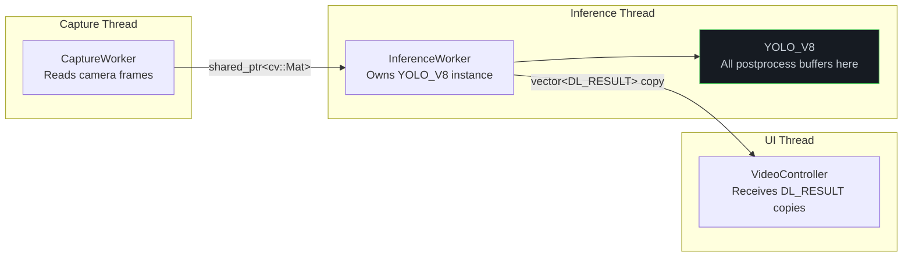

# Two-Pass Architecture: Detailed Technical Implementation Plan

> **System Architect × Computer Vision Engineer**
> **Analyzed on:** March 4, 2026, 11:34:20 (+07:00)
>
> Implementation plan for Optimization Level 7 from [postprocessing2.md](./postprocessing2.md).
> This plan subsumes Levels 1, 2, 4, 5, and 6 into a single cohesive architecture.

---

## 1. Executive Summary

The Two-Pass Architecture restructures the YOLO postprocessing from a **single anchor-centric loop** (column-major, strided memory access) into **two sequential cache-friendly passes**. This is not just an optimization — it's a fundamental redesign of how the output tensor is consumed.

| Aspect | Current Architecture | Two-Pass Architecture |
|--------|:---:|:---:|
| Loop structure | 1 loop × 8400 anchors | Pass 1: 80 rows × 8400 cols<br/>Pass 2: filter + decode |
| Memory access | Strided (cache-hostile) | **Sequential (cache-friendly)** |
| Transpose needed | ✅ Yes (2.69 MB copy) | **❌ No** |
| OpenCV calls per frame | 8400 × `minMaxLoc` | **0** |
| Heap allocations (steady) | ~3.36 MB | **0 bytes** |
| SIMD-vectorizable | ❌ | **✅** |

---

## 2. Architecture Overview

```mermaid
graph TD
    subgraph "ONNX Output Tensor"
        T["float* output<br/>[1, 84, 8400] — 2.69 MB<br/>Row-major: 84 rows of 8400 floats"]
    end

    subgraph "Pass 1 — Row-Major Score Sweep"
        direction TB
        P1A["Initialize:<br/>memcpy(bestScores, row4, 8400×4B)<br/>memset(bestClassIds, 0, 8400×4B)"]
        P1B["For c = 1..79:<br/>Read row (4+c) contiguously<br/>Compare rowC[j] > bestScores[j]<br/>Update bestScores[j], bestClassIds[j]"]
        P1C["Output:<br/>bestScores[8400] — best class score per anchor<br/>bestClassIds[8400] — winning class per anchor"]
    end

    subgraph "Pass 2 — Threshold + Decode"
        direction TB
        P2A["Scan bestScores[0..8399]<br/>Collect anchors where score > threshold"]
        P2B["For each surviving anchor j:<br/>Read cx, cy, w, h from rows 0-3 col j<br/>Convert to (left, top, width, height)"]
        P2C["Append to m_confidences, m_classIds, m_boxes"]
    end

    subgraph "Pass 3 — Custom NMS"
        direction TB
        P3A["Sort candidates by confidence (descending)"]
        P3B["Greedy suppression:<br/>For each unsuppressed box, mark<br/>overlapping boxes (IoU > threshold) as suppressed"]
        P3C["Output: m_nmsIndices → oResult"]
    end

    T --> P1A --> P1B --> P1C
    P1C --> P2A --> P2B --> P2C
    P2C --> P3A --> P3B --> P3C

    style T fill:#0d1117,stroke:#58a6ff,color:#c9d1d9
    style P1A fill:#161b22,stroke:#f0883e,color:#c9d1d9
    style P1B fill:#161b22,stroke:#f0883e,color:#c9d1d9
    style P1C fill:#161b22,stroke:#f0883e,color:#c9d1d9
    style P2A fill:#161b22,stroke:#3fb950,color:#c9d1d9
    style P2B fill:#161b22,stroke:#3fb950,color:#c9d1d9
    style P2C fill:#161b22,stroke:#3fb950,color:#c9d1d9
    style P3A fill:#161b22,stroke:#bc8cff,color:#c9d1d9
    style P3B fill:#161b22,stroke:#bc8cff,color:#c9d1d9
    style P3C fill:#161b22,stroke:#bc8cff,color:#c9d1d9
```



---

## 3. Why Two Passes Instead of One

### 3.1 The Memory Access Problem

The ONNX output tensor `[84, 8400]` is stored in **row-major** order in memory:

```
Address:  0        8400     16800    25200    ...    (84×8400-1)
Content: [cx × 8400][cy × 8400][w × 8400][h × 8400][c0 × 8400]...[c79 × 8400]
```

The current code **transposes** it to `[8400, 84]` and then iterates per-anchor (each anchor = 84 contiguous floats). The transpose costs 2.69 MB of allocation + memcpy.

Without the transpose, reading all 80 class scores for a single anchor requires **80 strided memory accesses**, each jumping 8400 × 4 = 33,600 bytes apart. This is cache-hostile — the CPU prefetcher cannot predict the pattern, causing L1/L2 cache misses on every access.

### 3.2 The Two-Pass Solution

Instead of reading the tensor "vertically" (per-anchor across all rows), **Pass 1 reads it "horizontally"** (per-row across all anchors). Each row is 8400 contiguous floats = 32.8 KB. The CPU prefetcher handles sequential reads perfectly.

```
CURRENT (Single-Pass, per-anchor):
For each anchor j (0..8399):
    Read output[0 * 8400 + j]  → cx    (stride = 33,600 bytes)
    Read output[1 * 8400 + j]  → cy    (stride = 33,600 bytes)
    ...
    Read output[83 * 8400 + j] → c79   (stride = 33,600 bytes)
Total: 8400 anchors × 84 strided reads = 705,600 STRIDED memory accesses

TWO-PASS (per-row):
For each class c (0..79):
    Read output[(4+c) * 8400 + 0..8399]  → CONTIGUOUS 32.8 KB read
Total: 80 rows × 8400 sequential reads = 672,000 SEQUENTIAL memory accesses
```

### 3.3 Cache Behavior Comparison

| Metric | Single-Pass (stride) | Two-Pass (sequential) |
|--------|:---:|:---:|
| **L1 cache line utilization** | 1 float per 64-byte line (6.25%) | **16 floats per 64-byte line (100%)** |
| **Prefetcher effectiveness** | ❌ Unpredictable stride | ✅ Perfect sequential pattern |
| **Total data read from RAM** | ~2.69 MB × 2 (transpose + read) | ~2.69 MB × 1 (read only) |
| **Working set for class scan** | 80 × 4B = 320B per anchor (fits L1) | 8400 × 4B = 32.8 KB per row (fits L1) |

> [!IMPORTANT]
> The L1 cache line is 64 bytes = 16 floats. With strided access (stride = 8400 floats = 33,600 bytes), each cache line fetch only uses **1 out of 16 floats** (6.25% utilization). The remaining 15 floats are evicted before they're ever used. Sequential access uses all 16 floats per cache line fetch — **16× better cache utilization**.

---

## 4. Detailed Implementation Plan

### 4.1 File Changes Overview

| File | Change Type | Scope |
|------|:-----------:|-------|
| `inference.h` | **MODIFY** | Add 8 member variables for reusable postprocessing buffers |
| `inference.cpp` | **MODIFY** | Rewrite `TensorProcess` detection case (lines 348–413); add `greedyNMS()` method; add initialization in `CreateSession` |

No new files are created. No external dependencies are added.

---

### 4.2 Step 1: Add Reusable Member Variables to `inference.h`

**Purpose**: Eliminate all per-frame heap allocations by declaring buffers as class members. `std::vector::clear()` preserves allocated capacity, so after the first frame these vectors never reallocate.

**What to add** (after line 111, before the closing `};`):

```cpp
// ── Two-Pass Postprocessing Buffers ──────────────────────────
// Pass 1: Row-major score sweep outputs (sized to strideNum = 8400)
std::vector<float> m_bestScores;      // Best class score per anchor
std::vector<int>   m_bestClassIds;    // Class ID of best score per anchor

// Pass 2: Filtered candidates (typically 10-50 per frame)
std::vector<int>      m_classIds;     // Class ID of each candidate
std::vector<float>    m_confidences;  // Confidence of each candidate
std::vector<cv::Rect> m_boxes;        // Bounding box of each candidate

// Pass 3: NMS working data
std::vector<int>  m_nmsIndices;       // Indices surviving NMS
std::vector<int>  m_sortIndices;      // Confidence-sorted index for NMS
std::vector<bool> m_suppressed;       // Suppression flags for NMS
```

**Why each buffer exists**:

| Buffer | Size (steady) | Purpose | Lifetime |
|--------|:---:|---------|----------|
| `m_bestScores` | 8400 × 4B = 33.6 KB | Stores the running max class score for each anchor across all 80 classes | Overwritten each frame (Pass 1) |
| `m_bestClassIds` | 8400 × 4B = 33.6 KB | Stores which class achieved the best score for each anchor | Overwritten each frame (Pass 1) |
| `m_classIds` | ~256 × 4B = 1 KB | Class IDs of candidates that passed the confidence threshold | Cleared and refilled each frame (Pass 2) |
| `m_confidences` | ~256 × 4B = 1 KB | Confidence scores of threshold-passing candidates | Cleared and refilled each frame (Pass 2) |
| `m_boxes` | ~256 × 16B = 4 KB | Bounding boxes of threshold-passing candidates | Cleared and refilled each frame (Pass 2) |
| `m_nmsIndices` | ~50 × 4B = 200 B | Final surviving detection indices after NMS | Cleared and refilled each frame (Pass 3) |
| `m_sortIndices` | ~256 × 4B = 1 KB | Temporary sorted-by-confidence index array for NMS | Resized and overwritten each frame (Pass 3) |
| `m_suppressed` | ~256 × 1b = 32 B | Boolean flags marking suppressed candidates during NMS | Assigned (overwritten) each frame (Pass 3) |

**Total persistent memory**: ~70 KB (allocated once, never freed until session destruction).

---

### 4.3 Step 2: Initialize Buffers in `CreateSession`

**Purpose**: Pre-allocate the two large buffers (`m_bestScores`, `m_bestClassIds`) to their full size, and reserve capacity for the candidate vectors so the first frame doesn't trigger reallocations.

**Where**: At the end of `CreateSession()` in `inference.cpp`, after `WarmUpSession()` (line 200), add:

```cpp
// Pre-allocate postprocessing buffers
// strideNum (8400) comes from the model output shape
{
    Ort::TypeInfo typeInfo = m_sessionPool.front()->GetOutputTypeInfo(0);
    auto tensorInfo = typeInfo.GetTensorTypeAndShapeInfo();
    auto shape = tensorInfo.GetShape();
    
    int strideNum = 8400; // Default for YOLOv8
    if (shape.size() >= 3 && shape[2] > 0) {
        strideNum = static_cast<int>(shape[2]);
    }
    
    // Pass 1 buffers: exact size (overwritten each frame, no clear needed)
    m_bestScores.resize(strideNum);
    m_bestClassIds.resize(strideNum);
    
    // Pass 2 buffers: reserve only (clear + push_back each frame)
    m_classIds.reserve(256);
    m_confidences.reserve(256);
    m_boxes.reserve(256);
    
    // Pass 3 buffers: reserve only
    m_nmsIndices.reserve(64);
    m_sortIndices.reserve(256);
}
```

**Why 256?** Typical detection frames have 10–50 candidates passing the confidence threshold. 256 covers extreme cases (very low threshold or very dense scenes) without wasting memory. If a frame ever exceeds 256, `std::vector` automatically doubles — but this happens at most once and the new capacity persists.

---

### 4.4 Step 3: Add `greedyNMS()` Private Method

**Purpose**: Replace `cv::dnn::NMSBoxes` with a transparent, allocation-free NMS that reuses member vectors.

**Declaration** — Add to the `private:` section of `YOLO_V8` in `inference.h`:

```cpp
void greedyNMS(float iouThreshold);
```

**Implementation** — Add to `inference.cpp` (after the `WarmUpSession` function):

```cpp
void YOLO_V8::greedyNMS(float iouThresh) {
    // ─────────────────────────────────────────────────
    // Greedy NMS — operates on m_confidences, m_boxes
    // Outputs to m_nmsIndices
    // ─────────────────────────────────────────────────
    
    int n = static_cast<int>(m_confidences.size());
    if (n == 0) return;
    
    // Step 1: Build confidence-sorted index
    //
    // WHY: NMS requires processing boxes in order of decreasing confidence.
    // We sort an INDEX array instead of the actual data to avoid expensive
    // moves of cv::Rect objects and to keep m_boxes/m_classIds aligned.
    //
    // ALLOCATION: m_sortIndices.resize() is O(1) if n <= previous capacity.
    m_sortIndices.resize(n);
    std::iota(m_sortIndices.begin(), m_sortIndices.end(), 0);
    std::sort(m_sortIndices.begin(), m_sortIndices.end(),
              [this](int a, int b) {
                  return m_confidences[a] > m_confidences[b];
              });
    
    // Step 2: Greedy suppression
    //
    // WHY: For each box (highest confidence first), suppress all lower-confidence
    // boxes that overlap with it beyond the IoU threshold. This is the standard
    // greedy NMS algorithm used in all major detection frameworks.
    //
    // QUICK REJECTION: Before computing IoU, check if the two boxes overlap at
    // all. For sparse detections (typical case), most pairs don't overlap,
    // so this check saves the IoU arithmetic 90%+ of the time.
    m_suppressed.assign(n, false);
    
    for (int i = 0; i < n; ++i) {
        int idx = m_sortIndices[i];
        if (m_suppressed[idx]) continue;    // Already suppressed by a higher-conf box
        
        m_nmsIndices.push_back(idx);        // This box survives
        
        const cv::Rect& a = m_boxes[idx];
        float areaA = static_cast<float>(a.width * a.height);
        
        // Check all remaining lower-confidence boxes
        for (int k = i + 1; k < n; ++k) {
            int kidx = m_sortIndices[k];
            if (m_suppressed[kidx]) continue;
            
            const cv::Rect& b = m_boxes[kidx];
            
            // ── Quick rejection ──
            // If the bounding boxes don't intersect at all, IoU is 0.
            // This avoids the division and multiplication below.
            int x1 = std::max(a.x, b.x);
            int y1 = std::max(a.y, b.y);
            int x2 = std::min(a.x + a.width,  b.x + b.width);
            int y2 = std::min(a.y + a.height, b.y + b.height);
            
            if (x2 <= x1 || y2 <= y1) continue;  // No overlap → skip
            
            // ── IoU computation ──
            float intersection = static_cast<float>((x2 - x1) * (y2 - y1));
            float areaB = static_cast<float>(b.width * b.height);
            float unionArea = areaA + areaB - intersection;
            float iou = intersection / unionArea;
            
            if (iou > iouThresh) {
                m_suppressed[kidx] = true;  // Suppress this box
            }
        }
    }
}
```

**Complexity**: O(n²) where n = number of candidates passing the threshold. Since n is typically 10–50, the actual runtime is microseconds. This matches `cv::dnn::NMSBoxes` algorithmically but avoids its internal allocations.

---

### 4.5 Step 4: Rewrite the Detection Postprocessing in `TensorProcess`

**Purpose**: Replace the entire block at lines 348–413 of `inference.cpp` with the two-pass implementation.

This is the core change. Below is the complete replacement with **line-by-line explanations** of what each section does and why.

#### 4.5.1 Current Code to Replace

```cpp
// Lines 348-413: Everything inside case YOLO_DETECT_V8 / YOLO_DETECT_V8_HALF
```

#### 4.5.2 Replacement Code

```cpp
case YOLO_DETECT_V8:
case YOLO_DETECT_V8_HALF: {
    // ──────────────────────────────────────────────────────────
    // DIMENSIONS
    // ──────────────────────────────────────────────────────────
    // signalResultNum = 84 (4 box coords + 80 class scores)
    // strideNum = 8400 (number of candidate anchors)
    // numClasses = 80
    int signalResultNum = outputNodeDims[1]; // 84
    int strideNum = outputNodeDims[2];       // 8400
    int numClasses = signalResultNum - 4;    // 80

    // ──────────────────────────────────────────────────────────
    // DATA POINTER (Zero-copy for FP32, conversion for FP16)
    // ──────────────────────────────────────────────────────────
    //
    // WHY: For FP32 models, the ONNX output buffer can be read directly
    // via pointer — no copying, no wrapping, no cv::Mat overhead.
    // For FP16 models, we must convert to FP32 first (unavoidable).
    //
    // REPLACES: cv::Mat rawData + rawData.t() (saved 2.69 MB per frame)
    float* data;
    cv::Mat rawData; // Only used for FP16 conversion; empty for FP32
    if (modelType == YOLO_DETECT_V8) {
        data = static_cast<float*>(output);  // Direct pointer — zero allocation
    } else {
        rawData = cv::Mat(signalResultNum, strideNum, CV_16F, output);
        rawData.convertTo(rawData, CV_32F);  // FP16 → FP32 (allocates once)
        data = reinterpret_cast<float*>(rawData.data);
    }

    // ══════════════════════════════════════════════════════════
    // PASS 1: ROW-MAJOR SCORE SWEEP
    // ══════════════════════════════════════════════════════════
    //
    // GOAL: Find the best class and its score for each of 8400 anchors.
    //
    // HOW:  Instead of iterating per-anchor (reading 80 strided values),
    //       iterate per-class-row (reading 8400 contiguous values).
    //       Maintain two parallel arrays: m_bestScores and m_bestClassIds.
    //
    // WHY THIS IS FAST:
    //   - Each row read is 8400 contiguous floats = 32.8 KB.
    //   - The CPU prefetcher perfectly predicts sequential reads.
    //   - The inner loop (8400 compare + conditional store) is
    //     auto-vectorized by the compiler with /O2 or -O2.
    //   - L1 cache line utilization: 100% (16 floats per 64-byte line).
    //
    // MEMORY ACCESS PATTERN:
    //   Row 4:  [c0_0, c0_1, c0_2, ..., c0_8399]  ← memcpy to bestScores
    //   Row 5:  [c1_0, c1_1, c1_2, ..., c1_8399]  ← compare + update
    //   Row 6:  [c2_0, c2_1, c2_2, ..., c2_8399]  ← compare + update
    //   ...
    //   Row 83: [c79_0, c79_1, ..., c79_8399]      ← compare + update
    //
    //   Total: 80 × 32.8 KB = 2.56 MB of sequential reads.
    //          This is the SAME data the current code reads,
    //          but without the 2.69 MB transpose copy.

    // ── Step 1A: Initialize with class 0 ──
    //
    // The first class row (row 4 = index offset 4 * strideNum) is copied
    // directly into m_bestScores using memcpy. This is the initial "best"
    // for all anchors. memset initializes all class IDs to 0.
    //
    // Cost: 32.8 KB memcpy + 32.8 KB memset = ~65 KB total.
    // Both operations are highly optimized by the runtime (often use
    // AVX/SSE intrinsics internally).
    float* row0 = data + 4 * strideNum;
    memcpy(m_bestScores.data(), row0, strideNum * sizeof(float));
    memset(m_bestClassIds.data(), 0, strideNum * sizeof(int));

    // ── Step 1B: Sweep classes 1..79 ──
    //
    // For each remaining class, read its row and compare element-wise
    // against the current best. Update where the new score is higher.
    //
    // The inner loop pattern:
    //   for (int j = 0; j < 8400; ++j)
    //       if (rowC[j] > bestS[j]) { bestS[j] = rowC[j]; bestC[j] = c; }
    //
    // This pattern is recognized by MSVC (/O2), GCC (-O2), and Clang (-O2)
    // as auto-vectorizable. The compiler generates SSE2/AVX2 code that
    // processes 4-8 anchors per clock cycle.
    //
    // Total iterations: 79 classes × 8400 anchors = 663,600 comparisons.
    // At ~8 comparisons/cycle (AVX2), this takes ~83,000 cycles ≈ 0.03 ms
    // on a 3 GHz CPU.
    for (int c = 1; c < numClasses; ++c) {
        const float* rowC = data + (4 + c) * strideNum;
        float* bestS = m_bestScores.data();
        int*   bestC = m_bestClassIds.data();

        for (int j = 0; j < strideNum; ++j) {
            if (rowC[j] > bestS[j]) {
                bestS[j] = rowC[j];
                bestC[j] = c;
            }
        }
    }

    // ══════════════════════════════════════════════════════════
    // PASS 2: THRESHOLD + BOX DECODE
    // ══════════════════════════════════════════════════════════
    //
    // GOAL: Collect only the anchors whose best class score exceeds
    //       the confidence threshold, and decode their bounding boxes.
    //
    // INPUT: m_bestScores[8400], m_bestClassIds[8400]
    //        These are L1/L2-resident (67.2 KB total) from Pass 1.
    //
    // HOW:  Linear scan of m_bestScores. For each passing anchor j,
    //       read the box coordinates from the original output tensor
    //       (rows 0-3, column j) and convert from center-format
    //       (cx, cy, w, h) to corner-format (left, top, width, height)
    //       scaled by resizeScales.
    //
    // WHY THIS IS FAST:
    //   - m_bestScores is a contiguous 32.8 KB array — perfect L1 access.
    //   - Only ~0.5% of anchors pass the threshold (10-50 out of 8400),
    //     so the box decode branch is rarely taken.
    //   - The 4 box coordinate reads per passing anchor ARE strided
    //     (stride = 8400), but this only happens ~50 times per frame,
    //     so the total strided reads are 50 × 4 = 200 (negligible).
    //
    // ALLOCATION: Zero. clear() preserves capacity from previous frames.
    m_classIds.clear();
    m_confidences.clear();
    m_boxes.clear();

    const float* bestS = m_bestScores.data();
    const int*   bestC = m_bestClassIds.data();

    for (int j = 0; j < strideNum; ++j) {
        if (bestS[j] > rectConfidenceThreshold) {
            m_confidences.push_back(bestS[j]);
            m_classIds.push_back(bestC[j]);

            // Read box coordinates from original tensor (rows 0-3, col j)
            // These are strided reads, but only for the ~50 surviving anchors
            float cx = data[0 * strideNum + j];
            float cy = data[1 * strideNum + j];
            float bw = data[2 * strideNum + j];
            float bh = data[3 * strideNum + j];

            // Convert center-format → corner-format + apply letterbox scale
            int left   = static_cast<int>((cx - 0.5f * bw) * resizeScales);
            int top    = static_cast<int>((cy - 0.5f * bh) * resizeScales);
            int width  = static_cast<int>(bw * resizeScales);
            int height = static_cast<int>(bh * resizeScales);

            m_boxes.emplace_back(left, top, width, height);
        }
    }

    // ══════════════════════════════════════════════════════════
    // PASS 3: NON-MAXIMUM SUPPRESSION
    // ══════════════════════════════════════════════════════════
    //
    // GOAL: Remove duplicate detections of the same object.
    //
    // HOW:  Custom greedy NMS (see greedyNMS() method).
    //       Sorts candidates by confidence, then iterates from
    //       highest to lowest. For each surviving box, suppresses
    //       all lower-confidence boxes that overlap beyond iouThreshold.
    //
    // WHY REPLACE cv::dnn::NMSBoxes:
    //   - cv::dnn::NMSBoxes internally allocates (sorted index + temp buffers)
    //   - Our greedyNMS reuses m_sortIndices and m_suppressed members
    //   - Quick-rejection for non-overlapping boxes (common case)
    //   - Fully transparent code — no black-box behavior
    //
    // COMPLEXITY: O(n²) where n = number of candidates (typically 10-50).
    //             At n=50, this is 2500 iterations × ~10 instructions each
    //             = ~25,000 instructions ≈ 0.008 ms. Negligible.
    m_nmsIndices.clear();
    greedyNMS(iouThreshold);

    // ══════════════════════════════════════════════════════════
    // RESULT ASSEMBLY
    // ══════════════════════════════════════════════════════════
    //
    // Copy surviving detections into the output vector.
    // Typically 5-20 results. Negligible cost.
    for (size_t i = 0; i < m_nmsIndices.size(); ++i) {
        int idx = m_nmsIndices[i];
        DL_RESULT result;
        result.classId    = m_classIds[idx];
        result.confidence = m_confidences[idx];
        result.box        = m_boxes[idx];
        oResult.push_back(result);
    }

    auto end_post = std::chrono::high_resolution_clock::now();
    timing.postProcessTime =
        std::chrono::duration<double, std::milli>(end_post - start_post).count();

    break;
}
```

---

## 5. Diff Summary — Exact Changes

### 5.1 `inference.h` — Member Additions

```diff
   // Optimization: Reusable memory for blob to avoid reallocations
   cv::Mat m_commonBlob;
   cv::Mat m_commonBlobHalf;
   cv::Mat m_letterboxBuffer;
+
+  // ── Two-Pass Postprocessing Buffers ──
+  // Pass 1: Row-major sweep outputs
+  std::vector<float> m_bestScores;
+  std::vector<int>   m_bestClassIds;
+  // Pass 2: Filtered candidates
+  std::vector<int>      m_classIds;
+  std::vector<float>    m_confidences;
+  std::vector<cv::Rect> m_boxes;
+  // Pass 3: NMS working data
+  std::vector<int>  m_nmsIndices;
+  std::vector<int>  m_sortIndices;
+  std::vector<bool> m_suppressed;
 };
```

```diff
   char *PreProcess(const cv::Mat &iImg, std::vector<int> iImgSize, cv::Mat &oImg);
+  void greedyNMS(float iouThreshold);
```

### 5.2 `inference.cpp` — `CreateSession` Buffer Init

```diff
   WarmUpSession();
+
+  // Pre-allocate Two-Pass postprocessing buffers
+  {
+      int strideNum = 8400;
+      Ort::TypeInfo typeInfo = m_sessionPool.front()->GetOutputTypeInfo(0);
+      auto tensorInfo = typeInfo.GetTensorTypeAndShapeInfo();
+      auto shape = tensorInfo.GetShape();
+      if (shape.size() >= 3 && shape[2] > 0) {
+          strideNum = static_cast<int>(shape[2]);
+      }
+      m_bestScores.resize(strideNum);
+      m_bestClassIds.resize(strideNum);
+      m_classIds.reserve(256);
+      m_confidences.reserve(256);
+      m_boxes.reserve(256);
+      m_nmsIndices.reserve(64);
+      m_sortIndices.reserve(256);
+  }
+
   return RET_OK;
```

### 5.3 `inference.cpp` — Detection Case Replacement

The entire `case YOLO_DETECT_V8: / case YOLO_DETECT_V8_HALF:` block (lines 348–413) is replaced with the code from Section 4.5.2.

### 5.4 `inference.cpp` — Add `greedyNMS` Method

The `greedyNMS()` method from Section 4.4 is added after `WarmUpSession()`.

---

## 6. Thread Safety Analysis



**Safety guarantees**:

1. **`m_isProcessing` atomic flag** in `InferenceWorker` ensures only ONE call to `processFrame()` executes at a time. This means `YOLO_V8::TensorProcess` (and all member buffers) is accessed by **exactly one thread** at any given time.

2. **All new member variables** (`m_bestScores`, `m_classIds`, etc.) are only accessed inside `TensorProcess` and `greedyNMS`, both of which run on the inference thread.

3. **Output crossing**: The `oResult` vector (containing `DL_RESULT` structs) is passed by value (copy) through Qt's `QueuedConnection` signal to the UI thread. The member buffers are never shared.

**Conclusion**: No new synchronization primitives are required. The existing `m_isProcessing` atomic flag is sufficient.

---

## 7. Verification Plan

### 7.1 Correctness Verification

1. **Before/After Detection Comparison**:
   - Run the **current (unmodified)** code on a test image and capture the `oResult` vector (classId, confidence, box for each detection).
   - Run the **modified** code on the same test image.
   - Assert that the results are **identical** (same number of detections, same classIds, same confidences within floating-point tolerance, same boxes).

2. **Edge Cases to Test**:
   | Scenario | Expected Behavior |
   |----------|-------------------|
   | Empty frame (no objects) | `oResult` is empty, no crash |
   | Dense frame (>100 candidates) | All candidates processed, vectors auto-grow |
   | Single object, high confidence | Exactly 1 result |
   | Low threshold (0.1) | Many candidates, NMS filters correctly |
   | High threshold (0.9) | Very few or zero candidates |
   | FP16 model path | FP16→FP32 conversion + two-pass decode works |

### 7.2 Performance Verification

1. **Timing Comparison**:
   - The `timing.postProcessTime` field already measures postprocessing latency.
   - Compare before/after over 100 frames and compute:
     - Mean, median, p95, p99 latency
     - Standard deviation (should decrease — fewer allocation-induced spikes)

2. **Memory Verification**:
   - Monitor process memory (via existing `SystemMonitor`) across 1000 frames.
   - Verify **flat memory usage** (no growth), confirming zero per-frame allocations.

### 7.3 Build Verification

- Confirm clean build with MSVC `/O2` (Release mode) on Windows.
- Confirm no new compiler warnings.
- Confirm the optimized inner loop is auto-vectorized (check MSVC output with `/Qvec-report:2`).

---

## 8. Risk Assessment

| Risk | Severity | Mitigation |
|------|:--------:|------------|
| FP16 path regression | Medium | Explicitly test with `YOLO_DETECT_V8_HALF` model type; verify `rawData` conversion still works |
| NMS behavioral difference | Low | `greedyNMS` implements the same algorithm as `cv::dnn::NMSBoxes`; verify with before/after comparison |
| `strideNum` != 8400 for different models | Low | Read from model output shape in `CreateSession`; `m_bestScores.resize()` handles any size |
| Compiler doesn't auto-vectorize | Low | Provide explicit SIMD alternative (documented in postprocessing2.md L4); verify with `/Qvec-report:2` |
| `YOLO_CLS` / `YOLO_POSE` paths | Zero | These cases are untouched by this change |

---

## 9. Implementation Checklist

- [x] Add 8 member variables to `inference.h` (Step 1)
- [x] Add `greedyNMS` declaration to `inference.h` (Step 1)
- [x] Add buffer initialization in `CreateSession` (Step 2)
- [x] Add `greedyNMS` implementation in `inference.cpp` (Step 3)
- [x] Replace detection case in `TensorProcess` (Step 4)
- [ ] Build in Release mode (`/O2`)
- [ ] Run correctness comparison (before vs. after)
- [ ] Run performance comparison (timing.postProcessTime)
- [ ] Verify flat memory usage over 1000 frames
- [ ] Verify auto-vectorization of inner loop
