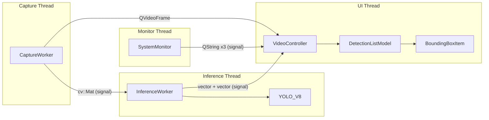

# Memory & Data Flow Inefficiency Analysis

> System Architect Review — February 2026

This document identifies memory consumption and data flow inefficiencies across the YOLOApp codebase, explains their impact, and provides concrete improvement strategies.

---

## Architecture Overview



---

## Issue 1: Raw `new`/`delete` Without Smart Pointers

| Severity | Impact | Files |
|:--------:|--------|-------|
| 🔴 High | Memory leaks on exceptions | [inference.cpp](file:///d:/najib/2_archived-projects/desktop/qt-qml/YOLOApp/src/inference.cpp), [VideoController.cpp](file:///d:/najib/2_archived-projects/desktop/qt-qml/YOLOApp/src/VideoController.cpp) |

### Problem

Multiple raw `new`/`delete` patterns risk leaks if exceptions occur between allocation and deallocation.

**inference.cpp — Node name buffers (Lines 185–195):**
```cpp
char *temp_buf = new char[50];   // Fixed 50-byte allocation
strcpy(temp_buf, input_node_name.get()); // Potential buffer overflow
inputNodeNames.push_back(temp_buf);
// ...
char *temp_buf = new char[10];   // Only 10 bytes for output names
strcpy(temp_buf, output_node_name.get()); // High overflow risk
```

- Hard-coded buffer sizes (`50` and `10`) risk **buffer overflows** if ONNX node names exceed the size.
- These `char*` pointers are **never freed** in any destructor — pure memory leak.

**VideoController.cpp — Worker allocation (Lines 163–164):**
```cpp
m_captureWorker = new CaptureWorker();
m_inferenceWorker = new InferenceWorker();
```

- Raw `new` without `std::unique_ptr`, making exception safety fragile.

**inference.cpp — YOLO_V8 allocation (Line 100):**
```cpp
m_yolo = new YOLO_V8;
// ...
if (m_yolo) delete m_yolo;  // Manual delete in destructor
```

### Improvement

```diff
 // inference.cpp — Replace raw char* with std::string
-char *temp_buf = new char[50];
-strcpy(temp_buf, input_node_name.get());
-inputNodeNames.push_back(temp_buf);
+// Store as std::string, convert to c_str() at call sites
+m_inputNodeNameStorage.push_back(std::string(input_node_name.get()));

 // VideoController.cpp — Use unique_ptr
-m_yolo = new YOLO_V8;
+m_yolo = std::make_unique<YOLO_V8>();

 // Worker creation
-m_captureWorker = new CaptureWorker();
+auto captureWorker = std::make_unique<CaptureWorker>();
+m_captureWorker = captureWorker.get();
+captureWorker.release(); // Qt takes ownership via moveToThread
```

> [!NOTE]
> For `inputNodeNames`/`outputNodeNames`, store the strings in a `std::vector<std::string>` member, then rebuild a `std::vector<const char*>` pointing into those strings for the ONNX API calls. This avoids leaks and buffer overflows entirely.

---

## Issue 2: Queued `cv::Mat` Copies Across Threads

| Severity | Impact | Files |
|:--------:|--------|-------|
| 🔴 High | ~900KB copy per frame at 30 FPS = ~27 MB/s throughput overhead | [VideoController.h](file:///d:/najib/2_archived-projects/desktop/qt-qml/YOLOApp/src/VideoController.h#L112), [VideoController.cpp](file:///d:/najib/2_archived-projects/desktop/qt-qml/YOLOApp/src/VideoController.cpp#L64) |

### Problem

The `frameReady` signal sends `const cv::Mat&`, but Qt's `QueuedConnection` **serializes and copies** the entire `cv::Mat` data when crossing thread boundaries. For a 640×480 BGR frame, this is:

```
640 × 480 × 3 bytes = 921,600 bytes ≈ 900 KB per frame
At 30 FPS → 27 MB/s of unnecessary copying
```

The ring buffer `m_framePool[3]` was designed to avoid `clone()`, but the queued connection negates this optimization because Qt's metatype system forces a deep copy on dispatch.

### Improvement

Use `std::shared_ptr<cv::Mat>` to share ownership across threads without copying pixel data:

```diff
 // Signal declaration
-void frameReady(const cv::Mat& frame);
+void frameReady(std::shared_ptr<cv::Mat> frame);

 // Capture loop — wrap the pool buffer
-emit frameReady(currentFrame);
+auto shared = std::make_shared<cv::Mat>(currentFrame.clone());
+emit frameReady(shared);

 // Inference slot
-void processFrame(const cv::Mat& frame);
+void processFrame(std::shared_ptr<cv::Mat> frame);
```

> [!IMPORTANT]
> This trades one explicit `clone()` in the producer for zero copies through the queue. The `shared_ptr` itself is lightweight (~16 bytes) to copy across the connection.

---

## Issue 3: BGR→RGBA Conversion Allocates a Temporary Frame Every Tick

| Severity | Impact | Files |
|:--------:|--------|-------|
| 🟡 Medium | ~1.2 MB allocation per frame (640×480×4) | [VideoController.cpp](file:///d:/najib/2_archived-projects/desktop/qt-qml/YOLOApp/src/VideoController.cpp#L46-L57) |

### Problem

```cpp
QVideoFrame frame(format);          // Allocates ~1.2 MB internally
if (frame.map(QVideoFrame::WriteOnly)) {
    cv::Mat wrapper(..., frame.bits(0), frame.bytesPerLine(0));
    cv::cvtColor(currentFrame, wrapper, cv::COLOR_BGR2RGBA);
```

A brand-new `QVideoFrame` (with its internal buffer) is constructed **every single frame**. Qt allocates and deallocates the backing memory pool on each iteration.

### Improvement

Pre-allocate and reuse the `QVideoFrame`:

```diff
 // In CaptureWorker — add a member
+QVideoFrame m_reusableFrame;

 // In startCapturing, before the loop
+QVideoFrameFormat format(QSize(AppConfig::FrameWidth, AppConfig::FrameHeight),
+                         QVideoFrameFormat::Format_RGBA8888);
+m_reusableFrame = QVideoFrame(format);

 // In the loop
-QVideoFrame frame(format);
-if (frame.map(QVideoFrame::WriteOnly)) {
+if (m_reusableFrame.map(QVideoFrame::WriteOnly)) {
     cv::Mat wrapper(...);
-    cv::cvtColor(currentFrame, wrapper, cv::COLOR_BGR2RGBA);
-    frame.unmap();
-    sink->setVideoFrame(frame);
+    cv::cvtColor(currentFrame, wrapper, cv::COLOR_BGR2RGBA);
+    m_reusableFrame.unmap();
+    sink->setVideoFrame(m_reusableFrame);
 }
```

> [!TIP]
> Verify that `QVideoSink::setVideoFrame()` does not take exclusive ownership. If it does, you'll need a double-buffered `QVideoFrame` approach instead.

---

## Issue 4: `vector<string>` Class Names Copied on Every Inference Signal

| Severity | Impact | Files |
|:--------:|--------|-------|
| 🟡 Medium | 80 `std::string` copies × 30 FPS = heap churn | [VideoController.h](file:///d:/najib/2_archived-projects/desktop/qt-qml/YOLOApp/src/VideoController.h#L136), [VideoController.cpp](file:///d:/najib/2_archived-projects/desktop/qt-qml/YOLOApp/src/VideoController.cpp#L252) |

### Problem

```cpp
// Signal emitted every inference frame
emit detectionsReady(results, m_classNames, timing);
```

`m_classNames` is a `std::vector<std::string>` with 80 COCO class names. The queued connection deep-copies all 80 strings on **every frame**. These names never change at runtime.

### Improvement

Share a **const pointer** instead of copying the entire vector:

```diff
 // Option A: Store once in VideoController, pass a const pointer
 // InferenceWorker stores classNames, VideoController receives pointer at init
-emit detectionsReady(results, m_classNames, timing);
+emit detectionsReady(results, timing);  // Remove classNames from signal

 // VideoController already knows classNames (stored once during construction)
 void VideoController::updateDetections(const std::vector<DL_RESULT>& results,
-    const std::vector<std::string>& classNames,
     const YOLO_V8::InferenceTiming& timing) {
-    m_detections->updateDetections(results, classNames);
+    m_detections->updateDetections(results, m_classNames);
 }
```

Alternatively, use `std::shared_ptr<const std::vector<std::string>>` if ownership semantics require it.

---

## Issue 5: `DetectionListModel` Full Reset on Every Frame

| Severity | Impact | Files |
|:--------:|--------|-------|
| 🟡 Medium | QML destroys and recreates all delegate items every frame | [DetectionListModel.cpp](file:///d:/najib/2_archived-projects/desktop/qt-qml/YOLOApp/src/DetectionListModel.cpp#L72-L92) |

### Problem

```cpp
beginResetModel();
m_detections.clear();
m_detections.reserve(results.size());
// ... rebuild ...
endResetModel();
```

`beginResetModel()`/`endResetModel()` forces QML's `Repeater` (bound to this model) to **destroy all delegate Items and recreate them from scratch**. This includes all `Rectangle`, `Text`, and `Transform` elements in the bounding box overlay. At only 5–10 detections this seems minor, but:

- Each reset triggers **QObject allocation + property binding** for every delegate
- Scene graph nodes are destroyed and rebuilt
- The `BoundingBoxItem` also gets its `onModelUpdated()` triggered, causing geometry reallocation

### Improvement

Use **in-place updates** when the detection count stays stable:

```diff
 void DetectionListModel::updateDetections(...) {
     if (results.empty() && m_detections.empty()) return;
 
-    beginResetModel();
-    m_detections.clear();
-    m_detections.reserve(results.size());
-    for (...) { m_detections.push_back(det); }
-    endResetModel();

+    int oldSize = m_detections.size();
+    int newSize = results.size();
+
+    // Update existing items in-place (no delegate destruction)
+    int updateCount = std::min(oldSize, newSize);
+    for (int i = 0; i < updateCount; ++i) {
+        m_detections[i] = buildDetection(results[i], classNames);
+        emit dataChanged(index(i), index(i));
+    }
+
+    // Add new items if newSize > oldSize
+    if (newSize > oldSize) {
+        beginInsertRows(QModelIndex(), oldSize, newSize - 1);
+        for (int i = oldSize; i < newSize; ++i)
+            m_detections.push_back(buildDetection(results[i], classNames));
+        endInsertRows();
+    }
+    // Remove excess items if newSize < oldSize
+    else if (newSize < oldSize) {
+        beginRemoveRows(QModelIndex(), newSize, oldSize - 1);
+        m_detections.resize(newSize);
+        endRemoveRows();
+    }
 }
```

> [!NOTE]
> This preserves existing QML delegate objects, only updating their bound properties via `dataChanged`. Scene graph updates become incremental rather than full rebuilds.

---

## Issue 6: Scene Graph Node Thrashing in `BoundingBoxItem`

| Severity | Impact | Files |
|:--------:|--------|-------|
| 🟡 Medium | `new`/`delete` of `QSGGeometryNode` every time detections go 0→N or N→0 | [BoundingBoxItem.cpp](file:///d:/najib/2_archived-projects/desktop/qt-qml/YOLOApp/src/BoundingBoxItem.cpp#L48-L66) |

### Problem

```cpp
if (detectionCount == 0) {
    if (node) delete node;   // Destroy the node
    return nullptr;
}
if (!node) {
    node = new QSGGeometryNode; // Recreate next frame
```

When detections intermittently drop to zero (common in real-time detection), the scene graph node is deleted and then immediately recreated in the next frame. This causes:
- Repeated heap allocation/deallocation
- Scene graph tree restructuring
- GPU resource churn

### Improvement

Keep the node alive but with zero vertices:

```diff
 if (detectionCount == 0) {
-    if (node) delete node;
-    return nullptr;
+    if (node) {
+        node->geometry()->allocate(0);
+        node->markDirty(QSGNode::DirtyGeometry);
+    }
+    return node;
 }
```

---

## Issue 7: `SystemMonitor` String Formatting Overhead

| Severity | Impact | Files |
|:--------:|--------|-------|
| 🟢 Low | Three `QString` constructions + one timestamp formatting per second | [SystemMonitor.cpp](file:///d:/najib/2_archived-projects/desktop/qt-qml/YOLOApp/src/SystemMonitor.cpp#L36-L49) |

### Problem

```cpp
void SystemMonitor::updateMetrics() {
    QString cpuStr = QString::number(cpuUsage, 'f', 1) + "%";
    QString timestamp = QDateTime::currentDateTime().toString("yyyy-MM-dd hh:mm:ss");
    QString message = QString("[%1] CPU: %2 | ...").arg(timestamp, cpuStr, sysMemory, processMemory);
    emit resourceUsageUpdated(cpuStr, sysMemory, processMemory);
}
```

- `timestamp` and `message` are constructed but **never used** (debug lines are commented out).
- Three separate `QString` arguments cross the thread boundary, each getting deep-copied by the queued connection.

### Improvement

```diff
 void SystemMonitor::updateMetrics() {
     double cpuUsage = getCpuUsage();
     QString sysMemory = getSystemMemoryInfo();
     QString processMemory = getProcessMemoryInfo();
     
-    QString cpuStr = QString::number(cpuUsage, 'f', 1) + "%";
-    QString timestamp = QDateTime::currentDateTime().toString("yyyy-MM-dd hh:mm:ss");
-    QString message = QString("[%1] CPU: %2 | Sys Memory: %3 | Process Memory: %4")
-                     .arg(timestamp, cpuStr, sysMemory, processMemory);
-    emit resourceUsageUpdated(cpuStr, sysMemory, processMemory);
+    // Emit a single pre-formatted string to reduce cross-thread copies
+    QString formatted = QString("CPU: %1% | RAM: %2")
+        .arg(QString::number(cpuUsage, 'f', 1), processMemory);
+    emit resourceUsageUpdated(formatted);
 }
```

This also eliminates the `updateSystemStats` formatting in `VideoController.cpp` (lines 244–249), which currently re-formats the same data.

---

## Issue 8: Duplicate Class Name Storage

| Severity | Impact | Files |
|:--------:|--------|-------|
| 🟢 Low | ~5 KB wasted (80 class names stored twice) | [inference.h](file:///d:/najib/2_archived-projects/desktop/qt-qml/YOLOApp/src/inference.h#L83), [VideoController.h](file:///d:/najib/2_archived-projects/desktop/qt-qml/YOLOApp/src/VideoController.h#L146) |

### Problem

```cpp
// InferenceWorker (VideoController.h:146)
std::vector<std::string> m_classNames;

// YOLO_V8 (inference.h:83)
std::vector<std::string> classes{};
```

Class names are loaded twice — once into `YOLO_V8::classes` and once into `InferenceWorker::m_classNames`:

```cpp
while (std::getline(file, line)) {
    m_yolo->classes.push_back(line);  // Copy 1
    m_classNames.push_back(line);      // Copy 2
}
```

### Improvement

Expose class names from `YOLO_V8` and remove the duplicate:

```diff
 // inference.h — add getter
+const std::vector<std::string>& getClassNames() const { return classes; }

 // InferenceWorker — remove m_classNames, reference YOLO_V8's copy
-m_classNames.push_back(line);
 // When emitting:
-emit detectionsReady(results, m_classNames, timing);
+emit detectionsReady(results, m_yolo->getClassNames(), timing);
```

---

## Summary — Priority Matrix

| Priority | Issue | Memory Impact | FPS Impact | Effort |
|:--------:|-------|:------------:|:----------:|:------:|
| 🔴 P0 | Raw `new`/`delete` + buffer overflow | Leak risk | — | Low |
| 🔴 P0 | Queued `cv::Mat` deep copy | ~27 MB/s | ~2-5 FPS | Medium |
| 🟡 P1 | `QVideoFrame` per-frame allocation | ~1.2 MB/frame | ~1-2 FPS | Low |
| 🟡 P1 | Class names copied per signal | Heap churn | < 1 FPS | Low |
| 🟡 P1 | Model full reset every frame | QML churn | ~1-3 FPS | Medium |
| 🟡 P1 | Scene graph node thrashing | GPU churn | < 1 FPS | Low |
| 🟢 P2 | SystemMonitor string overhead | Trivial | — | Low |
| 🟢 P2 | Duplicate class name storage | ~5 KB | — | Low |
