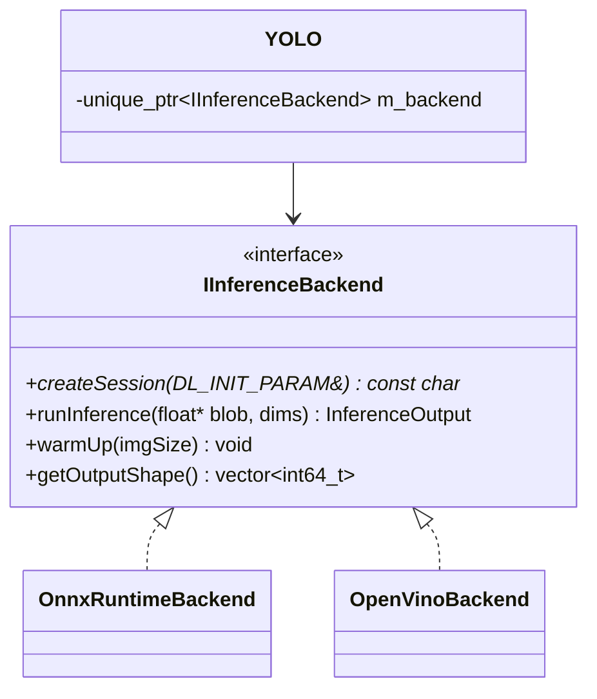

# OpenVINO Runtime Integration — Dual Runtime Support

Integrate OpenVINO as the **default** inference runtime for all 3 YOLO tasks (detection, segmentation, pose estimation), while keeping the existing ONNX Runtime code as a switchable alternative. The user can choose which runtime to use at runtime.

## Prerequisites

> [!IMPORTANT]
> **OpenVINO Model Format**: OpenVINO uses IR format (`.xml` + `.bin`) instead of `.onnx`. Export the pose and segmentation models to IR format:
> ```bash
> ovc yolov8n-pose.onnx
> ovc yolov8n-seg.onnx
> ```
> Place the exported `.xml`/`.bin` files in the `inference/` directory alongside the existing `.onnx` files.

> [!WARNING]
> **Compiler Migration**: OpenVINO on Windows requires MSVC. The current project uses MinGW (`C:/opencv/build_mingw`). We must switch to MSVC before integrating OpenVINO. See [Step 0](#step-0-msvc-migration) below.

---

## Step 0: MSVC Migration

OpenVINO distributes pre-built Windows binaries compiled with MSVC. Mixing MinGW-compiled code with MSVC-compiled libraries causes linker errors.

| Item | Current (MinGW) | Target (MSVC) |
|------|-----------------|---------------|
| **CMake Generator** | `MinGW Makefiles` | `Visual Studio 17 2022` or `Ninja` with MSVC |
| **OpenCV Path** | `C:/opencv/build_mingw` | `C:/opencv/build` |
| **Compiler Flags** | `-O3 -march=native -ffast-math` | `/O2 /Ob2 /Oi /Ot /Oy /GL` + `/LTCG` |
| **Build Directory** | `build/` (contains MinGW objects) | Delete and recreate |

### Steps

1. Delete `build/` directory
2. Update `CMakeLists.txt`: change OpenCV path, remove MinGW flags
3. Reconfigure: `cmake -B build -G "Visual Studio 17 2022" -A x64`
4. Verify build succeeds with existing ONNX Runtime code

---

## Architecture

**Strategy Pattern** — abstract `IInferenceBackend` interface with two implementations:



---

## File Changes Summary

### New Files
| File | Purpose |
|------|---------|
| `src/pipeline/inference_backend.h` | `IInferenceBackend` interface + `InferenceOutput` struct |
| `src/pipeline/onnxruntime_backend.h/.cpp` | Wraps existing ONNX Runtime code into a backend |
| `src/pipeline/openvino_backend.h/.cpp` | New OpenVINO backend adapted from `reference/` |

### Modified Files
| File | Changes |
|------|---------|
| `src/pipeline/yolo_types.h` | Add `RUNTIME_TYPE` enum, add `runtimeType` to `DL_INIT_PARAM` |
| `src/pipeline/inference.h` | Remove ONNX Runtime members, add `IInferenceBackend` pointer |
| `src/pipeline/inference.cpp` | Delegate to backend; ~80 lines instead of ~280 |
| `CMakeLists.txt` | Add OpenVINO, switch OpenCV path, add new sources, DLL copy |
| `src/core/VideoController.h` | Add `RuntimeType` enum, `currentRuntime` property |
| `src/core/VideoController.cpp` | Set `runtimeType` in params, use correct model paths |
| `content/Main.qml` | Add Runtime ComboBox in header |

---

## Verification

Test all 6 combinations:

| Task | OpenVINO | ONNX Runtime |
|------|----------|--------------|
| Object Detection | Bounding boxes | Bounding boxes |
| Pose Estimation | Skeleton keypoints | Skeleton keypoints |
| Image Segmentation | Colored masks | Colored masks |

Additional checks: runtime switching, performance comparison, no regression on existing features.
