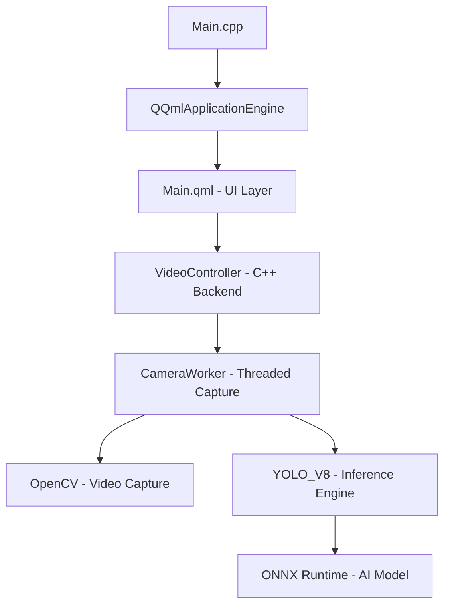

# Project Structure

This document outlines the organization of the **QtOpenCVCamera** codebase, integrating C++, Qt Quick (QML), and AI inference components.

## Architecture Overview



## File Tree

```
root/
├── .agent/                 # AI Agent configurations and skills
├── build/                  # Build artifacts (excluded from git)
├── content/                # Qt Quick (QML) UI files
│   └── Main.qml            # Main application window
├── docs/                   # Documentation Suite
│   ├── prd.md              # Product Requirements
│   ├── design-spec.md      # Architecture & Component Specs
│   ├── tech-stack.md       # Libraries & Standards
│   └── ...                 # Other documentation
├── inference/              # AI Model assets
│   ├── yolov8n.onnx        # YOLOv8 ONNX model
│   └── classes.txt         # Class labels
├── src/                    # C++ Source Code
│   ├── VideoController.h/cpp # QML-C++ Bridge & Worker Management
│   ├── SystemMonitor.h/cpp   # Performance monitoring (CPU/RAM)
│   └── inference.h/cpp       # ONNX Runtime wrapper for YOLOv8
├── CMakeLists.txt          # Build configuration (Qt6 + OpenCV + ONNX)
├── main.cpp                # Application entry point
└── tech-stack.md           # Quick tech stack overview
```

## Key Directories

- **`src/`**: Contains the core C++ logic.
    - **`VideoController`**: The main bridge between the QML UI and the C++ backend. It manages the background worker thread for video capture and inference.
    - **`inference`**: Wraps the ONNX Runtime C++ API to load the YOLOv8 model and perform object detection.
    - **`SystemMonitor`**: utility for tracking application performance.

- **`content/`**: Contains the QML files for the user interface.
    - **`Main.qml`**: Defines the visual structure, video output element, and UI controls.

- **`inference/`**: Stores the runtime assets needed for AI detection.
    - **`yolov8n.onnx`**: The pre-trained neural network model.
    - **`classes.txt`**: The list of object categories the model can detect.

- **`docs/`**: The central knowledge base for the project, maintained by the System Architect agent.
