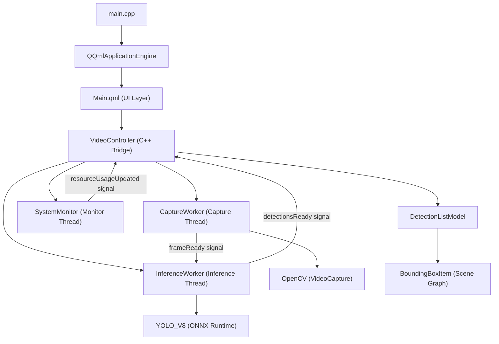

# Project Structure

This document outlines the organization of the **QtOpenCVCamera** codebase, integrating C++, Qt Quick (QML), and AI inference components.

## Architecture Overview



## File Tree

```
root/
├── .agent/                 # AI Agent configurations and skills
├── build/                  # Build artifacts (excluded from git)
├── content/                # Qt Quick (QML) UI files
│   └── Main.qml            # Main application window & overlays
├── docs/                   # Documentation Suite
│   ├── prd.md              # Product Requirements
│   ├── design-spec.md      # Architecture & Component Specs
│   ├── tech-stack.md       # Libraries & Standards
│   ├── dod.md              # Definition of Done
│   ├── personas.md         # User Personas
│   └── project-structure.md# This file
├── inference/              # AI Model assets
│   ├── yolov8n.onnx        # YOLOv8 Nano ONNX model
│   └── classes.txt         # COCO class labels (80 classes)
├── src/                    # C++ Source Code
│   ├── VideoController.h/cpp   # Controller + CaptureWorker + InferenceWorker
│   ├── BoundingBoxItem.h/cpp   # Scene Graph overlay for bounding boxes
│   ├── DetectionListModel.h/cpp# QAbstractListModel for detection data
│   ├── DetectionStruct.h       # Detection Q_GADGET struct
│   ├── SystemMonitor.h/cpp     # CPU/RAM monitoring (platform-native)
│   └── inference.h/cpp         # ONNX Runtime wrapper for YOLOv8
├── CMakeLists.txt          # Build configuration (Qt6 + OpenCV + ONNX)
├── main.cpp                # Application entry point
└── README.md               # Project overview
```

## Key Directories

- **`src/`**: Contains the core C++ logic.
    - **`VideoController`**: The main orchestrator. Bridges QML ↔ C++ via `Q_PROPERTY` and signals/slots. Manages three background threads (`CaptureWorker`, `InferenceWorker`, `SystemMonitor`) and owns the `DetectionListModel`.
    - **`CaptureWorker`**: Runs on a dedicated thread. Opens the camera via `cv::VideoCapture`, pushes raw frames to `QVideoSink` for display, and emits frames to the inference pipeline. Uses a 3-frame ring buffer to avoid cloning.
    - **`InferenceWorker`**: Runs on a dedicated high-priority thread. Loads the YOLOv8 ONNX model, processes incoming frames with frame-drop logic (if inference is slower than capture), and emits detection results + timing metrics.
    - **`YOLO_V8` (inference)**: Wraps the ONNX Runtime C++ API. Handles session creation/pooling, letterbox preprocessing, blob generation, inference execution, and NMS postprocessing. Includes reusable memory buffers for the blob to minimize allocations.
    - **`BoundingBoxItem`**: A custom `QQuickItem` that renders bounding box rectangles directly via Qt's Scene Graph for hardware-accelerated performance. Works alongside a QML `Repeater` for text labels.
    - **`DetectionListModel`**: A `QAbstractListModel` that bridges detection data from C++ to QML. Stores normalized detection coordinates, class IDs, labels, and confidence scores.
    - **`DetectionStruct`**: A `Q_GADGET` struct defining the per-detection data (classId, confidence, label, x, y, w, h) for efficient C++ ↔ QML data passing.
    - **`SystemMonitor`**: Platform-native CPU and RAM monitoring. Uses PDH/PSAPI on Windows, `/proc` on Linux, and `sysctl`/`mach` on macOS. Runs on a low-priority background thread.

- **`content/`**: Contains the QML files for the user interface.
    - **`Main.qml`**: Defines the visual layout including `VideoOutput` for the camera feed, a `BoundingBoxItem` overlay with nested `Repeater` for labels, a performance HUD (camera FPS, inference FPS, timing, system stats), and a close button.

- **`inference/`**: Stores the runtime assets needed for AI detection.
    - **`yolov8n.onnx`**: The pre-trained YOLOv8 Nano neural network model.
    - **`classes.txt`**: The list of 80 COCO object categories the model can detect.

- **`docs/`**: The central knowledge base for the project, maintained by the System Architect agent.

## Configuration Constants

Defined in `AppConfig` namespace (`VideoController.h`):

| Constant | Value | Description |
|:---|:---|:---|
| `FrameWidth` | 640 | Capture resolution width |
| `FrameHeight` | 480 | Capture resolution height |
| `ModelWidth` | 640 | YOLO input tensor width |
| `ModelHeight` | 640 | YOLO input tensor height |
