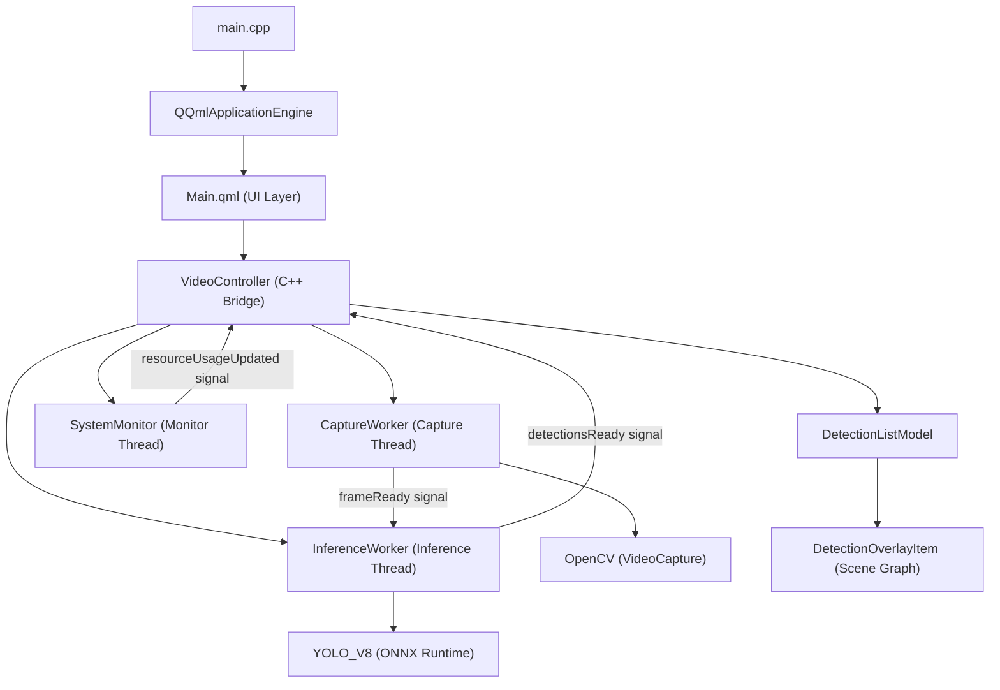

# Project Structure

This document outlines the organization of the **QtOpenCVCamera** codebase, integrating C++, Qt Quick (QML), and AI inference components.

## Architecture Overview


```mermaid
graph TD
  A[main.cpp] --> B[QQmlApplicationEngine]
  B --> C["Main.qml (UI Layer)"]
  C --> D["VideoController (C++ Bridge)"]
  D --> E["CaptureWorker (Capture Thread)"]
  D --> F["InferenceWorker (Inference Thread)"]
  D --> G["SystemMonitor (Monitor Thread)"]
  E --> H["OpenCV (VideoCapture)"]
  E -->|frameReady signal| F
  F --> I["YOLO_V8 (ONNX Runtime)"]
  F -->|detectionsReady signal| D
  D --> J["DetectionListModel"]
  J --> K["DetectionOverlayItem (Scene Graph)"]
  G -->|resourceUsageUpdated signal| D
```

## File Tree

```
root/
├── .agent/                 # AI Agent configurations and skills
├── build/                  # Build artifacts (excluded from git)
├── content/                # Qt Quick (QML) UI files
│   └── Main.qml            # Main application window & overlays
├── docs/                   # Documentation Suite
│   ├── prd.md              # Product Requirements
│   ├── design-spec.md      # Architecture & Component Specs
│   ├── tech-stack.md       # Libraries & Standards
│   ├── dod.md              # Definition of Done
│   ├── personas.md         # User Personas
│   └── project-structure.md# This file
├── assets/                 # AI Model assets
│   ├── onnx/               # ONNX Runtime models
│   │   ├── yolov8n.onnx
│   │   ├── yolov8n-pose.onnx
│   │   └── yolov8n-seg.onnx
│   ├── openvino/           # OpenVINO Intermediate Representation
│   │   ├── yolov8n.xml
│   │   └── yolov8n.bin
│   └── classes.txt         # COCO class labels (80 classes)
├── src/                    # C++ Source Code
│   ├── core/               # Controllers and Monitors
│   │   ├── VideoController.h/cpp
│   │   └── SystemMonitor.h/cpp
│   ├── ui/                 # Qt Quick UI Elements
│   │   └── DetectionOverlayItem.h/cpp
│   ├── models/             # Data Models
│   │   ├── DetectionListModel.h/cpp
│   │   └── DetectionStruct.h
│   └── pipeline/           # AI Pipeline (Pre, Infer, Post)
│       ├── YoloPipeline.h/cpp
│       ├── PreProcessor.h/cpp
│       ├── PostProcessor.h/cpp
│       ├── YoloTypes.h
│       ├── SimdUtils.h
│       └── backends/       # Runtime-specific backends
│           ├── IInferenceBackend.h
│           ├── OnnxRuntimeBackend.h/cpp
│           └── OpenVinoBackend.h/cpp
├── CMakeLists.txt          # Build configuration (Qt6 + OpenCV + ONNX)
├── main.cpp                # Application entry point
└── README.md               # Project overview
```

## Key Directories

- **`src/`**: Contains the core C++ logic.
    - **`core/VideoController`**: The main orchestrator. Bridges QML ↔ C++ via `Q_PROPERTY` and signals/slots. Manages three background threads (`CaptureWorker`, `InferenceWorker`, `SystemMonitor`) and owns the `DetectionListModel`.
    - **`core/CaptureWorker`**: Runs on a dedicated thread. Opens the camera via `cv::VideoCapture`, pushes raw frames to `QVideoSink` for display, and emits frames to the inference pipeline. Uses a 3-frame ring buffer to avoid cloning.
    - **`core/InferenceWorker`**: Runs on a dedicated high-priority thread. Loads the YOLO ONNX model, processes incoming frames with frame-drop logic (if inference is slower than capture), and emits detection results + timing metrics.
    - **`pipeline/YOLO` (inference)**: Wraps the ONNX Runtime C++ API. Handles session creation/pooling, letterbox preprocessing, blob generation, inference execution, and delegates to specific post-processors.
    - **`ui/DetectionOverlayItem`**: A custom `QQuickItem` that renders bounding box rectangles directly via Qt's Scene Graph for hardware-accelerated performance. Works alongside a QML `Repeater` for text labels.
    - **`models/DetectionListModel`**: A `QAbstractListModel` that bridges detection data from C++ to QML. Stores normalized detection coordinates, class IDs, labels, and confidence scores.
    - **`models/DetectionStruct`**: A `Q_GADGET` struct defining the per-detection data (classId, confidence, label, x, y, w, h) for efficient C++ ↔ QML data passing.
    - **`core/SystemMonitor`**: Platform-native CPU and RAM monitoring. Uses PDH/PSAPI on Windows, `/proc` on Linux, and `sysctl`/`mach` on macOS. Runs on a low-priority background thread.

- **`content/`**: Contains the QML files for the user interface.
    - **`Main.qml`**: Defines the visual layout including `VideoOutput` for the camera feed, a `DetectionOverlayItem` overlay with nested `Repeater` for labels, a performance HUD (camera FPS, inference FPS, timing, system stats), and a close button.

- **`assets/`**: Stores the runtime assets needed for AI detection.
    - **`onnx/`**: Contains `.onnx` models for ONNX Runtime.
    - **`openvino/`**: Contains `.xml` and `.bin` files for OpenVINO.
    - **`classes.txt`**: The list of 80 COCO object categories the model can detect.

- **`docs/`**: The central knowledge base for the project, maintained by the System Architect agent.

## Configuration Constants

Defined in `AppConfig` namespace (`VideoController.h`):

| Constant | Value | Description |
|:---|:---|:---|
| `FrameWidth` | 640 | Capture resolution width |
| `FrameHeight` | 480 | Capture resolution height |
| `ModelWidth` | 640 | YOLO input tensor width |
| `ModelHeight` | 640 | YOLO input tensor height |
